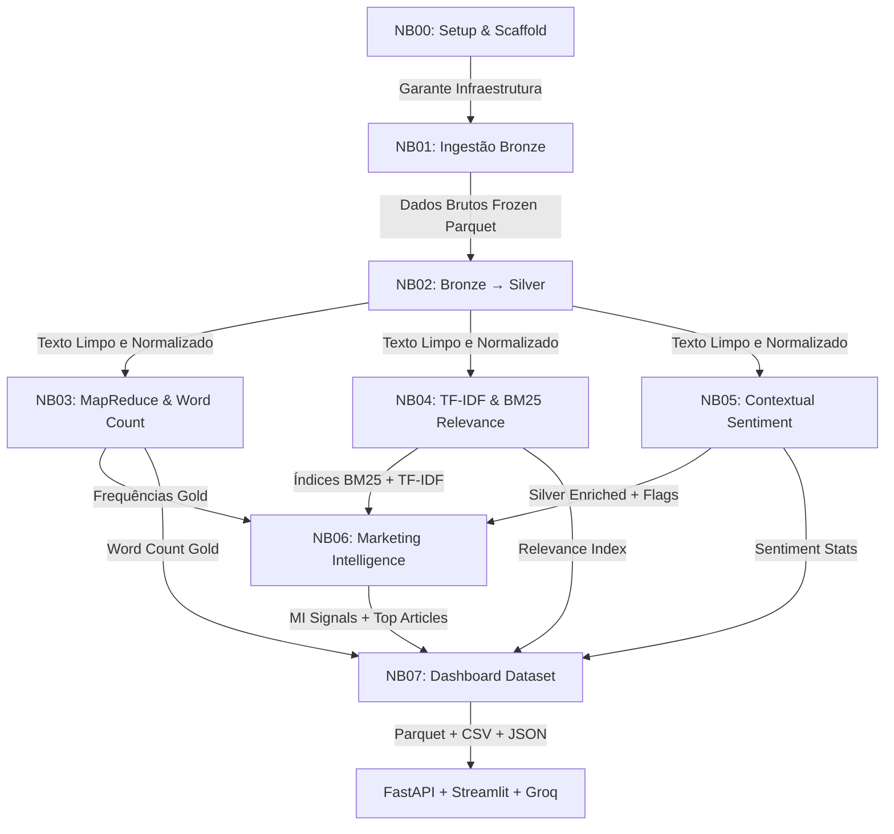

<!-- ======================================= ⚡️ Start DEFAULT HEADER ===========================================  -->
<!-- ========= START LANGUAGE BUTTON ========= -->
**\[[🇧🇷 Português](README.pt_BR.md)\] \[**[🇬🇧 English](README.md)**\]**

<br><br>
<!-- ========= END LANGUAGE BUTTON ========= -->


<!-- ========= START REPO TITLE ========= -->
# <p align="center"> [Investor Intelligence Platform  🇧🇷  Brazilian FIIs]() 

### <p align="center"> Real Estate Investment Funds (FIIs) - Market Intelligence & Behavioral Analytics

<br>

$$\Huge {\textbf{\color{green} CRISP-DM} \space \textbf{\color{white} •} \space \textbf{\color{yellow}  Data Lakehouse} \space \textbf{\color{white} •} \space \textbf{\color{green} NLP} \space \textbf{\color{white} •} \space \textbf{\color{yellow} Responsible AI} \space \textbf{\color{white} •} \space \textbf{\color{green} Regulatory Alignment}}$$

<br>

### <p align="center"> ***An institutional-grade intelligence platform for monitoring, structuring, ranking, and interpreting Brazilian Real Estate Investment Fund (FII) signals from financial media, research portals, and investor communities.***

<br>

#### <p align="center"> [Big Data]() • [PySpark]() • [MapReduce Word Count]() • [NLP]() • [TF-IDF]() • [BM25 Ranking]() • [Hybrid Retrieval]() • [FAISS + Multilingual Embeddings]() • [Web Scraping]() • [TOFU/MOFU/BOFU]() • [CRISP-DM]() • [FastAPI]() • [Streamlit]() • [Docker]() • [Responsible AI]() • [LGPD]() • [EU AI Act Alignment]()

<br><br>
<!-- ========= END REPO TITLE ========= -->

<!-- ========= START SPONSOR BADGES ========= -->
### <p align="center"> [](https://github.com/sponsors/Quantum-Software-Development)

<br><br>
<!-- ========= END SPONSOR BADGES ========= -->

<!-- ========= START DEMO VIDEO ========= -->
<p align="center">
   

 </p>

<!--
#### 🖤 Creative Direction, Music Curation & Editing by Fab⚡️  
##### 🎶 [Soundtrack:]() "Canon in D" — Johann Pachelbel
-->

<br><br>
<!-- ========= END DEMO VIDEO ========= -->


<!-- ========= START Institutional INFO ========= -->
## 🎓 Academic 

<br>

**Institution:** Pontifical Catholic University of São Paulo (PUC-SP) — FACEI  
[**Bachelor’s Program:**]() Humanistic AI & Data Science • 5th Semester • 2026  
[**Course:**]() AI Security, Cybersecurity & Social Engineering  
**Professors** [✨ Eduardo Savino Gomes]() and [✨ Carlos Eduardo Paes](https://www.linkedin.com/in/carlos-eduardo-de-barros-paes-ph-d-7b137a4/)  
**Project Authors:** [Fabiana ⚡️ Campanari](https://linktr.ee/fabianacampanari) and [Pedro Vyctor  Almeida]()

<br><br>

#

<br><br>
<!-- ========= END Institutional INFO ========= -->


<!-- ========= START Dashboard Streamlit ========= -->
<p align="center">
  <a href="" target="_blank" rel="noopener noreferrer">
    
  </a>
</p>
<!-- ========= END Dashboard Streamlit ========= -->

<!-- ========= START REACT APP ========= -->
<p align="center">

  <a href="" target="_blank" rel="noopener noreferrer">
    
  </a>
  <!-- ========= END REACT APP ========= -->

<!-- ========= START PPTX ========= -->
  <a href="" target="_blank" rel="noopener noreferrer">
    
  </a>

</p>
<!-- ========= END PPTX ========= -->

<!-- ========= START DATA ANALYSING REPORT ========= -->
<p align="center">
  <a href="">
    
  </a>
</p>

<br><br>

#

<br><br>
<!-- ========= END DATA ANALYSING REPORT ========= -->
<!-- ===================== END BADGE GROUP 1 ===================== -->


<!-- ========= START NOTE ========= -->
> [!TIP]
> 🔗 **[Cybersecurity, Social Engineering & AI Security — Hub Repository](https://github.com/Quantum-Software-Development/1-Cybersecurity-SocialEngineering_Hub)**  <br>
>
> ###  Real Estate Investment Funds (FIIs) 🇧🇷 Market Intelligence & Behavioral Analytics
> 
> A scalable platform combining **Big Data, PySpark, MapReduce, Word Count, NLP, TF-IDF, BM25, FAISS, multilingual embeddings, Web Scraping, Hybrid RAG** and AI-assisted analytics to
> transform large-scale financial discussions into actionable insights for FIIs.<br>
> 
> <br>
>
> $$\Huge {\textbf{\color{green} Where market discussions become investment narratives…}}$$
>
> $$\Huge {\textbf{\color{yellow} because markets talk a lot...}}$$
> 
> $$\Huge {\textbf{\color{green} intelligent systems just listen better}}$$
>
> ### <p align="center"> ⚡


<br><br>

#

<br><br>
<!-- ========= END NOTE ========= -->

<!-- ========= START !WARNING] ========= -->
> [!WARNING]
>
> <br>
> ⚠️ Projects may be publicly shared when permitted.  
> The focus is on applied, hands-on learning with real datasets in AI governance and security contexts.  
> All sensitive content remains protected in private repositories when required.  <br><br> 
> 
> ⚠️ Disclaimer
> Plataforma exclusivamente educacional e analítica. Não constitui recomendação de investimento.

<br><br><br><br>

## Table of Contents

1. [Contexto Acadêmico](#-contexto-acadêmico)
2. [Visão Geral](#-visão-geral)
3. [O Que Esta Plataforma Entrega](#-o-que-esta-plataforma-entrega)
4. [Por Que Isso Importa](#-por-que-isso-importa)
5. [Arquitetura e Pipeline](#-arquitetura-e-pipeline)
6. [Notebooks NB00–NB07: Relatório Técnico](#-notebooks-nb00nb07-relatório-técnico)
7. [As 3 Técnicas Centrais: MapReduce + TF-IDF + BM25](#-as-3-técnicas-centrais-mapreduce--tf-idf--bm25-como-se-complementam)
8. [Fontes de Dados — 21 Fontes](#-fontes-de-dados--21-fontes-monitoradas)
9. [Infraestrutura Big Data](#-infraestrutura-big-data)
10. [Metodologia CRISP-DM](#-metodologia-crisp-dm)
11. [Governança](#-governança)
12. [Estrutura de Pastas](#-estrutura-de-pastas)
13. [Como Executar](#-como-executar)
14. [Makefile — Referência Completa](#-makefile--referência-completa)
15. [Outputs Esperados](#-outputs-esperados)
16. [Referências](#-referências)
17. [Autores](#-autores)

---

## 🎓 Contexto Acadêmico

| Campo | Valor |
|---|---|
| **Instituição** | PUC-SP — Pontifícia Universidade Católica de São Paulo |
| **Faculdade** | FACEI — Faculdade de Ciências Exatas e de Informática |
| **Curso** | Humanistic AI & Data Science |
| **Semestre** | 5º Semestre — 2026 |
| **Disciplinas** | AI Security · Cybersecurity · Social Engineering · Sistemas Distribuídos · Machine Learning |
| **Professores** | ✨ Eduardo Savino Gomes · ✨ Carlos Eduardo Paes |
| **Autores** | Fabiana ⚡️ Campanari · Pedro Vyctor ⭐️ Almeida |
| **Metodologia** | CRISP-DM (Cross-Industry Standard Process for Data Mining) |

### Requisitos Acadêmicos Atendidos

| Requisito | Implementação |
|---|---|
| Computação Distribuída | PySpark · RDD MapReduce · SparkSession |
| Big Data Architecture | Medallion (Bronze → Silver → Gold) |
| Machine Learning | TF-IDF · BM25 · Análise de Sentimento |
| NLP | Tokenização PT-BR · Léxico FII · Signal Flags |
| Governança de Dados | LGPD · EU AI Act · Responsible AI · XAI |
| API REST | FastAPI · Uvicorn |
| Visualização | Streamlit · Plotly |
| RAG / LLM | Groq (llama-3.1-8b-instant) |

---

## 📖 Visão Geral

O **Investor Intelligence Platform — FIIs Brasil** é uma pipeline de Big Data completa para monitoramento, análise e geração de inteligência de marketing sobre **Fundos de Investimento Imobiliário (FIIs)** brasileiros.

A plataforma ingere conteúdo de **21 fontes** (6 RSS primários + 4 RSS suplementares + 10 portais de scraping + Reddit), aplica **NLP em português**, produz rankings de relevância por **TF-IDF + BM25**, análise de **sentimento contextual FII PT-BR** e consolida métricas de **marketing intelligence** em dashboards prontos para consumo por FastAPI e Streamlit.

É um sistema de inteligência de investidores orientado a AI, capaz de:

- Analisar sentimento de investidores em comunidades financeiras
- Identificar tópicos de alta relevância em discussões sobre FIIs
- Rankear relevância de conteúdo usando **BM25 + TF-IDF hybrid retrieval**
- Detectar padrões de comportamento de mercado
- Apoiar decisões de estratégia de marketing e comunicação
- Mapear engajamento de investidores por ecossistema digital

---

## 📦 O Que Esta Plataforma Entrega

> Uma camada consolidada de inteligência de mercado que transforma conversas públicas fragmentadas sobre FIIs em insights estruturados, pesquisáveis e explicáveis para analistas, gestores de fundos e equipes de comunicação.

Concretamente:

**Source Intelligence para FIIs**
Mostra *onde* os FIIs são discutidos (quais portais e comunidades), *com que frequência* e *com que intensidade narrativa*, permitindo priorizar canais e entender o panorama de visibilidade.

**Behavioral & Sentiment Analytics**
Mede sentimento, contexto negativo e tópicos recorrentes em fontes editoriais e sociais, ajudando a detectar sinais precoces de entusiasmo, preocupação ou risco reputacional em torno de fundos ou temas específicos.

**Relevance-Ranked Information Retrieval**
Usa **PySpark, MapReduce, TF-IDF e BM25** para rankear conteúdo FII por relevância, facilitando a localização dos artigos e narrativas mais importantes em vez de varrer manualmente dezenas de sites.

**Executive Dashboards + AI-Assisted Exploration**
Expõe a inteligência processada via **Streamlit dashboards**, **FastAPI** e uma **camada de assistente IA** (Groq) que permite exploração por perguntas sobre contexto governado e explicável — não um modelo black-box.

| Componente | Tecnologia | Função |
|---|---|---|
| Pipeline NLP | PySpark 3.5 + Pandas | Processamento distribuído Bronze→Silver→Gold |
| REST API | FastAPI + Uvicorn | Endpoints `/articles`, `/sources`, `/fii-signals` |
| Dashboard | Streamlit + Plotly | Visualizações interativas dark mode |
| Chatbot | Groq (llama-3.1-8b-instant) | Assistente FII com RAG contextual |
| Search | rank_bm25 + TF-IDF sklearn | Busca híbrida sobre 21 fontes |

---

## ❓ Por Que Isso Importa

Na prática, gestores de FIIs, analistas e equipes de comunicação financeira enfrentam:

- informação dispersa em dezenas de portais e comunidades
- alta razão ruído/sinal nas discussões de mercado
- dificuldade para rastrear como sentimento e narrativas evoluem ao longo do tempo
- ausência de ferramentas transparentes e explicáveis alinhadas com **AI Governance, LGPD e EU AI Act**

Esta plataforma endereça essa lacuna ao:

- Organizar **21 fontes monitoradas** em taxonomia transparente (RSS editorial, scraping editorial, social/comportamental)
- Processá-las via **pipeline Bronze/Silver/Gold com Spark/PySpark**
- Entregar **analytics reproduzíveis e interpretáveis** auditáveis, explicáveis e reutilizáveis em contextos acadêmicos, corporativos ou de pesquisa

---

## 🏗️ Arquitetura e Pipeline

### Visão Macro

```
┌─────────────────────────────────────────────────────────────────────┐
│                    21 FONTES MONITORADAS                            │
│  6 RSS primários + 4 RSS supl. + 10 portais scraping + Reddit       │
└──────────────────────────┬──────────────────────────────────────────┘
                           │  NB01: feedparser · requests/BS4 · PRAW
                           ▼
┌─────────────────────────────────────────────────────────────────────┐
│  🥉 BRONZE LAYER — data/external/                                   │
│  Schema 17 campos · SHA-256 article_id · published_at=None          │
│  para conteúdo raspado · Parquet snappy · FREEZE após NB01          │
└──────────────────────────┬──────────────────────────────────────────┘
                           │  NB02: limpeza · normalização · 3 quality gates
                           ▼
┌─────────────────────────────────────────────────────────────────────┐
│  🥈 SILVER LAYER — data/silver/                                     │
│  text_clean · word_count · char_count · published_dt (ISO UTC)      │
│  Gate 1: null IDs · Gate 2: word_count≥30 · Gate 3: dedup Window   │
└──────┬────────────────────┬──────────────────┬──────────────────────┘
       │ NB03               │ NB04             │ NB05
       ▼                    ▼                  ▼
  MapReduce            TF-IDF+BM25        Sentimento
  Word Count           Índices            FII PT-BR
  (RDD PySpark)        (sklearn+bm25)     (Léxico 70+)
       │                    │                  │
       └────────────────────┴──────┬───────────┘
                                   │ NB06
                                   ▼
┌─────────────────────────────────────────────────────────────────────┐
│  🥇 GOLD LAYER — data/gold/                                         │
│  MI Signals · MI Top Articles · MI Funnel TOFU/MOFU/BOFU           │
│  Word Count · TF-IDF/BM25 index · Sentiment stats                  │
└──────────────────────────┬──────────────────────────────────────────┘
                           │  NB07: consolidação + validação Plotly
                           ▼
┌─────────────────────────────────────────────────────────────────────┐
│  📊 DASHBOARD DATASETS — data/gold/dashboard/                       │
│  dashboard_articles · dashboard_fii_signals                         │
│  dashboard_source_stats · dashboard_funnel_stats                    │
│  dashboard_word_cloud · api_payload_summary.json                    │
└──────────────────┬──────────────────────────┬───────────────────────┘
                   ▼                          ▼
            FastAPI REST                Streamlit
            api/app.py                 dashboard/Home.py
                   └──────────┬─────────────┘
                              ▼
                       Groq Chatbot
                  (llama-3.1-8b-instant)
```

### Fluxo de Dependências



> **Regra do Freeze:** NB01 é o único notebook que realiza requests HTTP ao vivo.
> NB02–NB07 lêem **exclusivamente** de `data/external/` (dataset congelado).
> Isso garante reprodutibilidade total — o corpus não muda entre execuções.

### Notebooks — Papel no Pipeline

| Notebook | CRISP-DM | Input | Output Principal | Engine |
|---|---|---|---|---|
| **NB00** `setup` | Business Understanding | — | `config/settings.py` · `src/utils/logger.py` | Python stdlib |
| **NB01** `bronze` | Data Understanding | 21 fontes ao vivo | `data/external/*.parquet` | feedparser · requests · PRAW |
| **NB02** `silver` | Data Preparation | `data/external/` | `silver_articles.parquet` | PySpark UDFs + quality gates |
| **NB03** `mapreduce` | Modeling | Silver | `word_count/*.parquet` (4 artefatos) | PySpark RDD MapReduce |
| **NB04** `tfidf_bm25` | Modeling | Silver | `tfidf_vectorizer.pkl` · `bm25_index.pkl` | sklearn + rank_bm25 |
| **NB05** `sentiment` | Modeling | Silver | `silver_enriched.parquet` · `articles_sentiment.parquet` | Léxico FII PT-BR + Spark UDF |
| **NB06** `mi` | Evaluation | Silver enriched + índices | `mi_signals.parquet` · `mi_top_articles.parquet` | BM25 + TF-IDF + PySpark agg |
| **NB07** `dashboard` | Deployment | Todos os Gold | `dashboard/*.parquet` · `*.csv` · `summary.json` | PySpark + Plotly |

---

## 🔬 Notebooks NB00–NB07: Relatório Técnico

Esta seção detalha o que cada notebook executa, o que entrega, sua importância arquitetural e as correções de bugs aplicadas para garantir execução estável.

---

### NB00 — Project Setup & Environment Bootstrap
**Fase CRISP-DM:** Business Understanding & Infrastructure Setup

**O que faz:** Inicializa a estrutura física do projeto, cria as pastas da arquitetura Medallion (`bronze/`, `silver/`, `gold/`), gera arquivos de configuração (`config/settings.py`), stubs da API (FastAPI) e do Dashboard (Streamlit), logger estruturado e documentação de governança.

**Outputs:**
- `config/settings.py` — fonte única de verdade (21 fontes, paths, seeds, Spark config)
- `src/utils/logger.py` — `get_logger()` + 9 funções de evento estruturadas
- `api/app.py` — stub FastAPI
- `dashboard/Home.py` — stub Streamlit
- `dashboard/chatbot/groq_client.py` — stub Groq
- Diretórios Medallion + `.gitignore` + `requirements.txt` + `Makefile`

**Por que isso importa:** Garante consistência de ambiente para todos os membros do time e sistemas de CI/CD — caminhos absolutos, `RANDOM_SEED=42`, e contratos de logging compartilhados desde o início.

**Correções aplicadas:**
- **Conflito de versão PySpark:** Injetada a configuração `PYSPARK_PYTHON` e `PYSPARK_DRIVER_PYTHON` para evitar mismatch Driver 3.12 vs Worker 3.14.
- **`%pip` magic cell:** Substituída por `subprocess.check_call([sys.executable, '-m', 'pip', 'install', ...])` para compatibilidade com execução via `nbconvert`.
- **`.gitignore` falso positivo:** A string literal `*.parquet` no `.gitignore` disparava validador de sintaxe; substituída por comentário descritivo.

---

### NB01 — Bronze Layer: Data Ingestion
**Fase CRISP-DM:** Data Understanding

**O que faz:** Coleta paralela e resiliente das 21 fontes monitoradas (20 portais editoriais + Reddit API). Implementa estratégia de fallback em 3 níveis para Reddit e fallbacks de scraping para RSS que falham.

**Outputs:**
- `data/external/bronze_all_articles.parquet` — dataset combinado (congelado)
- `data/external/rss_fii_articles.parquet`
- `data/external/portal_fii_articles.parquet`
- `data/external/reddit_fii_posts.parquet`
- `data_collection_report.json` — relatório de proveniência

**Por que isso importa:** Isola completamente a coleta de dados do restante do pipeline. O dataset "congelado" em `data/external/` garante que NB02–NB07 sejam 100% reprodutíveis e determinísticos.

**Regra crítica — `published_at = None`:**
> Para conteúdo raspado de portais sem data real de publicação, o campo `published_at` é sempre `None` — nunca preenchido com `collected_at`. Isso evita contaminação de análises temporais com timestamps de coleta.

**Correções aplicadas:**
- **Ordem de execução:** `scrape_portal()` era chamada no fluxo de contingência do Toro RSS antes de ser declarada. Células reordenadas para declarar funções de scraping antes de qualquer chamada.
- **Spark Session Signature:** Corrigido de `builder.config(_conf)` para `builder.config(conf=_conf)`.
- **NLTK OSError Patch:** Tratamento de `OSError` adicionado além do `LookupError` padrão para o recurso `punkt_tab`.

---

### NB02 — Bronze → Silver: ETL & Data Preparation
**Fase CRISP-DM:** Data Preparation

**O que faz:** Limpa textos brutos (remoção de tags HTML, entidades de caracteres, URLs, boilerplates de rodapé). Normaliza datas desestruturadas para ISO 8601 UTC. Aplica 3 quality gates via PySpark.

**Outputs:**
- `data/silver/silver_articles.parquet` — 22 colunas enriquecidas
- `data/silver/silver_processing_report.json` — métricas por gate

**Quality Gates:**
1. **Gate 1** — `article_id` e `url` não nulos
2. **Gate 2** — `word_count ≥ 30` palavras
3. **Gate 3** — deduplicação via `Window.partitionBy("article_id").orderBy(collected_at DESC)`

**Por que isso importa:** É o coração da governança de dados. Garante que TF-IDF e BM25 não processem ruído de HTML, anúncios ou duplicatas cross-source.

**Correções aplicadas:**
- **Injeção `PYSPARK_PYTHON`:** Adicionada no topo da sessão para workers paralelos.
- **Assinatura do Logger:** `log_spark_start(logger)` → `log_spark_start(logger, spark.sparkContext.appName, spark.version)` (3 argumentos obrigatórios).

---

### NB03 — MapReduce Word Count
**Fase CRISP-DM:** Modeling — Exploratory Text Mining

**O que faz:** Implementa contagem de palavras distribuída via RDD PySpark no pattern MapReduce canônico. Gera frequência global, por fonte, por termos TOFU e análise de contexto negativo.

**Pattern MapReduce:**
```python
# MAP PHASE
texts_rdd
  .flatMap(tokenize)         # texto → stream de tokens
  .map(lambda w: (w, 1))    # (token, 1)

# REDUCE PHASE
  .reduceByKey(lambda a, b: a + b)    # soma por token
  .sortBy(lambda x: x[1], ascending=False)
  .collect()
```

**Outputs:**
1. `global_word_count.parquet` — frequência consolidada de todos os termos
2. `source_word_count.parquet` — frequência agrupada por portal editorial
3. `tofu_frequency.parquet` — termos do funil financeiro TOFU rankeados
4. `negative_context.parquet` — indicador `negative_ctx_ratio` por termo de risco

**Por que isso importa:** Implementa o requisito de processamento distribuído nativo com PySpark RDD. O `negative_ctx_ratio` resolve o desafio prático de identificar quais keywords de investimento aparecem mais frequentemente em textos de teor pessimista — distinção impossível com simples contagem de frequência.

**Correções aplicadas:**
- `log_spark_start(logger)` → `log_spark_start(logger, spark.sparkContext.appName, spark.version)`

---

### NB04 — TF-IDF + BM25 Relevance Engine
**Fase CRISP-DM:** Modeling — Relevance Engine

**O que faz:** Constrói máquina de busca e relevância com dois índices complementares: TF-IDF (penaliza termos muito comuns) e BM25 (normaliza por comprimento de documento). Expõe `search_tfidf()`, `search_bm25()` e `search_hybrid()`.

**Outputs:**
- `tfidf_vectorizer.pkl` + `tfidf_matrix.npz` — índice TF-IDF
- `bm25_index.pkl` + `corpus_tokens.pkl` — índice BM25
- `doc_index_map.parquet` — mapeamento doc_index ↔ article_id
- `document_relevance.parquet` — scores por query × doc
- `search_functions.py` — módulo reutilizável para API e dashboard

**Por que isso importa:** Permite rankear quais canais de notícias são de fato os mais relevantes para o ecossistema FII, combinando métricas estatísticas (TF-IDF) e probabilísticas (BM25) de recuperação de informação.

**Correções aplicadas:**
- `log_spark_start(logger)` → `log_spark_start(logger, spark.sparkContext.appName, spark.version)`

---

### NB05 — Contextual Sentiment & Financial Signals
**Fase CRISP-DM:** Modeling — Sentiment Analysis

**O que faz:** Aplica léxico FII PT-BR customizado (70+ termos calibrados para contexto financeiro imobiliário). Gera `polarity_score`, `sentiment_label` e 6 categorias de signal flags via Spark UDF.

**Outputs:**
- `data/silver/silver_enriched.parquet` — Silver + 12 colunas de sentimento
- `data/gold/sentiment/articles_sentiment.parquet`
- `data/gold/sentiment/sentiment_by_source.parquet`
- `data/gold/sentiment/sentiment_by_month.parquet`

---

### NB06 — Marketing Intelligence Layer
**Fase CRISP-DM:** Evaluation

**O que faz:** Combina BM25/TF-IDF + sentimento para gerar métricas de MI por FII. Cataloga 15 FIIs líquidos, classifica documentos por funil TOFU/MOFU/BOFU, gera rankings de fontes.

**Outputs:**
- `mi_signals.parquet` — métricas por FII (sentiment_avg, mentions, risk_score, opportunity_score, mi_score)
- `mi_top_articles.parquet` — top 10 artigos por FII × score híbrido
- `mi_funnel.parquet` — documentos por estágio TOFU/MOFU/BOFU
- `mi_source_ranking.parquet` — ranking de fontes por MI score

---

### NB07 — Dashboard Dataset
**Fase CRISP-DM:** Deployment

**O que faz:** Consolida todos os Gold outputs em 5 datasets normalizados prontos para FastAPI e Streamlit. Exporta Parquet + CSV + JSON. Valida com 4 gráficos Plotly.

**Outputs:**
- `dashboard_articles.{parquet,csv}` — catálogo completo com todos os scores
- `dashboard_fii_signals.{parquet,csv}` — métricas por FII com tendência
- `dashboard_source_stats.{parquet,csv}` — stats por fonte
- `dashboard_funnel_stats.{parquet,csv}` — volumetria por estágio
- `dashboard_word_cloud.{parquet,csv}` — top 200 termos
- `api_payload_summary.json` — resumo estruturado para FastAPI
- `dashboard_validation.html` — validação Plotly interativa

---

## ⚙️ As 3 Técnicas Centrais: MapReduce + TF-IDF + BM25 — Como se Complementam

Esta plataforma usa três técnicas de processamento de texto que se complementam em camadas. Entender por que cada uma foi escolhida — e por que as três juntas são necessárias — é fundamental para compreender o design do pipeline.

---

### 🗺️ 1. MapReduce Word Count (NB03)

**O que faz:** Conta a frequência de cada token no corpus distribuído via RDD PySpark.

**Fórmula:**
```
map(token) → (token, 1)
reduceByKey(+) → (token, total_count)
```

**Papel nesta plataforma:**
- Responde: **"O que os investidores falam?"** — quais termos dominam o discurso FII.
- Fornece o vocabulário base para TF-IDF e BM25.
- Calcula `negative_ctx_ratio` — razão de co-ocorrência de termos de risco com palavras negativas.
- Identifica termos TOFU (top of funnel) de alta frequência.

**Limitação:** Frequência bruta não distingue termos *importantes* de termos *comuns*. "de", "que", "para" serão sempre os mais frequentes — sem informação analítica.

---

### 📊 2. TF-IDF (Term Frequency–Inverse Document Frequency) (NB04)

**Fórmula:**
```
TF-IDF(t,d) = TF(t,d) × log((N+1) / (df(t)+1)) + 1

TF(t,d)   = frequência do termo t no documento d
df(t)     = número de documentos contendo t
N         = total de documentos no corpus
```

**Papel nesta plataforma:**
- Responde: **"Quais termos identificam *este* artigo em relação ao corpus?"**
- Penaliza termos ubíquos ("fundo", "mercado", "investimento") que aparecem em todos os documentos.
- Valoriza termos específicos que diferenciam artigos sobre logística, shopping, laje corporativa etc.
- Usado para busca por similaridade coseno: `cosine_similarity(query_vec, tfidf_matrix)`.

**Configuração usada:**
```python
TfidfVectorizer(
    ngram_range=(1, 2),    # unigramas + bigramas
    max_features=50_000,   # limita vocabulário
    sublinear_tf=True,     # aplica log(1+tf) — suaviza termos muito frequentes
    min_df=2,              # descarta hápax legómena
    max_df=0.95,           # descarta termos em >95% dos docs
)
```

**Limitação:** TF-IDF trata todos os documentos como igualmente compridos. Um artigo com 5.000 palavras e outro com 200 recebem o mesmo tratamento — artigos longos inflam artificialmente a frequência de termos.

---

### 🎯 3. BM25 (Best Match 25 — Okapi BM25) (NB04)

**Fórmula (Robertson & Zaragoza, 2009):**
```
BM25(D,Q) = Σ IDF(qi) · [f(qi,D) · (k1+1)] / [f(qi,D) + k1 · (1 − b + b · |D|/avgdl)]

k1    = 1.5  → saturação de frequência (termos repetidos têm retorno decrescente)
b     = 0.75 → normalização por comprimento de documento
|D|   = comprimento do documento D em tokens
avgdl = comprimento médio do corpus
```

**Papel nesta plataforma:**
- Responde: **"Quais artigos são mais *relevantes* para esta query, independente do seu comprimento?"**
- Normaliza o score por comprimento: artigos longos não são automaticamente mais relevantes.
- Aplica saturação de frequência: mencionar "dividendo" 20 vezes não é 20× mais relevante que mencionar 2 vezes.
- Usado como motor principal de ranking no NB06 (MI Signals por FII).

**Limitação:** BM25 é um modelo de recuperação bag-of-words — não captura semântica (sinônimos, contexto). "rendimento" e "yield" são termos diferentes para o BM25.

---

### 🔗 Por Que as 3 Técnicas São Necessárias Juntas

| Dimensão | MapReduce | TF-IDF | BM25 |
|---|---|---|---|
| **Pergunta respondida** | O que é falado? | O que diferencia cada doc? | O que é relevante para a query? |
| **Unidade de análise** | Corpus inteiro | Documento vs corpus | Query vs documento |
| **Escala** | RDD distribuído | Sparse matrix (N×V) | Lista de listas de tokens |
| **Normalização** | Nenhuma | Por frequência invertida | Por comprimento de documento |
| **Saturação** | Nenhuma | Parcial (sublinear_tf) | Explícita (k1=1.5) |
| **Uso no pipeline** | NB03: frequência, TOFU, risco | NB04: busca por similaridade | NB04/NB06: ranking de relevância |

**O pipeline híbrido:**
```
score_hybrid = α × score_tfidf_norm + (1 − α) × score_bm25_norm
α = 0.4   →   TF-IDF: 40% | BM25: 60%
```

**Por que 60% BM25?** BM25 tem desempenho comprovadamente superior em retrieval de documentos de comprimento variável, característica do corpus FII (artigos de 200 a 5.000 palavras). TF-IDF complementa com sensibilidade a termos tecnicamente específicos (tickers, siglas, bigramas raros).

**Resultado concreto:** Uma query como `"dividend yield FII logística"` encontra artigos relevantes mesmo que:
- A palavra "dividend" não apareça exatamente (TF-IDF via bigramas captura "dividend yield")
- O artigo mais relevante seja curto (BM25 normaliza por `avgdl`)
- O corpus tenha documentos de 200 a 5.000 palavras (BM25 `b=0.75` normaliza a diferença)

---

## 📡 Fontes de Dados — 21 Fontes Monitoradas

| # | Portal/Fonte | Tipo | Método | Fallback |
|---|---|---|---|---|
| 1 | InfoMoney | Editorial | RSS primário | — |
| 2 | Empiricus | Editorial | RSS primário | Scraping |
| 3 | Money Times | Editorial | RSS primário | — |
| 4 | Seu Dinheiro | Editorial | RSS primário | — |
| 5 | Exame Invest | Editorial | RSS primário | — |
| 6 | CNN Brasil Business | Editorial | RSS primário | — |
| 7 | Suno Research | Editorial | RSS suplementar | — |
| 8 | E-Investidor Estadão | Editorial | RSS suplementar | — |
| 9 | NeoFeed | Editorial | RSS suplementar | — |
| 10 | Toro Investimentos | Editorial | RSS suplementar | Scraping |
| 11 | Funds Explorer | Portal | Scraping | — |
| 12 | Status Invest | Portal | Scraping | — |
| 13 | Clube FII | Portal | Scraping | — |
| 14 | FIIs.com.br | Portal | Scraping | — |
| 15 | Portal do FII | Portal | Scraping | RSS fallback |
| 16 | Investidor10 | Portal | Scraping | — |
| 17 | Eu Quero Investir | Portal | Scraping | — |
| 18 | Bora Investir (B3) | Portal | Scraping | — |
| 19 | XP Conteúdos | Portal | Scraping | — |
| 20 | Investing Brasil | Portal | Scraping | — |
| **21** | **Reddit** | **Social** | **PRAW → API pública → frozen parquet** | **3 níveis** |

### Bronze Schema Contract — 17 Campos

| Campo | Tipo | Nullable | Notas |
|---|---|---|---|
| `article_id` | STRING | No | SHA-256(url) — chave primária determinística |
| `source` | STRING | No | Domínio do portal |
| `source_type` | STRING | No | `rss` / `scraping` / `reddit` |
| `title` | STRING | No | Título raw |
| `content` | STRING | Yes | Corpo completo do artigo |
| `summary` | STRING | Yes | Lead / resumo |
| `url` | STRING | No | URL canônica (sem parâmetros UTM) |
| `author` | STRING | Yes | Autor (metadado editorial público) |
| `published_at` | STRING | **Yes** | **RSS: data real · Scraping: `None` · Reddit: UTC ISO** |
| `collected_at` | STRING | No | ISO-8601 UTC da coleta |
| `language` | STRING | No | `pt-br` |
| `tags` | STRING | Yes | Tags separadas por vírgula |
| `query_used` | STRING | Yes | Termo FII que ativou a coleta |
| `ingestion_method` | STRING | No | `feedparser` / `requests+bs4` / `praw` / `reddit_public_api` |
| `raw_html` | STRING | Yes | HTML bruto (scraping only) |
| `content_hash` | STRING | No | MD5(title + content[:500]) — dedup de conteúdo |
| `metadata_json` | STRING | Yes | Metadados extras em JSON string |

> ⚠️ **Regra crítica:** `published_at = None` para conteúdo raspado sem data real.
> Nunca preencher com `collected_at` — contamina análises temporais.

---

## 🖥️ Infraestrutura Big Data

### Learning Path — Progressão de Ambiente

```text
Operating System Setup
        ↓
Hadoop + Spark Foundation
        ↓
Docker Infrastructure
        ↓
Data Lake (MinIO)
        ↓
Distributed Data Processing (PySpark)
```

### Stack por Camada

| Camada | Tecnologia | Propósito |
|---|---|---|
| Sistema Operacional | Ubuntu · macOS · Windows (WSL2) | Preparação do ambiente |
| Armazenamento Distribuído | HDFS | Armazenamento distribuído de arquivos |
| Gerenciamento de Recursos | YARN | Alocação e agendamento de recursos do cluster |
| Processamento Distribuído | Apache Spark | Processamento em larga escala e analytics |
| Containerização | Docker + Docker Compose | Portabilidade e reprodutibilidade de infraestrutura |
| Data Lake | MinIO (S3-compatible) | Object storage para datasets analíticos |
| ETL + Analytics | PySpark | Workflows de engenharia de dados distribuídos |

### Recursos de Instalação

#### Sistema Operacional
- [Apache Hadoop & Spark — Ubuntu Linux](https://github.com/Quantum-Software-Development/5-cybersecurity-social-engineering-fii-marketing-intelligence-platform/blob/5b7cc5f94b67611f236bd8a06f9bcdec53f93a9b/BigData_Stack_install_Ubuntu_Mac_Windows.md/ubuntu-linux-big-data-stack-installation-guide.md)
- [Apache Hadoop & Spark — macOS](https://github.com/Quantum-Software-Development/5-cybersecurity-social-engineering-fii-marketing-intelligence-platform/blob/2d0cf97c23cadd2b02f004d6e678abbf50cb8181/BigData_Stack_install_Ubuntu_Mac_Windows.md/macos-big-data-stack-installation-guide.md)
- [Apache Hadoop & Spark — Windows](https://github.com/Quantum-Software-Development/5-cybersecurity-social-engineering-fii-marketing-intelligence-platform/blob/36fca674eed9fe1934f9f2c2f4fdcd66c209e597/BigData_Stack_install_Ubuntu_Mac_Windows.md/windows-big-data-stack-installation-guide.md)

> ⚠️ Apache Hadoop não tem suporte oficial em Windows moderno. Para HDFS e YARN completos, Ubuntu Linux ou WSL2 é recomendado.

#### Infraestrutura
- [Docker Academic Infrastructure Setup](https://github.com/Quantum-Software-Development/5-cybersecurity-social-engineering-fii-marketing-intelligence-platform/blob/5d0e099f579a1ef0bd680dd39067ba9575eaa4ef/BigData_Stack_install_Ubuntu_Mac_Windows.md/docker-academic-infrastructure-setup-guide.md)

#### Storage Layer
- [MinIO Local Data Lake Setup](https://github.com/Quantum-Software-Development/5-cybersecurity-social-engineering-fii-marketing-intelligence-platform/blob/6bea047d53196fb8dd5f106dd91d32609590fd4b/BigData_Stack_install_Ubuntu_Mac_Windows.md/minio-local-data-lake-setup-guide.md)

#### Processing Layer
- [PySpark Distributed Environment Setup](https://github.com/Quantum-Software-Development/5-cybersecurity-social-engineering-fii-marketing-intelligence-platform/blob/20f3a3b30ef0f7efcc856c13b7d720552a2d044b/BigData_Stack_install_Ubuntu_Mac_Windows.md/pyspark-distributed-environment-setup-guide.md)

### Stack Tecnológica da Plataforma

```
┌─────────────────────────────────────────────────────────────┐
│  COMPUTE                                                    │
│  PySpark 3.5 — processamento distribuído (local[*] em dev) │
│  SparkSession · RDD · DataFrame API · UDFs tipadas          │
├─────────────────────────────────────────────────────────────┤
│  NLP                                                        │
│  nltk 3.8 — stopwords PT-BR, tokenização                   │
│  scikit-learn — TfidfVectorizer (ngram 1-2, max 50k)       │
│  rank_bm25 — BM25Okapi (k1=1.5, b=0.75)                   │
│  textblob — fallback de sentimento                          │
├─────────────────────────────────────────────────────────────┤
│  STORAGE                                                    │
│  Apache Parquet (snappy) — formato principal                │
│  scipy sparse NPZ — TF-IDF matrix                          │
│  pickle — BM25 index + corpus tokens                        │
│  CSV / JSON — exports para API e Dashboard                  │
├─────────────────────────────────────────────────────────────┤
│  INGESTION                                                  │
│  feedparser 6.x — RSS/Atom parsing                         │
│  requests + BeautifulSoup4 — scraping com retry exponencial │
│  praw — Reddit API (fallback: API pública → parquet frozen) │
├─────────────────────────────────────────────────────────────┤
│  SERVING                                                    │
│  FastAPI + Uvicorn — REST API                               │
│  Streamlit — dashboard interativo                           │
│  Plotly — visualizações dark mode                           │
│  Groq (llama-3.1-8b-instant) — chatbot FII com RAG         │
└─────────────────────────────────────────────────────────────┘
```

### Configuração Spark

| Parâmetro | Valor | Justificativa |
|---|---|---|
| `spark.driver.memory` | `4g` | Corpus de 21 fontes (~50–200 MB) |
| `spark.sql.shuffle.partitions` | `4` | Ambiente local — evita overhead de shuffle |
| `spark.sql.adaptive.enabled` | `false` | Reprodutibilidade determinística |
| `spark.serializer` | `KryoSerializer` | Performance em operações RDD |

---

## 🔬 Metodologia CRISP-DM

| Fase CRISP-DM | Notebooks | Descrição |
|---|---|---|
| Business Understanding | NB00 | Definição das 21 fontes, FII entities, funil TOFU/MOFU/BOFU, RANDOM_SEED |
| Data Understanding | NB01 | Ingestão, proveniência, schema bronze, relatório por fonte |
| Data Preparation | NB02 | Limpeza, normalização, 3 quality gates, Silver schema 22 cols |
| Modeling | NB03, NB04, NB05 | MapReduce, TF-IDF+BM25, Sentimento FII PT-BR |
| Evaluation | NB06 | MI Signals, Top Articles, Funil, Source Ranking |
| Deployment | NB07 | Dashboard datasets, CSV exports, JSON API, validação Plotly |

### Sentimento FII PT-BR — Por Que Não VADER/TextBlob Genérico?

| Ferramenta | Problema para FIIs |
|---|---|
| VADER (EN) | "dividend" = neutro; "yield" = positivo por contexto errado |
| TextBlob genérico (PT) | "vacância" classifica como positivo (confunde com inglês: vacancy = oportunidade) |
| **Léxico FII PT-BR** | 70+ termos calibrados para contexto financeiro imobiliário BR |

**Categorias de Sinal:**

| Sinal | Termos-chave | Impacto de Marketing |
|---|---|---|
| `flag_dividendo` | dividendo, provento, yield, rendimento, distribuição | ++ Conteúdo de conversão |
| `flag_oportunidade` | compra, desconto, p/vp, valorização, crescimento | + Intenção de compra |
| `flag_risco` | risco, volatilidade, incerteza, deterioração | - Alerta ao investidor |
| `flag_crise` | crise, crash, queda, colapso, desvalorização | -- Urgência negativa |
| `flag_vacancia` | vacância, desocupação, vacante | -- Fundamental negativo |
| `flag_inadimplencia` | inadimplência, calote, default | -- Fundamental crítico |

### Funil TOFU/MOFU/BOFU

| Estágio | Queries de Referência | Audiência |
|---|---|---|
| **TOFU** | "o que é FII", "como investir FII iniciante", "FII vs tesouro direto" | Descoberta / conscientização |
| **MOFU** | "análise fundamentalista FII", "vacância vs inadimplência", "yield vs IPCA" | Consideração / comparação |
| **BOFU** | "comprar HGLG11 agora", "FII desconto p/vp", "rebalancear carteira FII" | Decisão / conversão |

---

## 🛡️ Governança

### Responsible AI

- **Explicabilidade (XAI):** Todo score BM25 e TF-IDF decompõe em contribuições por termo — auditável e reversível.
- **Transparência:** `source`, `source_type`, `ingestion_method` preservados do Bronze ao Gold — rastreabilidade completa.
- **Escopo:** Plataforma analítica, não de recomendação de investimentos. Todos os outputs do chatbot incluem disclaimer legal obrigatório.
- **Viés:** Léxico de sentimento documentado, revisável e versionável. 21 fontes mitiga viés de fonte única.

### LGPD (Lei nº 13.709/2018)

- **Minimização de dados:** Apenas conteúdo editorial público e comunitário.
- **Base legal:** Interesse legítimo (Art. 7º, VI) — inteligência pública de mercado financeiro.
- **Dados pessoais:** Nomes de autores são metadados editoriais de artigos públicos. Usernames Reddit armazenados como metadados editoriais — sem profiling individual.
- **Retenção:** Dados retidos para reprodutibilidade acadêmica. Sem armazenamento indefinido.

### EU AI Act (Regulamento (UE) 2024/1689)

- Sistema classificado como **risco mínimo** — artigo informacional, não de crédito/emprego/justiça.
- Documentação técnica completa: model cards, data lineage, CRISP-DM mapping, schema contracts.
- Disclaimer obrigatório em todos os outputs do chatbot Groq.

### Reprodutibilidade — RANDOM_SEED = 42

| Mecanismo | Garantia |
|---|---|
| `RANDOM_SEED = 42` | Todas as operações estocásticas |
| Dataset frozen (`data/external/`) | Corpus idêntico entre execuções |
| BM25 stateless | Scores determinísticos |
| `.orderBy()` explícito | Ordenação determinística em Spark |
| `PYTHONHASHSEED=42` | Hash determinístico (efeito pleno pré-kernel) |

---

## 🗂️ Estrutura de Pastas

```
fii-intelligence-platform/
│
├── config/
│   ├── __init__.py
│   └── settings.py              # ← Gerado por NB00 — NÃO editar manualmente
│
├── src/
│   ├── __init__.py
│   └── utils/
│       ├── __init__.py
│       └── logger.py            # ← Gerado por NB00
│
├── notebooks/
│   ├── NB00_setup.ipynb
│   ├── NB01_bronze_ingestion.ipynb
│   ├── NB02_bronze_to_silver.ipynb
│   ├── NB03_word_count_mapreduce.ipynb
│   ├── NB04_tfidf_bm25.ipynb
│   ├── NB05_contextual_sentiment.ipynb
│   ├── NB06_marketing_intelligence.ipynb
│   └── NB07_dashboard_dataset.ipynb
│
├── data/
│   ├── external/                # 🔒 Bronze frozen — NB01 grava; NB02–NB07 lêem
│   │   ├── bronze_all_articles.parquet
│   │   ├── rss_fii_articles.parquet
│   │   ├── portal_fii_articles.parquet
│   │   └── reddit_fii_posts.parquet
│   ├── silver/
│   │   ├── silver_articles.parquet
│   │   └── silver_enriched.parquet
│   └── gold/
│       ├── word_count/
│       │   ├── global_word_count.parquet
│       │   ├── source_word_count.parquet
│       │   ├── tofu_frequency.parquet
│       │   └── negative_context.parquet
│       ├── tfidf_bm25/
│       │   ├── tfidf_vectorizer.pkl
│       │   ├── tfidf_matrix.npz
│       │   ├── bm25_index.pkl
│       │   ├── corpus_tokens.pkl
│       │   ├── doc_index_map.parquet
│       │   ├── document_relevance.parquet
│       │   └── search_functions.py
│       ├── sentiment/
│       │   ├── articles_sentiment.parquet
│       │   ├── sentiment_by_source.parquet
│       │   └── sentiment_by_month.parquet
│       ├── marketing_intelligence/
│       │   ├── mi_signals.parquet
│       │   ├── mi_top_articles.parquet
│       │   ├── mi_funnel.parquet
│       │   └── mi_source_ranking.parquet
│       └── dashboard/
│           ├── dashboard_articles.parquet + .csv
│           ├── dashboard_fii_signals.parquet + .csv
│           ├── dashboard_source_stats.parquet + .csv
│           ├── dashboard_funnel_stats.parquet + .csv
│           ├── dashboard_word_cloud.parquet + .csv
│           ├── api_payload_summary.json
│           └── dashboard_validation.html
│
├── api/
│   └── app.py                   # FastAPI — gerado por NB00
│
├── dashboard/
│   ├── Home.py                  # Streamlit — gerado por NB00
│   ├── pages/
│   └── chatbot/
│       └── groq_client.py
│
├── docs/
│   ├── BM25_FOUNDATION.md
│   ├── architecture/
│   │   └── bronze_schema.md
│   └── governance/
│       ├── LGPD_ALIGNMENT.md
│       └── RESPONSIBLE_AI.md
│
├── logs/
├── .env.example
├── .gitignore
├── requirements.txt
├── Makefile
└── README.md
```

---

## ▶️ Como Executar

### Pré-requisitos

```bash
# Python 3.10+
python --version   # >= 3.10

# Java 11+ (obrigatório para PySpark)
java -version      # >= 11.0

# Clonar e entrar no projeto
git clone <repo-url>
cd fii-intelligence-platform

# Ambiente virtual (recomendado)
python -m venv .venv
source .venv/bin/activate    # Linux/Mac
.venv\Scripts\activate       # Windows

# Instalar dependências
pip install -r requirements.txt
```

### Variáveis de Ambiente

```bash
# Copiar template
cp .env.example .env

# Editar .env com suas credenciais (opcionais)
REDDIT_CLIENT_ID=your_client_id_here
REDDIT_CLIENT_SECRET=your_client_secret_here
REDDIT_USER_AGENT=FIIIntelligencePlatform/1.0 (academic; PUC-SP FACEI)
GROQ_API_KEY=your_groq_api_key_here
PYTHONHASHSEED=42
```

### Workflow de Execução — Ordem Obrigatória

```bash
jupyter lab   # ou jupyter notebook
```

| Passo | Notebook | Duração estimada | Pré-requisito |
|---|---|---|---|
| 1 | `NB00_setup.ipynb` | ~2 min | — |
| 2 | `NB01_bronze_ingestion.ipynb` | ~15–30 min | NB00 executado |
| 3 | `NB02_bronze_to_silver.ipynb` | ~5 min | NB01 executado |
| 4 | `NB03_word_count_mapreduce.ipynb` | ~5 min | NB02 executado |
| 5 | `NB04_tfidf_bm25.ipynb` | ~10 min | NB02 executado |
| 6 | `NB05_contextual_sentiment.ipynb` | ~10 min | NB02 executado |
| 7 | `NB06_marketing_intelligence.ipynb` | ~15 min | NB02 + NB04 + NB05 |
| 8 | `NB07_dashboard_dataset.ipynb` | ~5 min | NB03–NB06 |

### Servindo API e Dashboard

```bash
# FastAPI (Swagger UI em http://localhost:8000/docs)
cd api && uvicorn app:app --reload --port 8000

# Streamlit Dashboard (http://localhost:8501)
streamlit run dashboard/Home.py
```

---

## 🛠️ Makefile — Referência Completa

O `Makefile` centraliza os comandos mais usados do projeto. Compatível com **Unix/macOS** (requer `make` instalado).

```makefile
# Investor Intelligence Platform — Unix/Mac only
.PHONY: help install notebooks api dashboard clean

help:
	@echo "Commands: install | notebooks | api | dashboard | clean"

install:
	pip install -r requirements.txt

notebooks:
	jupyter notebook notebooks/

api:
	cd api && uvicorn app:app --reload --port 8000

dashboard:
	streamlit run dashboard/Home.py

clean:
	find . -name "*.pyc" -delete 2>/dev/null || true
	find . -type d -name __pycache__ -exec rm -rf {} + 2>/dev/null || true
	rm -rf .ipynb_checkpoints spark-warehouse metastore_db derby.log 2>/dev/null || true
```

### Referência de Comandos

| Comando | Ação |
|---|---|
| `make help` | Lista todos os comandos disponíveis |
| `make install` | Instala todas as dependências via `pip install -r requirements.txt` |
| `make notebooks` | Abre JupyterNotebook apontando para a pasta `notebooks/` |
| `make api` | Inicia FastAPI com hot reload em `http://localhost:8000` |
| `make dashboard` | Inicia Streamlit em `http://localhost:8501` |
| `make clean` | Remove `.pyc`, `__pycache__`, `.ipynb_checkpoints`, `spark-warehouse`, `metastore_db`, `derby.log` |

> **Nota Windows:** O Makefile não é suportado nativamente no Windows.
> Use WSL2, Git Bash, ou execute os comandos manualmente.

---

## 📊 Outputs Esperados

### Por Notebook

| Notebook | Artefatos | Formato |
|---|---|---|
| NB00 | `config/settings.py` · `src/utils/logger.py` · `api/app.py` · `dashboard/Home.py` | Python |
| NB01 | `bronze_all_articles.parquet` · `rss_*.parquet` · `portal_*.parquet` · `reddit_*.parquet` | Parquet |
| NB02 | `silver_articles.parquet` · `silver_processing_report.json` | Parquet + JSON |
| NB03 | `global_word_count.parquet` · `source_word_count.parquet` · `tofu_frequency.parquet` · `negative_context.parquet` | Parquet |
| NB04 | `tfidf_vectorizer.pkl` · `tfidf_matrix.npz` · `bm25_index.pkl` · `corpus_tokens.pkl` · `doc_index_map.parquet` · `document_relevance.parquet` · `search_functions.py` | Pickle + NPZ + Parquet |
| NB05 | `silver_enriched.parquet` · `articles_sentiment.parquet` · `sentiment_by_source.parquet` · `sentiment_by_month.parquet` · `sentiment_validation.html` | Parquet + HTML |
| NB06 | `mi_signals.parquet` · `mi_top_articles.parquet` · `mi_funnel.parquet` · `mi_source_ranking.parquet` | Parquet |
| NB07 | `dashboard_articles.{parquet,csv}` · `dashboard_fii_signals.{parquet,csv}` · `dashboard_source_stats.{parquet,csv}` · `dashboard_funnel_stats.{parquet,csv}` · `dashboard_word_cloud.{parquet,csv}` · `api_payload_summary.json` · `dashboard_validation.html` | Parquet + CSV + JSON + HTML |

### Métricas Esperadas

| Métrica | Valor Esperado | Variável por |
|---|---|---|
| Artigos Bronze | 500–5.000 | Dia, estado das fontes, conectividade |
| Artigos Silver (pós quality gates) | 200–3.000 | word_count ≥ 30, dedup cross-source |
| Vocabulário TF-IDF | 10.000–50.000 termos | ngram (1,2), min_df=2, max_df=0.95 |
| FIIs monitorados | 15 | Catálogo fixo em NB06 |
| Fontes monitoradas | 21 | Fixo — 20 editoriais + Reddit |
| Estágios de funil | 3 | TOFU · MOFU · BOFU |

---

## 📚 Referências

- Barocas, S., & Selbst, A. D. (2016). Big Data's Disparate Impact. *California Law Review*, 104(3), 671–732.
- Blei, D. M., Ng, A. Y., & Jordan, M. I. (2003). Latent Dirichlet Allocation. *Journal of Machine Learning Research*, 3, 993–1022.
- Brasil. (2018). *Lei nº 13.709, de 14 de agosto de 2018: Lei Geral de Proteção de Dados Pessoais (LGPD)*. Presidência da República.
- Chapman, P., Clinton, J., Kerber, R., Khabaza, T., Reinartz, T., Shearer, C., & Wirth, R. (2000). *CRISP-DM 1.0: Step-by-step data mining guide*. SPSS.
- European Commission. (2019). *Ethics Guidelines for Trustworthy AI*. High-Level Expert Group on AI.
- European Parliament. (2024). *EU Artificial Intelligence Act*. Regulation (EU) 2024/1689.
- Goodfellow, I., Bengio, Y., & Courville, A. (2016). *Deep Learning*. MIT Press.
- Jurafsky, D., & Martin, J. H. (2025). *Speech and Language Processing* (3rd ed.). Stanford University.
- Manning, C. D., Raghavan, P., & Schütze, H. (2008). *Introduction to Information Retrieval*. Cambridge University Press.
- Mitchell, M. et al. (2019). Model Cards for Model Reporting. *ACM FAccT*, 220–229.
- Molnar, C. (2022). *Interpretable Machine Learning* (2nd ed.). Lulu.com.
- Robertson, S. E., Walker, S., Jones, S., Hancock-Beaulieu, M., & Gatford, M. (1995). Okapi at TREC-3. *Text REtrieval Conference (TREC-3)*. NIST.
- Robertson, S. E., & Zaragoza, H. (2009). The Probabilistic Relevance Framework: BM25 and Beyond. *Foundations and Trends in Information Retrieval*, 3(4), 333–389.
- Russell, S., & Norvig, P. (2021). *Artificial Intelligence: A Modern Approach* (4th ed.). Pearson.
- Wirth, R., & Hipp, J. (2000). CRISP-DM: Towards a Standard Process Model for Data Mining. *4th International Conference on Practical Applications of Knowledge Discovery*.

---

## 👥 Autores

| Nome | Papel | Contato |
|---|---|---|
| **Fabiana ⚡️ Campanari** | Data Engineer · NLP · Documentação técnica | [linktr.ee/fabianacampanari](https://linktr.ee/fabianacampanari) |
| **Pedro Vyctor ⭐️ Almeida** | Data Engineer · Pipeline · Infraestrutura | PUC-SP FACEI |

**Supervisores Acadêmicos:**
- ✨ Prof. Eduardo Savino Gomes — PUC-SP FACEI
- ✨ Prof. Carlos Eduardo Paes — PUC-SP FACEI

---

## 💌 Contato

**[Let the data flow... Ping Me!](mailto:fabicampanari@proton.me)**

🛸 Contacts Hub: [linktr.ee/fabianacampanari](https://linktr.ee/fabianacampanari)

<p align="center"> ────────────── ⊹🔭 ──────────────

<p align="center"> ➣➢➤ <a href="#top">Back to Top</a>

#

##### <p align="center">Copyright 2026 Mindful-AI-Assistants. Code released under the [MIT License](https://github.com/Mindful-AI-Assistants/CDIA-Entrepreneurship-Soft-Skills-PUC-SP/blob/21961c2693169d461c6e05900e3d25e28a292297/LICENSE)

---

*Gerado e consolidado pela pipeline — Investor Intelligence Platform FIIs Brasil v1.0.0*
*CRISP-DM · Medallion Architecture · PySpark · MapReduce · BM25 · TF-IDF · Responsible AI*
