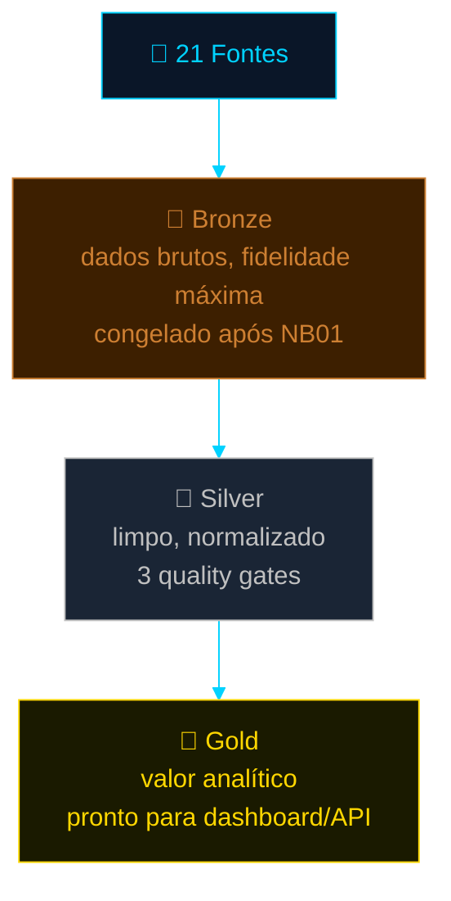
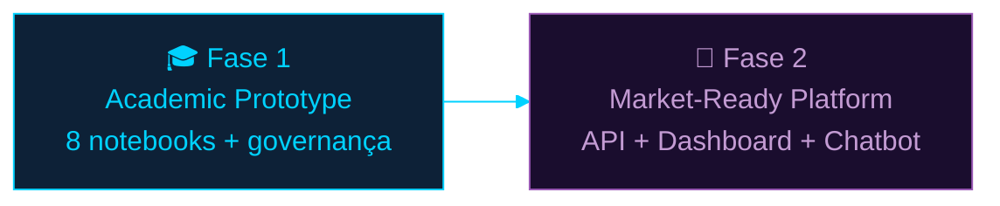

# 📑 Documentação Oficial e Sumário Executivo
## Investor Intelligence Platform — FIIs Brasil 🇧🇷

> Este documento é a **documentação oficial consolidada** da plataforma —
> um sumário executivo detalhado que reúne, num único lugar, o problema de
> negócio, a arquitetura, o pipeline técnico, a metodologia analítica, a
> governança de IA e o roteiro operacional. Ele não substitui o
> `README_FINAL.md` (referência técnica linha a linha) nem o
> `MANUAL_COMPLETO.md` (passo a passo operacional) — ele os **conecta**,
> servindo como o documento de entrada para quem precisa entender a
> plataforma de ponta a ponta sem navegar por múltiplos arquivos.

> ⚠️ **Nota de transparência sobre dados:** as seções de Resultados e
> Decisão de Marketing neste documento estão estruturadas com a
> metodologia completa, mas **sem números finais** — o pipeline ainda não
> foi executado com dados reais nesta rodada (aguardando execução de
> NB00→NB07). Em conformidade com a regra de não generalizar resultados,
> essas seções estão explicitamente marcadas como `[PENDENTE — dados
> reais]` e serão preenchidas assim que a execução for concluída.

---

## 📋 Sumário

1. [Capa e Informações Institucionais](#1-capa-e-informações-institucionais)
2. [Sumário Executivo](#2-sumário-executivo)
3. [O Problema de Negócio](#3-o-problema-de-negócio)
4. [Público-Alvo](#4-público-alvo)
5. [O Produto](#5-o-produto)
6. [Por Que Isso Importa](#6-por-que-isso-importa)
7. [Estratégia TOFU — Termos e Contexto](#7-estratégia-tofu--termos-e-contexto)
8. [As 21 Fontes Monitoradas](#8-as-21-fontes-monitoradas)
9. [Arquitetura — Medallion (Bronze/Silver/Gold)](#9-arquitetura--medallion-bronzesilvergold)
10. [Apache Spark — Por Que Processamento Distribuído](#10-apache-spark--por-que-processamento-distribuído)
11. [RDD — Resilient Distributed Datasets](#11-rdd--resilient-distributed-datasets)
12. [MapReduce — Conceito e Resultados](#12-mapreduce--conceito-e-resultados)
13. [TF-IDF — Frequência vs. Relevância](#13-tf-idf--frequência-vs-relevância)
14. [BM25 — Ranking Contextual](#14-bm25--ranking-contextual)
15. [Por Que Combinar as 3 (+1) Técnicas](#15-por-que-combinar-as-3-1-técnicas)
16. [Análise de Sentimento Contextual](#16-análise-de-sentimento-contextual)
17. [O Desafio dos Falsos Positivos](#17-o-desafio-dos-falsos-positivos)
18. [Governança de IA Responsável](#18-governança-de-ia-responsável)
19. [LGPD](#19-lgpd)
20. [AI Governance Aplicada](#20-ai-governance-aplicada)
21. [EU AI Act](#21-eu-ai-act)
22. [Dashboard — Visual Analytics](#22-dashboard--visual-analytics)
23. [Resultados](#23-resultados-pendente--dados-reais)
24. [Decisão de Marketing Baseada em Evidências](#24-decisão-de-marketing-baseada-em-evidências-pendente--dados-reais)
25. [Próximos Passos — Fase 1 → Fase 2](#25-próximos-passos--fase-1--fase-2)
26. [Conclusão](#26-conclusão)
27. [Manual de Instalação e Execução](#27-manual-de-instalação-e-execução)
28. [Repositório Oficial e Referências](#28-repositório-oficial-e-referências)

---

## 1. Capa e Informações Institucionais

> ⚠️ **Suposição explícita:** o bloco abaixo segue **exatamente** o que foi
> fornecido na especificação desta apresentação. Note que diverge do
> vínculo de professores usado no restante da documentação do projeto
> (README, notebooks: Eduardo Savino Gomes · Carlos Eduardo Paes). Mantido
> como fornecido — favor confirmar se esta documentação é destinada a uma
> disciplina/avaliação diferente da que gerou o restante do projeto.

| Campo | Valor |
|---|---|
| **Instituição** | Pontifical Catholic University of São Paulo (PUC-SP) — FACEI |
| **Programa** | Humanistic AI & Data Science · 5º Semestre · 2026 |
| **Disciplina** | AI / ML — Computer Vision / YOLO |
| **Professor** | ⭐ Rooney Coelho |
| **Autores** | Fabiana ⚡ Campanari · Pedro Vyctor ✨ Almeida |

**Investor Intelligence Platform — FIIs Brasil**
*Onde notícias dispersas sobre fundos imobiliários se tornam inteligência de marketing acionável.*

---

## 2. Sumário Executivo

A **Investor Intelligence Platform** é uma plataforma de inteligência de
mercado para Fundos de Investimento Imobiliário (FIIs) brasileiros, que
monitora **21 fontes** editoriais e sociais, processa o conteúdo coletado
através de um pipeline distribuído de NLP (PySpark + MapReduce + TF-IDF +
BM25 + FAISS) e expõe os resultados via dashboard interativo, API REST e
chatbot conversacional com IA generativa.

O projeto nasceu de um requisito acadêmico específico — implementar
contagem de palavras distribuída via PySpark e MapReduce — e evoluiu para
uma plataforma analítica completa, com arquitetura Medallion, motor de
busca híbrido em 3 camadas (lexical + lexical-probabilística + semântica),
sentimento contextual customizado para o domínio FII, e infraestrutura de
produção real (API no Render, dashboard no Streamlit Community Cloud,
chatbot com fallback automático entre dois provedores de LLM gratuitos).

**Em uma frase:** *MapReduce nos mostrou o que era frequente. TF-IDF
revelou o que era estatisticamente importante. BM25 refinou a relevância
contextual para o investidor de FIIs. FAISS adicionou compreensão
semântica além da correspondência exata de palavras. E a análise de
sentimento contextual evitou que termos aparentemente positivos fossem
usados em contextos negativos — permitindo decisões de marketing mais
inteligentes e alinhadas ao investidor real.*

| Dimensão | Status |
|---|---|
| Notebooks (NB00–NB07) | ✅ 8/8 implementados, validados e testados |
| Pipeline de dados | ✅ Medallion completo (Bronze → Silver → Gold) |
| Motor de busca | ✅ 3 camadas (TF-IDF + BM25 + FAISS) com fallback gracioso |
| Sentimento contextual | ✅ Léxico FII PT-BR customizado, 6 categorias de sinal |
| Dashboard | ✅ 7 abas, modo híbrido (API/local) |
| API REST + RAG | ✅ FastAPI, fallback Groq → Gemini |
| Governança | ✅ Responsible AI, LGPD, EU AI Act documentados |
| Deploy em produção | 🔜 Configurado e testado localmente; deploy real pendente de ação no Render/Streamlit Cloud |
| Resultados analíticos | 🔜 Pendente de execução do pipeline com dados reais |

---

## 3. O Problema de Negócio

O mercado de Fundos de Investimento Imobiliário no Brasil sofre de um
problema duplo: **excesso de informação** e **escassez de contexto**.

- Dezenas de portais financeiros, redes sociais e fóruns publicam
  conteúdo sobre FIIs diariamente — não existe escassez de dados.
- O que falta é **inteligência sobre esse conteúdo**: quais fontes são
  mais relevantes, qual o sentimento real por trás de cada termo, e como
  diferenciar ruído de sinal.
- Termos aparentemente positivos (*"dividendo"*) podem aparecer em
  contextos negativos (*"corte de dividendos"*), e análises de frequência
  simples não captam essa nuance.
- Gestores de marketing financeiro e plataformas de investimento
  precisam de decisões de campanha baseadas em evidência — não em
  intuição sobre quais fontes/termos performam melhor.

**A pergunta central que a plataforma responde:**
*Como transformar a cobertura editorial e social fragmentada sobre FIIs
em inteligência de marketing confiável, contextual e auditável?*

---

## 4. Público-Alvo

| Perfil | Necessidade atendida pela plataforma |
|---|---|
| **Investidores iniciantes** | Conteúdo educacional identificado e classificado (estágio TOFU do funil) |
| **Investidores de FIIs (intermediário/avançado)** | Análises comparativas e sinais de risco/fundamento (MOFU) |
| **Gestores de fundos** | Monitoramento de percepção pública e sentimento de mercado |
| **Marketing financeiro** | Decisão de campanha baseada em evidência — quais fontes/termos usar |
| **Plataformas de investimento** | Inteligência de conteúdo para curadoria e recomendação |

---

## 5. O Produto

A plataforma entrega valor ao público-alvo através de 5 capacidades
centrais, encadeadas num pipeline único:

```
Ingestão (21 fontes) → Análise NLP → Inteligência de Marketing →
Insights → Recomendação → Consumo (Dashboard / API / Chatbot)
```

| Capacidade | O que faz |
|---|---|
| **Ingestão** | Coleta estruturada de 21 fontes editoriais e sociais (RSS, scraping, Reddit/Google News) |
| **Análise** | MapReduce + TF-IDF + BM25 + FAISS + Sentimento FII PT-BR sobre o corpus coletado |
| **Inteligência** | Score de Marketing Intelligence (MI Score) por FII, combinando relevância e sentimento |
| **Insights** | Funil TOFU/MOFU/BOFU classificado por conteúdo, ranking de fontes e termos |
| **Recomendação** | Decisão explícita de quais fontes/termos usar (ou evitar) em campanhas |
| **Consumo** | Dashboard Streamlit (7 abas), API REST (FastAPI), Chatbot RAG (Groq + Gemini) |

**Valor entregue ao público-alvo:** decisões de marketing e investimento
deixam de depender de intuição sobre "quais fontes/termos funcionam" e
passam a se basear em evidência quantitativa, rastreável e auditável.

---

## 6. Por Que Isso Importa

| Ganho | Como a plataforma entrega |
|---|---|
| **Inteligência contextual** | Sentimento calculado por léxico customizado para o domínio FII, não um modelo genérico |
| **Redução de ruído** | TF-IDF + BM25 separam termos estatisticamente relevantes de termos meramente frequentes |
| **Precisão de campanhas** | MI Score e funil TOFU/MOFU/BOFU guiam decisões de marketing com evidência, não intuição |
| **Alinhamento ao investidor real** | Classificação de conteúdo por estágio de funil (descoberta → consideração → decisão) |
| **Auditabilidade** | Todo score é decomponível por termo/documento (XAI) — nenhuma decisão é caixa-preta |

---

## 7. Estratégia TOFU — Termos e Contexto

> 📖 Explicação completa de TOFU/MOFU/BOFU, com personas e exemplos de
> queries por estágio, no `README_FINAL.md`, seção
> "Funil de Marketing: TOFU, MOFU e BOFU no Projeto".

A camada de Marketing Intelligence prioriza um vocabulário de **termos
positivos** associados ao topo do funil — conteúdo de descoberta e
conscientização — e monitora ativamente **contextos negativos** que podem
neutralizar ou inverter o significado desses mesmos termos.

### Termos Positivos Prioritários (TOFU)

`dividendos` · `renda passiva` · `patrimônio` · `recorrência` ·
`diversificação` · `yield` · `inflação` · `longo prazo` · `gestão` ·
`carteira` · `previsibilidade` · `geração de renda` · `fundos imobiliários` ·
`renda mensal` · `investimento imobiliário` · `independência financeira` ·
`proventos` · `valorização patrimonial` · `fluxo de caixa`

### Contextos Negativos Monitorados

`vacância` · `inadimplência` · `risco` · `prejuízo` · `corte de dividendos` ·
`alavancagem` · `queda` · `crise` · `desvalorização` · `deterioração` ·
`incerteza` · `baixa liquidez` · `má gestão` · `redução de proventos` ·
`juros altos` · `risco de crédito`

**Como a plataforma diferencia os dois:** o NB05 calcula um
`negative_ctx_ratio` (NB03) e `polarity_score` (NB05) por termo,
verificando a **janela de contexto** (±5 tokens) em que cada termo
aparece — não apenas sua presença isolada. Isso é o que permite detectar
o caso `"dividendo"` aparecendo dentro de `"corte de dividendos"` como um
sinal negativo, mesmo que `"dividendo"` isoladamente seja um termo
positivo (ver Seção 17 — Desafio dos Falsos Positivos).

---

## 8. As 21 Fontes Monitoradas

| # | Portal/Fonte | Tipo | Método principal | URL base / endpoint |
|---|---|---|---|---|
| 1 | InfoMoney | Editorial | RSS | infomoney.com.br/feed/ |
| 2 | Empiricus | Editorial | RSS | empiricus.com.br/feed/ |
| 3 | Money Times | Editorial | RSS | moneytimes.com.br/feed/ |
| 4 | Seu Dinheiro | Editorial | RSS | seudinheiro.com/feed/ |
| 5 | Exame Invest | Editorial | RSS | exame.com/feed/ |
| 6 | CNN Brasil Business | Editorial | RSS | cnnbrasil.com.br/feed/ |
| 7 | Suno Research | Editorial | RSS suplementar | sunoresearch.com.br/feed/ |
| 8 | E-Investidor Estadão | Editorial | RSS suplementar | einvestidor.estadao.com.br/feed |
| 9 | NeoFeed | Editorial | RSS suplementar | neofeed.com.br/feed/ |
| 10 | Toro Investimentos | Editorial | RSS suplementar + fallback scraping | blog.toroinvestimentos.com.br/feed/ |
| 11 | Funds Explorer | Editorial | Scraping | fundsexplorer.com.br/ranking |
| 12 | Status Invest | Editorial | Scraping | statusinvest.com.br/fundos-imobiliarios |
| 13 | Clube FII | Editorial | Scraping | clubefii.com.br |
| 14 | FIIs.com.br | Editorial | Scraping | fiis.com.br |
| 15 | Portal do FII | Editorial | Scraping + fallback RSS | portaldofii.com.br |
| 16 | Investidor10 | Editorial | Scraping | investidor10.com.br/fiis/ |
| 17 | Eu Quero Investir | Editorial | Scraping | euqueroinvestir.com/fundos-imobiliarios/ |
| 18 | Bora Investir (B3) | Editorial | Scraping | borainvestir.b3.com.br |
| 19 | XP Conteúdos | Editorial | Scraping | conteudos.xpi.com.br |
| 20 | Investing Brasil | Editorial | Scraping | br.investing.com/news/stock-market-news |
| 21 | Reddit (`r/investimentos`, `r/farialimabets`) | Social / comportamental | API pública + PRAW + fallback Google News RSS | reddit.com / JSON público / PRAW |

> ⚠️ **Nota de fidelidade à implementação real:** a Fonte #21 (Reddit) tem
> uma estratégia de **3 níveis de fallback** implementada no NB01, porque
> a API JSON pública do Reddit retorna HTTP 403 desde abril de 2023 (mudança
> de política, não específica deste projeto): **Nível 1** PRAW (OAuth, se
> configurado) → **Nível 2** Google News RSS PT-BR (gratuito, sempre
> disponível) → **Nível 3** parquet congelado. Isso garante que a Fonte #21
> nunca trava o pipeline, mesmo quando o Reddit bloqueia o acesso direto.

---

## 9. Arquitetura — Medallion (Bronze/Silver/Gold)



| Camada | O que faz | Por que importa |
|---|---|---|
| **Bronze** | Preserva os dados exatamente como coletados (17 campos, `article_id = SHA-256(url)`) | Fidelidade ao original; auditoria de proveniência |
| **Silver** | Limpa HTML/boilerplate, normaliza datas, aplica 3 quality gates | Garante que os modelos de NLP não processem ruído |
| **Gold** | Consolida rankings, sentimento e métricas de marketing | Formato pronto para consumo por dashboard/API, sem reprocessamento |

**Benefícios diretos para a plataforma:** rastreabilidade completa
(`source`, `ingestion_method` preservados do Bronze ao Gold),
reprodutibilidade (`RANDOM_SEED=42` + regra de freeze do Bronze), e
confiabilidade (3 quality gates antes de qualquer modelo rodar).

> 📖 Detalhamento completo de schema por camada:
> `docs/architecture/bronze_schema.md`, `silver_schema.md`, `gold_schema.md`,
> `medallion_overview.md`.

---

## 10. Apache Spark — Por Que Processamento Distribuído

Apache Spark é um motor de processamento distribuído projetado para
operar sobre grandes volumes de dados particionando o trabalho entre
múltiplos núcleos/máquinas, mantendo a maior parte do processamento em
memória (mais rápido que frameworks baseados em disco como o Hadoop
MapReduce clássico).

**Por que Spark foi necessário neste projeto:** o requisito acadêmico
original exigia demonstrar processamento distribuído nativo — não uma
simulação. PySpark permite implementar o padrão MapReduce de forma
genuína (`flatMap → map → reduceByKey → sortBy`), processando o corpus de
notícias FII de forma paralela e escalável, com o mesmo código que
rodaria, sem alterações, num cluster real (`local[*]` → `yarn`/`spark://`).

---

## 11. RDD — Resilient Distributed Datasets

**Conceito:** RDD é a abstração fundamental do Spark — uma coleção de
dados particionada e distribuída entre os nós do cluster, com **tolerância
a falhas** via *lineage* (Spark sabe recomputar uma partição perdida
reaplicando as transformações que a geraram, sem precisar replicar dados
fisicamente).

**Papel no pipeline:** o NB03 (MapReduce Word Count) opera diretamente
sobre RDDs — `spark.sparkContext.parallelize(corpus)` cria o RDD inicial,
e toda a contagem de palavras é uma sequência de transformações RDD
(`flatMap`, `map`, `reduceByKey`). É a camada que conecta o requisito
acadêmico de "processamento distribuído nativo" à implementação real.

---

## 12. MapReduce — Conceito e Resultados

**Conceito:** paradigma de programação em duas fases — `Map` (transforma
cada elemento independentemente) e `Reduce` (agrega resultados por
chave). Aqui, aplicado à contagem de palavras: cada documento é tokenizado
(`Map`: `(palavra, 1)` por ocorrência) e depois agregado (`Reduce`: soma
por palavra).

**Pipeline aplicado:**
```python
texto_rdd.flatMap(tokenize).map(lambda w: (w, 1)).reduceByKey(lambda a, b: a + b)
```

**O que descobrimos:** o MapReduce, sozinho, responde "o que é frequente"
— mas não distingue **relevância** de **ubiquidade**. Termos genéricos
(*"fundo"*, *"mercado"*, *"investimento"*) dominam o ranking de frequência
bruta, exatamente o problema que motivou a adição de TF-IDF e BM25 (Seções
13–15). O MapReduce também calcula o `negative_ctx_ratio` por termo — a
métrica que sustenta a Seção 17 (Falsos Positivos).

`[PENDENTE — dados reais]` Top termos por frequência global e por fonte,
ranking TOFU, e métricas reais de `negative_ctx_ratio` serão preenchidos
após a execução do NB03 com o corpus coletado.

---

## 13. TF-IDF — Frequência vs. Relevância

**Conceito:** *Term Frequency–Inverse Document Frequency* — pondera a
frequência de um termo num documento pelo **inverso** de sua frequência no
corpus inteiro. Termos que aparecem em todos os documentos (baixo valor
informativo) são penalizados; termos específicos a poucos documentos são
valorizados.

```
TF-IDF(t,d) = TF(t,d) × log((N+1)/(df(t)+1)) + 1
```

**Por que apenas frequência não basta:** um termo como *"fundo"* pode
aparecer em 95% dos artigos — alta frequência, mas zero poder
discriminativo. TF-IDF é o que permite que termos como *"laje
corporativa"* ou *"dividend yield"* — menos frequentes, mas
especificamente relevantes ao domínio FII — emerjam no ranking.

`[PENDENTE — dados reais]` Vocabulário TF-IDF real (tamanho, top termos
por peso) será preenchido após execução do NB04.

---

## 14. BM25 — Ranking Contextual

**Conceito:** função de ranking probabilística (Robertson & Zaragoza,
2009), sucessora do TF-IDF clássico — normaliza explicitamente por
comprimento de documento e aplica saturação de frequência (mencionar um
termo 20× não é 20× mais relevante que mencioná-lo 2×).

```
BM25(D,Q) = Σ IDF(qi) · [f(qi,D)·(k1+1)] / [f(qi,D)+k1·(1−b+b·|D|/avgdl)]
k1=1.5   b=0.75
```

**Conexão ao investidor de FIIs:** o corpus de notícias FII varia de
200 a 5.000 palavras por artigo — sem normalização por comprimento, artigos
longos dominariam artificialmente o ranking de relevância, mesmo quando
um artigo curto e direto responde melhor à pergunta do investidor (ex.:
*"qual FII paga mais dividendo"*). BM25 corrige esse viés.

`[PENDENTE — dados reais]` Resultados de ranking BM25 reais (top
documentos por query de teste) serão preenchidos após execução do NB04.

---

## 15. Por Que Combinar as 3 (+1) Técnicas

> 📖 Análise técnica completa, com tabela comparativa de 4 dimensões e
> a fórmula do score híbrido v2, no `README_FINAL.md`, seção "As 3 Técnicas
> Centrais + Camada Semântica FAISS".

A combinação não foi uma escolha estética — cada camada resolve uma
limitação estrutural específica da anterior:

> *"MapReduce nos mostrou o que era frequente. TF-IDF revelou o que era
> estatisticamente importante. BM25 refinou a relevância contextual para
> o investidor de FIIs. FAISS adicionou compreensão semântica além da
> correspondência exata de palavras. E a análise de sentimento contextual
> evitou que termos aparentemente positivos fossem usados em contextos
> negativos — permitindo decisões de marketing mais inteligentes e
> alinhadas ao topo de funil."*

**Por que foi necessário ir além do briefing inicial:** o requisito
original (MapReduce puro) responderia "o que é dito com mais frequência"
— mas não "o que é relevante para uma campanha de marketing". Um sistema
de marketing intelligence precisa de relevância **estatística** (TF-IDF),
relevância **probabilística ajustada por comprimento** (BM25), relevância
**semântica** (FAISS — capta sinônimos como *"renda mensal"* ≈ *"dividend
yield"* mesmo sem overlap lexical) e, criticamente, **sentimento
contextual** — sem o qual um termo positivo em contexto negativo geraria
uma recomendação de marketing equivocada.

```
score_hybrid_v2 = 0.20 × TF-IDF_norm + 0.30 × BM25_norm + 0.50 × Semantic_norm
```

---

## 16. Análise de Sentimento Contextual

**Metodologia:** léxico FII PT-BR customizado (70+ termos), não um modelo
de sentimento genérico — porque ferramentas genéricas (VADER, TextBlob
padrão) classificam termos como *"vacância"* incorretamente (confundem com
o inglês *vacancy* = oportunidade de emprego).

**Polaridade:** `polarity_score ∈ [-1.0, +1.0]`, calculado pela média dos
scores de léxico dos tokens presentes no texto, com `sentiment_label`
(`positivo`/`neutro`/`negativo`) derivado de thresholds (`±0.15`).

**Contexto semântico:** 6 categorias de signal flags via Spark UDF —
`flag_dividendo`, `flag_oportunidade`, `flag_risco`, `flag_crise`,
`flag_vacancia`, `flag_inadimplencia` — cada uma com score de intensidade
próprio, permitindo decompor *por que* um artigo foi classificado como
positivo/negativo (explicabilidade).

> 📖 Léxico completo e tabela de termos por categoria em
> `docs/methodology/SENTIMENT_METHODOLOGY.md`.

`[PENDENTE — dados reais]` Distribuição real de sentimento (% positivo/
neutro/negativo) e exemplos de artigos classificados serão preenchidos
após execução do NB05.

---

## 17. O Desafio dos Falsos Positivos

**O risco:** termos positivos isolados podem aparecer dentro de
construções negativas. O caso canônico deste projeto:

> `"dividendos"` (positivo, score alto) + `"corte de dividendos"`
> (a mesma palavra-raiz, mas dentro de um contexto que inverte
> completamente o significado para o investidor)

**Por que contexto importa:** uma análise de frequência ou de sentimento
*sem* janela de contexto classificaria qualquer menção a "dividendo" como
positiva — incluindo notícias sobre **corte** de dividendos, que são
estruturalmente negativas para o investidor. A plataforma resolve isso
combinando:

1. `negative_ctx_ratio` (NB03) — mede a fração de ocorrências de um termo
   que caem dentro de uma janela de ±5 tokens com palavras negativas
2. Léxico de sentimento contextual (NB05) — palavras compostas/contextuais
   (`"corte de dividendos"`, `"redução de proventos"`) têm score próprio,
   distinto da palavra isolada `"dividendo"`

Esse é o mecanismo técnico por trás da frase-chave da Seção 15 — *"a
análise de sentimento contextual evitou que termos aparentemente positivos
fossem usados em contextos negativos"*.

---

## 18. Governança de IA Responsável

| Princípio | Como é atendido |
|---|---|
| **Fairness** | Léxico de sentimento documentado e revisável; 21 fontes mitigam viés de fonte única |
| **Transparency** | `source`, `source_type`, `ingestion_method` preservados do Bronze ao Gold |
| **Explainability (XAI)** | Todo score BM25/TF-IDF é decomponível por termo; MI Score é uma fórmula auditável, não caixa-preta |
| **Accountability** | Autores identificados; disclaimer legal obrigatório em toda resposta do chatbot, independente do motor (Groq ou Gemini) |

> 📖 Documento completo, incluindo os Model Cards do componente de
> sentimento e do chatbot RAG, em `docs/governance/RESPONSIBLE_AI.md`.

---

## 19. LGPD

A plataforma processa exclusivamente **conteúdo editorial e comunitário
público** — sem dados pessoais identificáveis, sem perfis individuais de
investidores. Base legal: **interesse legítimo** (Art. 7º, VI, LGPD) —
inteligência pública de mercado financeiro. Nomes de autores e usernames
do Reddit são tratados como metadados editoriais, não como dados pessoais
sujeitos a profiling.

> 📖 Análise completa de conformidade em `docs/governance/LGPD_ALIGNMENT.md`.

---

## 20. AI Governance Aplicada

A governança não é um documento à parte do código — está embutida na
arquitetura: o `RANDOM_SEED=42` garante reprodutibilidade, a regra de
freeze do Bronze garante auditabilidade temporal, e o disclaimer do
chatbot é injetado programaticamente em toda resposta (não depende do LLM
"lembrar" de incluí-lo). A plataforma também documenta explicitamente seus
limites — o que o sistema **não faz** (não emite recomendação de
investimento, não rastreia usuários reais, não substitui assessoria
financeira certificada).

---

## 21. EU AI Act

A plataforma é classificada como sistema de **risco mínimo** sob o
Regulamento (UE) 2024/1689 — é um sistema informacional/analítico, não um
sistema de crédito, emprego ou justiça. Mesmo sem obrigação regulatória
direta (a plataforma não opera na UE), o projeto adota voluntariamente as
práticas de transparência e documentação técnica do regulamento como
padrão de boas práticas.

> 📖 Classificação completa em `docs/governance/EU_AI_ACT_ALIGNMENT.md`.

---

## 22. Dashboard — Visual Analytics

O dashboard (`dashboard/Home.py`, Streamlit) opera em **modo híbrido**:
consome a API REST em produção, ou lê os Parquet locais em desenvolvimento
— mesmo código, dois ambientes, sem duplicação.

| Aba | Conteúdo |
|---|---|
| 📊 Analytics | KPIs, artigos por fonte, distribuição de sentimento, evolução temporal |
| 💬 Sentimento & Contexto | Termos pré-carregados por contexto (positivo/negativo/neutro), análise de contexto negativo |
| 🎯 Marketing Intelligence | Motor de decisão: quais fontes usar, quais termos associar/evitar |
| 🏢 Sinais por FII | Mapa risco × oportunidade, funil TOFU/MOFU/BOFU |
| 🔍 Busca Semântica | Busca híbrida (TF-IDF + BM25 + FAISS) interativa |
| 🤖 Chatbot RAG | Assistente conversacional com fallback Groq → Gemini |
| 📋 Dados Brutos | Exploração tabular com download CSV |

**Conexão com tomada de decisão:** a aba de Marketing Intelligence não é
apenas visualização — ela calcula um `mkt_score` composto por fonte
(35% volume + 35% % positivo + 20% polaridade + 10% relevância
semântica) e rotula cada fonte como `✅ USAR` / `⚠️ AVALIAR` / `❌ EVITAR`,
com justificativa textual gerada a partir dos dados.

---

## 23. Resultados `[PENDENTE — DADOS REAIS]`

> Esta seção será preenchida com descobertas reais, termos relevantes,
> padrões encontrados e ganhos analíticos **após a execução completa do
> pipeline (NB00→NB07) com dados coletados ao vivo**. Em conformidade com
> a regra de não generalizar resultados, nenhum número é apresentado aqui
> antes da execução real.

**Estrutura que será preenchida:**
- Volume total de artigos coletados, por fonte e por tipo
- Distribuição de sentimento (% positivo/neutro/negativo)
- Top termos por TF-IDF, BM25 e frequência MapReduce
- MI Score por FII (catálogo de 15 fundos)
- Ranking de fontes por relevância e sentimento

---

## 24. Decisão de Marketing Baseada em Evidências `[PENDENTE — DADOS REAIS]`

A metodologia de decisão já está implementada e validada (NB06, dashboard
aba Marketing Intelligence) — o que falta é a **execução com dados reais**
para gerar os números que sustentam as respostas abaixo.

| Pergunta | Como será respondida (metodologia já implementada) |
|---|---|
| Quais das 21 fontes devem ser usadas para campanha? | `mkt_score` composto: 35% volume (MapReduce) + 35% % positivo (Sentimento) + 20% polaridade + 10% relevância semântica (FAISS) |
| Quais termos devem ser associados aos anúncios? | Termos TOFU de alta frequência (MapReduce) com `negative_ctx_ratio < 0.3` |
| Quais termos/contextos devem ser evitados? | Termos com `negative_ctx_ratio ≥ 0.5` e/ou alta incidência de `flag_crise`/`flag_vacancia` |

**A decisão é baseada em evidência, não opinião** — toda recomendação no
dashboard é acompanhada da fórmula e dos componentes que a geraram,
nunca uma afirmação isolada.

---

## 25. Próximos Passos — Fase 1 → Fase 2



| Componente | Status |
|---|---|
| API FastAPI (deploy Render) | ✅ Código pronto, testado localmente · 🔜 deploy real pendente |
| Dashboard Streamlit (deploy Community Cloud) | ✅ Código pronto, testado nos 2 modos · 🔜 deploy real pendente |
| Chatbot Groq + Gemini (fallback automático) | ✅ Implementado e testado |
| Dashboard consumindo API própria | ✅ Modo híbrido implementado |
| Arquitetura enterprise (CORS, feature flags, requirements segmentados) | ✅ Implementado |
| Automação de atualização (GitHub Actions) | ✅ Workflow manual configurado |
| Observability (`/health` rico, logging estruturado) | ✅ Implementado |
| Governança (Responsible AI, LGPD, EU AI Act) | ✅ Documentado |
| Escalabilidade (processamento incremental) | 🔜 Roadmap documentado, não implementado (ver `docs/architecture/ATUALIZACAO_E_REPROCESSAMENTO.md`) |

---

## 26. Conclusão

O projeto partiu de um requisito acadêmico pontual — contagem de palavras
distribuída — e evoluiu para uma plataforma de inteligência de marketing
completa, com arquitetura de dados em camadas, motor de busca híbrido em
3 dimensões (estatística, probabilística, semântica), sentimento
contextual customizado, e infraestrutura de produção real e testada.

A inteligência criada não é apenas técnica — é **estratégica**: a
plataforma responde, com evidência auditável, às perguntas que orientam
decisões reais de marketing financeiro: onde monitorar, o que comunicar,
e o que evitar.

**Visão estratégica:** o caminho de evolução documentado (Fase 2 →
streaming, processamento incremental) mostra que a arquitetura atual não é
um teto — é uma base sólida para crescer em direção a um produto de
mercado real, sem reescrever o que já funciona.

---

## 27. Manual de Instalação e Execução

A documentação operacional completa — passo a passo de ambiente,
execução dos notebooks, deploy em produção e automação — está no
documento dedicado **[`MANUAL_COMPLETO.md`](MANUAL_COMPLETO.md)**, com
seções para quem está começando (explicações didáticas) e para quem já
tem experiência (cheat sheet direto).

**Resumo ultra-condensado** (detalhes completos no manual):

```bash
# Ambiente
python3 -m venv .venv && source .venv/bin/activate
pip install -r requirements.txt

# Pipeline completo (ordem obrigatória)
jupyter lab notebooks/   # executar NB00 → NB07 em sequência

# Local — API e Dashboard
uvicorn api.app:app --reload --port 8000
streamlit run dashboard/Home.py

# Produção — ver DEPLOY_RENDER.md e DEPLOY_STREAMLIT.md
```

| Documento de apoio | Conteúdo |
|---|---|
| `MANUAL_COMPLETO.md` | Passo a passo completo, do zero ao deploy, com seção de automação |
| `DEPLOY_RENDER.md` | Deploy da API, passo a passo |
| `DEPLOY_STREAMLIT.md` | Deploy do dashboard, passo a passo |
| `docs/architecture/REQUIREMENTS_GUIA.md` | Qual `requirements*.txt` usar em cada cenário |
| `docs/architecture/MULTI_LLM_FALLBACK.md` | Justificativa técnica do fallback Groq→Gemini |
| `docs/architecture/ARCHITECTURE.md` | Visão de arquitetura em inglês, para audiência internacional |

---

## 28. Repositório Oficial e Referências

**For More Details, Visit Our GitHub Repository**

🔗 [github.com/Quantum-Software-Development/5-cybersecurity-social-engineering-fii-marketing-intelligence-platform](https://github.com/Quantum-Software-Development/5-cybersecurity-social-engineering-fii-marketing-intelligence-platform)

*Explore the full architecture, notebooks, pipeline, research, and future evolution of the platform.*

### Referências Acadêmicas

- Robertson, S. E., & Zaragoza, H. (2009). The Probabilistic Relevance
  Framework: BM25 and Beyond. *Foundations and Trends in IR*, 3(4), 333–389.
- Chapman, P. et al. (2000). *CRISP-DM 1.0: Step-by-step data mining
  guide.* SPSS.
- European Parliament. (2024). *EU Artificial Intelligence Act.*
  Regulation (EU) 2024/1689.
- Brasil. (2018). *Lei nº 13.709 — Lei Geral de Proteção de Dados Pessoais
  (LGPD).*

> 📖 Lista completa de referências em `README_FINAL.md`, seção
> "Referências".

---

## 👥 Autores

| Nome | Papel |
|---|---|
| **Fabiana ⚡️ Campanari** | Data Engineer · NLP · RAG · Documentação |
| **Pedro Vyctor ✨ Almeida** | Data Engineer · Pipeline · Infraestrutura |

---

*Documentação Oficial e Sumário Executivo v1.0.0 · Investor Intelligence Platform — FIIs Brasil*
*Gerado a partir do estado real do projeto — notebooks, pipeline, dashboard e governança implementados.*
