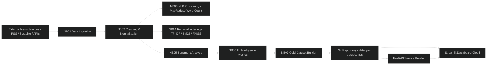
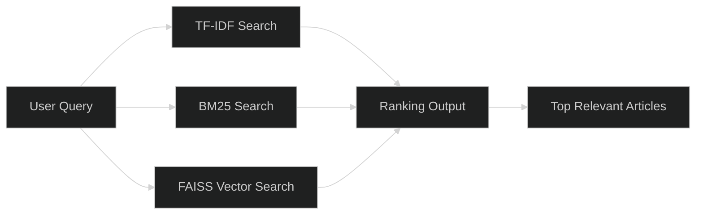
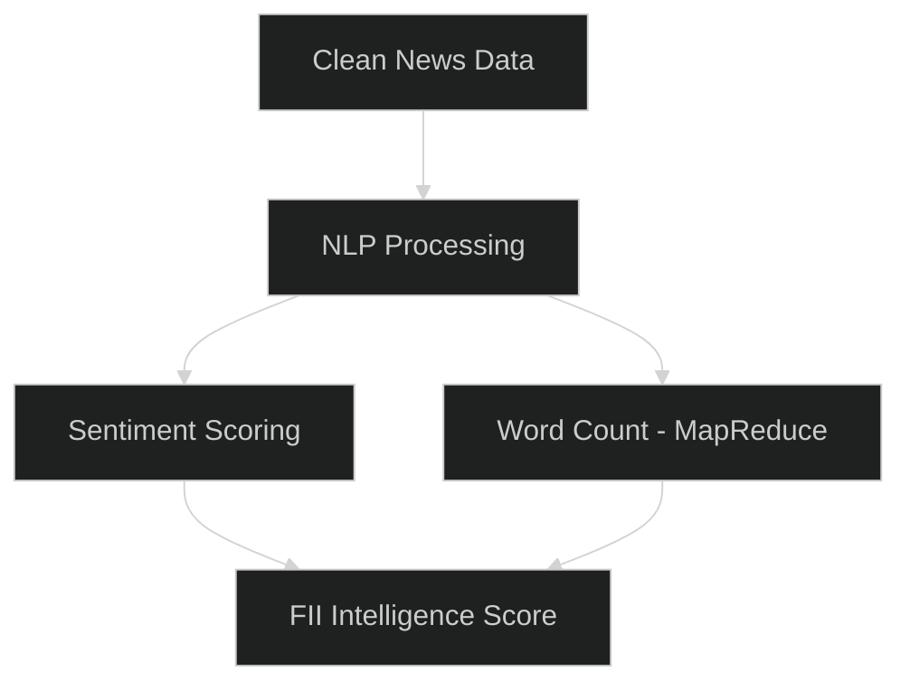
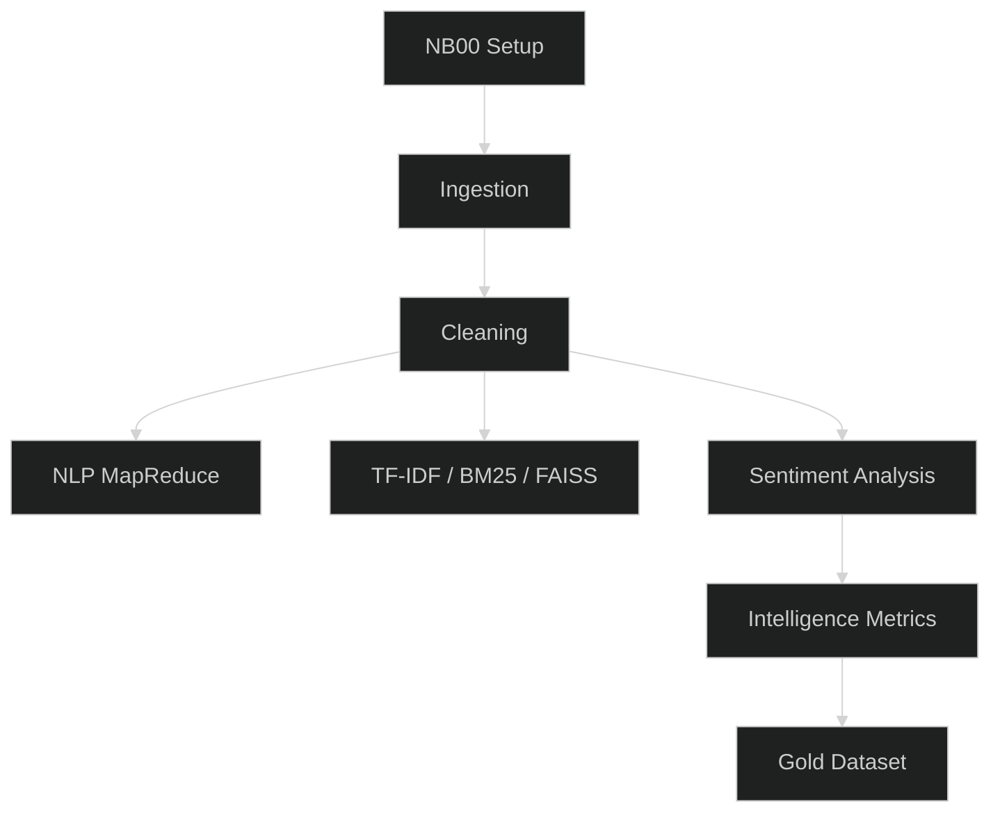
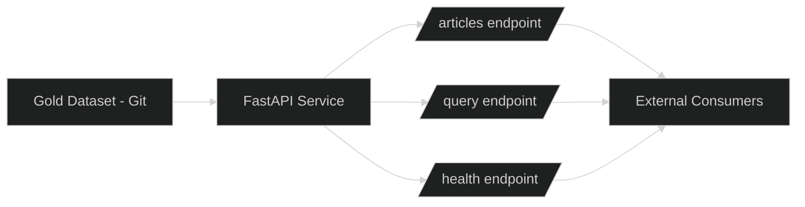
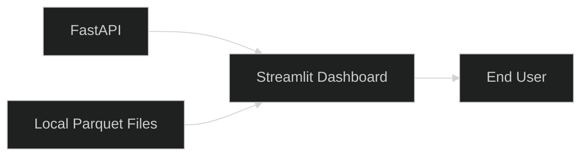
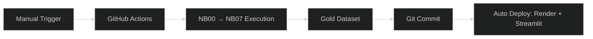

#  Investor Intelligence Platform 🇧🇷 FIIs Brazil 
###  Technical Documentation 

  

##  1. Project Overview

This project is a **data pipeline + retrieval + analytics system** focused on Brazilian REITs (FIIs).

It transforms raw financial news into structured datasets and enables:

* search and retrieval of relevant financial content
* sentiment analysis of news
* aggregated intelligence signals for FIIs
* API serving for external consumption
* interactive dashboard for analysis

  

##  2. System Architecture (Faithful)

### 🧠 Real System Flow

 

  

##  3. Data Architecture (Medallion Pattern)

### 🥉 Bronze Layer (Ingestion)

* RSS feeds
* news scraping (requests + BeautifulSoup)
* external financial sources

📌 Raw, unstructured text

 

### 🥈 Silver Layer (Processing)

* text cleaning
* normalization
* deduplication
* formatting into structured records

📌 Clean structured dataset

 

### 🥇 Gold Layer (Final Outputs)

* sentiment scores
* retrieval indexes
* FII-level aggregated signals
* dashboard-ready datasets

📌 Business-ready intelligence layer

  

##  4. Retrieval System (Core Feature)

The system implements **hybrid search**:

* TF-IDF (lexical similarity)
* BM25 (ranking improvement)
* FAISS (semantic vector search)

  

### Retrieval Flow

 

  

##  5. NLP & Analytics Pipeline

Implemented in notebooks:

* NB03 → MapReduce word frequency (PySpark)
* NB05 → sentiment analysis (lexicon-based)
* NB06 → FII intelligence scoring

  

### Processing Chain

 

  

## 6. Pipeline Execution (Batch System)

The system runs as a **sequential notebook pipeline**:

 

📌 Execution mode: **Batch processing (not streaming)**

  

## 🛰️ 7. API Layer (FastAPI)

The API serves processed data from the Gold layer.

### Responsibilities:

* expose structured endpoints
* serve retrieved articles
* handle query requests
* provide JSON responses

 

### API Flow

 

  

## 8. Dashboard Layer (Streamlit)

The dashboard provides:

* interactive visualization
* FII signals
* sentiment analysis
* ranked news exploration

  

### Dashboard Flow

 

  

##  9. Deployment Architecture

### Real deployment setup:

* API → Render (FastAPI)
* Dashboard → Streamlit Cloud
* Data → Git repository (versioned)

 

  

##  10. Automation Pipeline

The system is updated via GitHub Actions (manual trigger):

 

  

## ⚠️ 11. Key Design Decisions

### Why Batch Processing?

* reproducibility of datasets
* easier debugging of pipelines
* lower infrastructure cost
* deterministic outputs

 

### Trade-offs

 

| Choice            | Impact                           |
| ----------------- | -------------------------------- |
| Batch processing  | not real-time                    |
| Git as storage    | simple but size-limited          |
| Notebook pipeline | slower than production ETL tools |

  

##  12. Technologies Used

* Python 3.11
* PySpark
* Pandas / NumPy
* Scikit-learn
* FAISS
* FastAPI
* Streamlit
* NLTK
* BeautifulSoup
* GitHub Actions

  

##  13. Final Summary

This system implements a full **data-to-intelligence pipeline**:

### Core capabilities:

* data ingestion (multi-source)
* cleaning and normalization
* NLP processing (MapReduce + sentiment)
* hybrid retrieval engine
* structured intelligence scoring
* API serving layer
* interactive dashboard

  

## ⚡️ Portfolio Positioning

This project demonstrates:

* data engineering pipeline design
* NLP processing at scale (PySpark)
* hybrid retrieval systems (IR + vector search)
* full-stack data product architecture
* production-style deployment workflow

