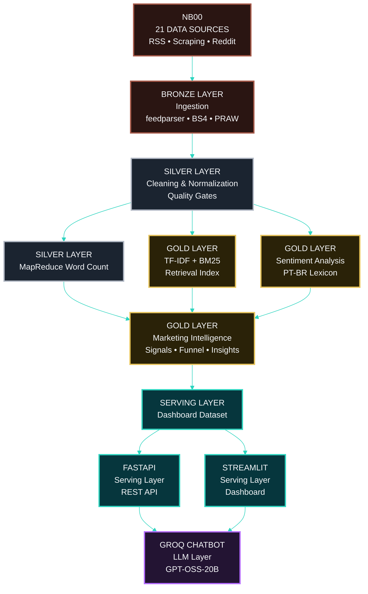

<!-- ======================================= ⚡️ Start DEFAULT HEADER ===========================================  -->
<!-- ========= START LANGUAGE BUTTON ========= -->
**\[[🇧🇷 Português](README.pt_BR.md)\] \[**[🇬🇧 English](README.md)**\]**

<br><br>
<!-- ========= END LANGUAGE BUTTON ========= -->


<!-- ========= START REPO TITLE ========= -->
# <p align="center"> [Investor Intelligence Platform  🇧🇷  Brazilian FIIs]() 

### <p align="center"> Real Estate Investment Funds (FIIs) - Market Intelligence & Behavioral Analytics

<br>

$$\Huge {\textbf{\color{green} CRISP-DM} \space \textbf{\color{white} •} \space \textbf{\color{yellow}  Data Lakehouse} \space \textbf{\color{white} •} \space \textbf{\color{green} NLP} \space \textbf{\color{white} •} \space \textbf{\color{yellow} Responsible AI} \space \textbf{\color{white} •} \space \textbf{\color{green} Regulatory Alignment}}$$

<br>

### <p align="center"> ***An institutional-grade intelligence platform for monitoring, structuring, ranking, and interpreting Brazilian Real Estate Investment Fund (FII) signals from financial media, research portals, and investor communities.***

<br>

#### <p align="center"> [Big Data]() • [PySpark]() • [MapReduce Word Count]() • [NLP]() • [TF-IDF]() • [BM25 Ranking]() • [Hybrid Retrieval]() • [FAISS + Multilingual Embeddings]() • [Web Scraping]() • [TOFU/MOFU/BOFU]() • [CRISP-DM]() • [FastAPI]() • [Streamlit]() • [Docker]() • [Responsible AI]() • [LGPD]() • [EU AI Act Alignment]()

<br><br>
<!-- ========= END REPO TITLE ========= -->

<!-- ========= START SPONSOR BADGES ========= -->
### <p align="center"> [](https://github.com/sponsors/Quantum-Software-Development)

<br><br>
<!-- ========= END SPONSOR BADGES ========= -->

<!-- ========= START DEMO VIDEO ========= -->
<p align="center">
   

 </p>

<!--
#### 🖤 Creative Direction, Music Curation & Editing by Fab⚡️  
##### 🎶 [Soundtrack:]() "Canon in D" — Johann Pachelbel
-->

<br><br>
<!-- ========= END DEMO VIDEO ========= -->


<!-- ========= START Institutional INFO ========= -->
## 🎓 Academic 

<br>

**Institution:** Pontifical Catholic University of São Paulo (PUC-SP) — FACEI  
[**Bachelor’s Program:**]() Humanistic AI & Data Science • 5th Semester • 2026  
[**Course:**]() AI Security, Cybersecurity & Social Engineering  
**Professors** [✨ Carlos Eduardo Paes](https://www.linkedin.com/in/carlos-eduardo-de-barros-paes-ph-d-7b137a4/)  and  [✨ Eduardo Savino Gomes]() 
**Project Authors:** [Fabiana ⚡️ Campanari](https://linktr.ee/fabianacampanari) and [Pedro Vyctor  Almeida](https://www.linkedin.com/in/pedro-vyctor-almeida-285b89273/)

<br><br>

#

<br><br>
<!-- ========= END Institutional INFO ========= -->


<!-- ========= START Dashboard Streamlit ========= -->
<p align="center">
  <a href="" target="_blank" rel="noopener noreferrer">
    
  </a>
</p>
<!-- ========= END Dashboard Streamlit ========= -->

<!-- ========= START REACT APP ========= -->
<p align="center">

  <a href="https://euphonious-churros-b68a51.netlify.app" target="_blank" rel="noopener noreferrer">
    
  </a>
  <!-- ========= END REACT APP ========= -->

<!-- ========= START PPTX ========= -->
  <a href="" target="_blank" rel="noopener noreferrer">
    
  </a>

</p>
<!-- ========= END PPTX ========= -->

<!-- ========= START DATA ANALYSING REPORT ========= -->
<p align="center">
  <a href="">
    
  </a>
</p>

<br><br>

#

<br><br>
<!-- ========= END DATA ANALYSING REPORT ========= -->
<!-- ===================== END BADGE GROUP 1 ===================== -->


<!-- ========= START NOTE ========= -->
> [!TIP]
> 🔗 **[Cybersecurity, Social Engineering & AI Security — Hub Repository](https://github.com/Quantum-Software-Development/1-Cybersecurity-SocialEngineering_Hub)**  <br>
>
> ###  Real Estate Investment Funds (FIIs) 🇧🇷 Market Intelligence & Behavioral Analytics
> 
> A scalable platform combining **Big Data, PySpark, MapReduce, Word Count, NLP, TF-IDF, BM25, FAISS, multilingual embeddings, Web Scraping, Hybrid RAG** and AI-assisted analytics to
> transform large-scale financial discussions into actionable insights for FIIs.<br>
> 
> <br>
>
> $$\Huge {\textbf{\color{green} Where market discussions become investment narratives…}}$$
>
> $$\Huge {\textbf{\color{yellow} because markets talk a lot...}}$$
> 
> $$\Huge {\textbf{\color{green} intelligent systems just listen better}}$$
>
> ### <p align="center"> ⚡


<br><br>

#

<br><br>
<!-- ========= END NOTE ========= -->

<!-- ========= START !WARNING] ========= -->
> [!WARNING]
>
> <br>
> ⚠️ Projects may be publicly shared when permitted.  
> The focus is on applied, hands-on learning with real datasets in AI governance and security contexts.  
> All sensitive content remains protected in private repositories when required.  <br><br> 
> 
> ⚠️ Disclaimer
> Plataforma exclusivamente educacional e analítica. Não constitui recomendação de investimento.

<br><br><br><br>
<!-- ========= END!WARNING]========= -->

## Table of Contents

1. [Academic and Institutional Context](#-academic-and-institutional-context)
2. [Product Overview and Definition](#-product-overview-and-definition)
3. [Objectives](#-objectives)
4. [Target Audience](#-target-audience)
5. [Why This Matters](#-why-this-matters)
6. [Source Coverage](#-source-coverage)
7. [Collection Strategy by Source Type](#-collection-strategy-by-source-type)
8. [Official Data Sources — 21 Monitored Sources](#-official-data-sources--21-monitored-sources)
9. [High-Level Architecture](#-high-level-architecture)
10. [Pipeline NB00–NB07](#-pipeline-nb00nb07)
11. [Serving Architecture — FastAPI + RAG](#-serving-architecture--fastapi--rag)
12. [Project Structure](#-project-structure)
13. [API Layer (FastAPI)](#-api-layer-fastapi)
14. [Main Endpoint — Semantic Query](#-main-endpoint--semantic-query)
15. [Retrieval Layer (RAG via BM25)](#-retrieval-layer-rag-via-bm25)
16. [Generation Layer (LLM — Groq)](#-generation-layer-llm--groq)
17. [End-to-End Flow](#-end-to-end-flow)
18. [Expanded Analytical Methodology](#-expanded-analytical-methodology)
19. [The 3 Core Techniques: MapReduce + TF-IDF + BM25](#-the-3-core-techniques-mapreduce--tf-idf--bm25--how-they-complement-each-other)
20. [Focus on Marketing Intelligence: TOFU and Negative Context](#-focus-on-marketing-intelligence-tofu-and-negative-context)
21. [From Academic Requirement to Analytical Platform](#-from-academic-requirement-to-analytical-platform)
22. [What This Platform Delivers](#-what-this-platform-delivers)
23. [Cybersecurity and Social Engineering Perspective](#-cybersecurity-and-social-engineering-perspective)
24. [Notebooks NB00–NB07: Technical Report](#-notebooks-nb00nb07-technical-report)
25. [Big Data Infrastructure](#-big-data-infrastructure)
26. [Governance](#-governance)
27. [How to Run](#-how-to-run)
28. [Makefile — Complete Reference](#-makefile--complete-reference)
29. [Delivery Roadmap](#-delivery-roadmap)
30. [Portfolio Evolution](#-portfolio-evolution)
31. [Expected Outputs](#-expected-outputs)
32. [Documentation Set](#-documentation-set)
33. [References](#-references)


<br><br>

## [🎓 Academic and Institutional Context]()

<br>

This project was developed at PUC-SP in the courses of cybersecurity, social engineering, data engineering and Big Data analytics applied to financial markets. The original requirement focused on demonstrating a distributed word count solution using PySpark and the MapReduce paradigm.

From this starting point, the repository was extended to incorporate more advanced analytical techniques (TF-IDF, BM25, contextual sentiment), a serving architecture with FastAPI + RAG and a structured pipeline oriented towards FII marketing intelligence.

<br><br>

## [Academic Requirements Met]()

<br>

| [Requirement]() | [Implementation]() |
| :-- | :-- |
| [Distributed Computing]() | PySpark · RDD MapReduce · SparkSession |
| [Big Data Architecture]() | Medallion (Bronze → Silver → Gold) |
| [Machine Learning]() | TF-IDF · BM25 · Semantic Embeddings · Sentiment Analysis |
| [Vector Search]() | FAISS · Dense Index · Multilingual PT-BR Embeddings |
| [NLP]() | PT-BR Tokenization · FII Lexicon · Signal Flags |
| [Data Governance]() | LGPD · EU AI Act · Responsible AI · XAI |
| [REST API]() | FastAPI · Uvicorn |
| [RAG]() | Hybrid Retrieval · Groq LLM · Context-Aware Answering |
| [Visualization]() | Streamlit · Plotly |
| [Cybersecurity]() | Narrative surface analysis · Social Engineering awareness |

<br><br>

## [Product Overview and Definition]()

<br>

The [**Investor Intelligence Platform 🇧🇷 FIIs Brazil**]() is not just an academic Big Data exercise. It is an investor intelligence platform for Brazilian Real Estate Investment Funds (FIIs), designed to transform fragmented public financial discussions into structured, searchable, explainable and decision-oriented market intelligence.

Instead of being a simple dashboard, the system operates as an end-to-end analytical environment that:

[-]() collects data from 21 sources (RSS · scraping · Reddit)<br>
[-]()organizes them in a Bronze/Silver/Gold architecture <br>
[-]() enriches them with hybrid retrieval (TF-IDF + BM25 + FAISS semantic search with multilingual PT-BR embeddings), FII PT-BR sentiment and explainable marketing intelligence signals   <br>
[-]() exposes results via [**FastAPI + RAG + Groq chatbot + Streamlit**]()

<br><br>


## [🎯 Objectives]()

<br>

1. [**Complete end-to-end pipeline**]() — from ingestion to analytical output. <br>
2. [**Distributed processing + NLP**]() — PySpark MapReduce combined with TF-IDF, BM25 and contextual sentiment. <br>
3. [**RAG over FII corpus**]() — hybrid retrieval via TF-IDF, BM25 and FAISS-backed multilingual PT-BR embeddings, followed by contextual generation via Groq. <br>
4. [**Cybersecurity and Social Engineering**]() — security perspective in interpreting channels and narratives.

<br><br>

## [👥 Target Audience]()

<br>

[-]() Asset and fund managers who monitor investor perception <br>
[-]() Financial analysts who track market narratives <br>
[-]() Marketing teams interested in FII visibility and engagement <br>
[-]() Academic evaluators assessing Big Data, Spark, NLP and RAG <br>
[-]() Recruiters and technical portfolio reviewers

<br><br>

## [ Why This Matters ❓]()

<br>

Analysts, managers and financial communication teams face:

[-]() information dispersed across dozens of portals and communities <br>
[-]() high noise-to-signal ratio in market discussions <br>
[-]() difficulty tracking how sentiment and narratives evolvev <br>
[-]()  lack of transparent tools aligned with LGPD and the EU AI Act

<br>

> [!TIP]
> This platform addresses this gap with 21 monitored sources, a Bronze/Silver/Gold pipeline and reproducible, interpretable analytics.

<br><br>


## [ Source Coverage]()

The platform monitors a curated set of editorial and behavioral sources relevant to the Brazilian FII ecosystem. Instead of treating all inputs as an undifferentiated corpus, the project distinguishes:

<br>

[-]() [**Editorial RSS sources**]() — collected via structured feeds ><br>
[-]() [**Editorial portals via scraping**]() — controlled extraction of public metadata ><br>
[-]() [**Behavioral social sources**]() — Reddit as a community sentiment layer

<br>

> [!IMPORTANT]
> Detailed documentation per source: [`docs/data_sources.md`](https://github.com/Quantum-Software-Development/5-cybersecurity-social-engineering-fii-marketing-intelligence-platform/blob/2b697bb54a78f4d31424ecd334466f9fc4a8d6e0/docs/data_sources.md)

<br><br>


## [Collection Strategy by Source Type]()

<br>

### [***RSS-First***]()


When available, [**RSS**]() is preferred: lower extraction cost, native structured metadata, no risk of breakage due to HTML layout changes, reliable scheduling.

<br>

### [***Scraping as Controlled Fallback***]()

When RSS is unavailable or unstable, controlled HTML extraction of public pages. It does not simulate human navigation — it collects observable metadata (titles, links, timestamps, categories, excerpts).


### [***Collection of Social Sources***]()

Reddit follows a separate logical path because it represents conversational and community-based data.
It is treated as a behavioral and discursive input layer that complements editorial coverage with public sentiment and emerging narratives.


### [***3-level strategy:***](docs/data_collection.md)

<br>

| [Level]() | [Method]() | [Requires]() |
|---|---|---|
| [1]() | PRAW (Python Reddit API Wrapper) | `REDDIT_CLIENT_ID` + `REDDIT_CLIENT_SECRET` |
| [2]() | Public API `/new.json` + `/hot.json` | None |
| [3]() | Committed frozen Parquet | None |


<br><br>


###  [ Official Data Sources — 21 Monitored Sources]()

<br>

| #  | [Source]()                                    | [Category]()  | [Primary Method]() | [Fallback]() | [Endpoint]()                        |
| -- | --------------------------------------------- | ------------- | ------------------ | ------------ | ----------------------------------- |
| 1  | [InfoMoney]()                                 | Editorial     | RSS                | —            | infomoney.com.br/feed/              |
| 2  | [Empiricus]()                                 | Editorial     | RSS                | Scraping     | empiricus.com.br/feed/              |
| 3  | [Money Times]()                               | Editorial     | RSS                | —            | moneytimes.com.br/feed/             |
| 4  | [Seu Dinheiro]()                              | Editorial     | RSS                | —            | seudinheiro.com/feed/               |
| 5  | [Exame Invest]()                              | Editorial     | RSS                | —            | exame.com/feed/                     |
| 6  | [CNN Brasil Business ]()                      | Editorial     | RSS                | —            | cnnbrasil.com.br/feed/              |
| 7  | [Suno Research]()                             | Editorial     | RSS (Secondary)    | —            | sunoresearch.com.br/feed/           |
| 8  | [E-Investidor]()                              | Editorial     | RSS (Secondary)    | —            | einvestidor.estadao.com.br/feed     |
| 9  | [NeoFeed]()                                   | Editorial     | RSS (Secondary)    | —            | neofeed.com.br/feed/                |
| 10 | [Toro Investimentos]()                        | Editorial     | RSS                | Scraping     | blog.toroinvestimentos.com.br/feed/ |
| 11 | [Funds Explorer]()                            | Portal        | Scraping           | —            | fundsexplorer.com.br                |
| 12 | [Status Invest]()                             | Portal        | Scraping           | —            | statusinvest.com.br                 |
| 13 | [Clube FII]()                                 | Portal        | Scraping           | —            | clubefii.com.br                     |
| 14 | [FIIs.com.br]()                               | Portal        | Scraping           | —            | fiis.com.br                         |
| 15 | [Portal do FII]()                             | Portal        | Scraping           | RSS          | portaldofii.com.br                  |
| 16 | [Investidor10]()                              | Portal        | Scraping           | —            | investidor10.com.br                 |
| 17 | [Eu Quero Investir]()                         | Portal        | Scraping           | —            | euqueroinvestir.com                 |
| 18 | [Bora Investir (B3)]()                        | Institutional | Scraping           | —            | borainvestir.b3.com.br              |
| 19 | [XP Conteúdos]()                              | Institutional | Scraping           | —            | conteudos.xpi.com.br                |
| 20 | [Investing Brasil]()                          | Portal        | Scraping           | —            | br.investing.com                    |
| 21| [**Reddit / Google News (Fallback)**]() | [**Social / Behavioral**]() | [**PRAW (when available) + Google News RSS (fallback)**]() | `r/investimentos` · `r/farialimabets` · news.google.com |

<br>


> [!TIP]
> The original behavioral source uses Reddit subreddits (`r/investimentos` and `r/farialimabets`) as a [**social intelligence and market narrative layer**]().  
> Following changes to Reddit’s public API policy in April 2023 (HTTP 403 restrictions), the pipeline was redesigned to operate across three levels:

<br>

### [***Source 21 — Reddit / Google News (Fallback)***]()

<br>

1. [**Level 1 — PRAW**]() (when `REDDIT_API_AVAILABLE = True`) 
 
   Uses the authenticated Reddit API to collect recent posts from the target subreddits.

   <br>

2. [**Level 2 — Google News RSS PT-BR (fallback)*]()
   
   - When Level 1 is unavailable (e.g., missing `REDDIT_CLIENT_ID` in `.env` or public API restrictions), NB01 triggers `collect_google_news_rss()`, which:
   - queries Google News in Portuguese using FII-specific search terms,
   - filters content using FII-related keywords (`FII_FILTER_TERMS`),
   - stores articles with `source='news.google.com'`, `source_type='reddit'`, `tags='google_news_rss'`, and `ingestion_method='feedparser_google_news'`.
  
    <br>

3. [**Level 3 — Frozen Parquet (Resilient Snapshot)** ]()

   For reproducible evaluations and operational resilience, Source 21 data can be frozen in `data/external/` and reused without issuing new requests.

In the documented reference execution, the [Google News RSS fallback]() generated [**351 FII-related articles**]() for [Source 2]()1, preserving continuity of the behavioral intelligence layer even when direct access to Reddit’s public API was unavailable. [page:46]

<br><br>


## [🏗️ High-Level Architecture]()

<br>



<br>


> [!TIP]
> 
> Detailed architecture diagram → [docs/architecture.md](https://github.com/Quantum-Software-Development/5-cybersecurity-social-engineering-fii-marketing-intelligence-platform/blob/5e7c18a109c56f765ea7cdbf16b8a65ad41a0e2a/docs/architecture.md)

<br><br>


<br><br>
<br><br>
<br><br>
<br><br>
<br><br>
<br><br>
<br><br>
<br><br>
<br><br>


<br><br>

## 4. [Project Structure]()

```text
app/
├── main.py
├── api/
│   └── routes.py
├── services/
│   ├── retrieval.py
│   ├── embeddings.py
│   ├── llm.py
├── models/
│   └── schemas.py
├── db/
│   └── vector_store.py
├── core/
│   └── config.py
```

<br><br>

## 5. [API Layer (FastAPI)]()

<br>

```python
from fastapi import FastAPI
from app.api.routes import router

app = FastAPI(
    title="Market Intelligence API",
    description="RAG-powered financial intelligence system",
    version="1.0.0"
)

app.include_router(router)
```

<br><br>

## 6. [Core Endpoint — Semantic Query]()

<br>

```python
@router.post("/query")
async def query_system(question: str):
    
    context = retrieve_context(question)
    answer = generate_answer(question, context)

    return {
        "question": question,
        "context": context,
        "answer": answer
    }
```

<br><br>

## 7. [Retrieval Layer (RAG)]()

<br>

```python
def retrieve_context(query: str, k: int = 5):
    query_embedding = embed_query(query)
    results = search_vectors(query_embedding, k=k)
    return [r["text"] for r in results]
```

<br><br>

## 8. [Embeddings Layer]()

<br>

```python
from sentence_transformers import SentenceTransformer

model = SentenceTransformer("all-MiniLM-L6-v2")

def embed_query(text: str):
    return model.encode(text)
```

<br><br>

## 9. [Vector Store (FAISS)]()

<br>

```python
index = faiss.IndexFlatL2(384)

def search_vectors(query_embedding, k=5):
    D, I = index.search(np.array([query_embedding]), k)
    return [{"text": f"doc_{i}"} for i in I[0]]
```

<br><br>

## 10. [LLM Generation Layer]()

<br>

```python
def generate_answer(question, context):
    prompt = f"""
    Context:
    {context}

    Question:
    {question}

    Answer:
    """
    return call_llm(prompt)
```

<br><br>

## 11. [End-to-End Flow]()

<br>

| [Layer]()   | [Function]()                         |
| ------- | -------------------------------- |
| 🥉 [Bronze]()  | Raw ingestion and storage        |
| 🥈 [Silver]()  | Data cleaning and NLP processing |
| 🥇 [Gold]()    | Signal generation and ranking    |
| [RAG ]()    | Semantic retrieval               |
| [FastAPI]() | API interface                    |
| [LLM]()    | Natural language reasoning       |

<br><br>

## 12. [Example Query]()

<br>

```json
{
  "question": "What is the current investor sentiment on logistics REITs?"
}
```

<br>

➠ [**Response:**]()

```json
{
  "answer": "Recent data indicates a moderately positive sentiment driven by stable dividend yields and occupancy rates."
}
```

<br>

## [Final Note]()

This architecture transforms a traditional data pipeline into a **full-stack AI intelligence system**, enabling:

[*]() semantic search <br>
[*]()  investor sentiment  <br>
[*]()  real-time insights <br>
[*]()  natural language interaction


<br><br>


<br><br>
<br><br>
<br><br>
<br><br>
<br><br>
<br><br>
<br><br>
<br><br>


## [How to run this project locally]()

### [Prerequisites]()

[-]() Python 3.10+ installed
[-]() Git installed
[-]() (Optional) Python virtual environment (venv) to isolate dependencies

<br>

### [Clone the repository]()

```bash
git clone https://github.com/Quantum-Software-Development/5-cybersecurity-social-engineering-fii-marketing-intelligence-platform.git
cd 5-cybersecurity-social-engineering-fii-marketing-intelligence-platform
```

<br>

### [Create and activate the virtual environment]]()

```bash
# macOS / Linux
python3 -m venv .venv
source .venv/bin/activate

# Windows (PowerShell)
python -m venv .venv
.\.venv\Scripts\Activate.ps1
```

> Note: the `.venv/` folder is already ignored in `.gitignore`, so the virtual environment will not be versioned. 

<br>

### [Install dependencies]()

```bash
pip install --upgrade pip
pip install -r requirements.txt
```

<br>

### [Run notebooks / scripts]()

- Open the notebooks in the `2-FIIs_Final` folder in Jupyter Notebook, JupyterLab, or VS Code.
- Make sure the selected kernel is the `.venv` virtual environment.
- Adjust data paths if needed (under the `data/` directory). Local data layers such as `data/bronze`, `data/silver`, and `data/gold` are git-ignored by default.

<br>

### [Whenever you add or remove dependencies:]()

```bash
pip freeze > requirements.txt
git add requirements.txt
git commit -m "Update project dependencies"
```

<br><br>

## [References]()

- Barocas, S., & Selbst, A. D. (2016). Big Data’s Disparate Impact. *California Law Review*, 104(3), 671–732.
- Blei, D. M., Ng, A. Y., & Jordan, M. I. (2003). Latent Dirichlet Allocation. *Journal of Machine Learning Research (JMLR)*, 3, 993–1022.
- Brasil. (2018). *Lei nº 13.709, de 14 de agosto de 2018: Lei Geral de Proteção de Dados Pessoais (LGPD)*.
- Chapman, P., Clinton, J., Kerber, R., Khabaza, T., Reinartz, T., Shearer, C., & Wirth, R. (2000). *CRISP-DM 1.0: Step-by-step data mining guide*. SPSS.
- European Commission. (2019). *Ethics Guidelines for Trustworthy AI*. Brussels: High-Level Expert Group on Artificial Intelligence.
- Goodfellow, I., Bengio, Y., & Courville, A. (2016). *Deep Learning*. MIT Press.
- Jurafsky, D., & Martin, J. H. (2025). *Speech and Language Processing* (3rd ed.). Stanford University.
- Manning, C. D., Raghavan, P., & Schütze, H. (2008). *Introduction to Information Retrieval*. Cambridge University Press.
- Mitchell, M., Wu, S., Zaldivar, A., Barnes, P., Vasserman, L., Hutchinson, B., Spitzer, E., Raji, I. D., & Gebru, T. (2019). Model Cards for Model Reporting. In *Proceedings of the ACM Conference on Fairness, Accountability, and Transparency (FAccT)* (pp. 220–229).
- Molnar, C. (2022). *Interpretable Machine Learning* (2nd ed.). Lulu.com.
- Robertson, S. E., Walker, S., Jones, S., Hancock-Beaulieu, M., & Gatford, M. (1995). Okapi at TREC-3. In *Text REtrieval Conference (TREC-3)*. NIST.
- Robertson, S. E., & Zaragoza, H. (2009). The Probabilistic Relevance Framework: BM25 and Beyond. *Foundations and Trends in Information Retrieval*, 3(4), 333–389.
- Russell, S., & Norvig, P. (2021). *Artificial Intelligence: A Modern Approach* (4th ed.). Pearson.

<br><br>


<!-- ======================================= Start DEFAULT Footer ===========================================  -->

<br><br>


## 💌 [Let the data flow... Ping Me !](mailto:fabicampanari@proton.me)

<br>


#### <p align="center">  🛸๋ My Contacts [Hub](https://linktr.ee/fabianacampanari)


<br>

### <p align="center"> 


<br><br>

<p align="center">  ────────────── ⊹🔭๋ ──────────────

<!--
<p align="center">  ────────────── 🛸๋*ੈ✩* 🔭*ੈ₊ ──────────────
-->

<br>

<p align="center"> ➣➢➤ <a href="#top">Back to Top </a>
  

  
#
 
##### <p align="center">Copyright 2026 Mindful-AI-Assistants. Code released under the  [MIT license.](https://github.com/Mindful-AI-Assistants/CDIA-Entrepreneurship-Soft-Skills-PUC-SP/blob/21961c2693169d461c6e05900e3d25e28a292297/LICENSE)
<!-- ======================================= End  DEFAULT Footer ===========================================  -->

