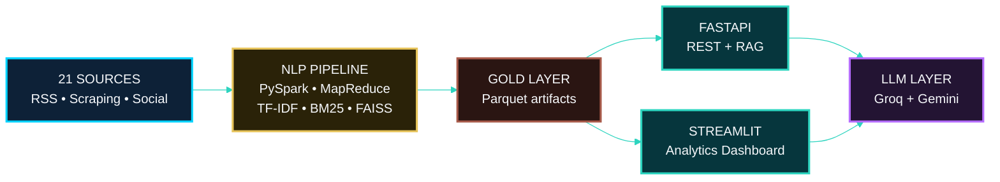
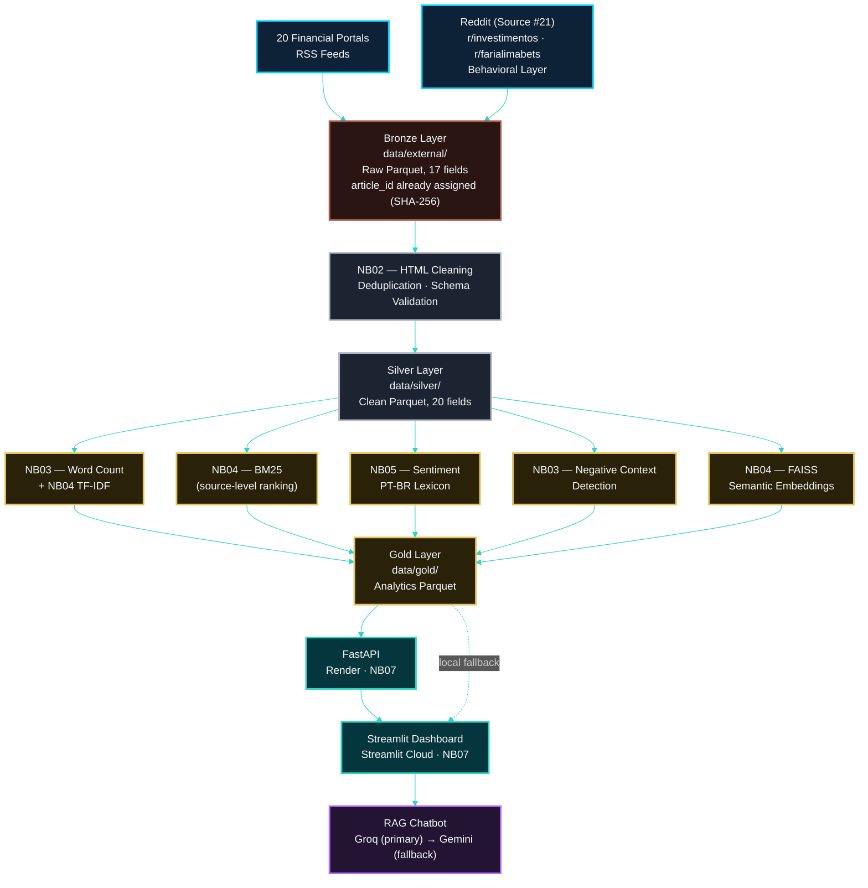

<!-- ========= START LANGUAGE BUTTON ========= -->
\[[🇧🇷 Português](README.pt_BR.md)\] \[**[🇬🇧 English](README.md)**\]

<br><br>
<!-- ========= END LANGUAGE BUTTON ========= -->

<!-- ========= START REPO TITLE ========= -->
# <p align="center"> 🇧🇷 [Investor Intelligence Platform for Brazilian REITs (FIIs)]() </p>
### <p align="center"> AI-Powered Market Intelligence · Behavioral Analytics · Sentiment Analysis </p>

<br>

<p align="center">
End-to-end AI infrastructure transforming unstructured financial data into actionable intelligence for Brazilian REITs (FIIs).
</p>

<br>

$$\Huge {\textbf{\color{green} CRISP-DM} \space \textbf{\color{white} •} \space \textbf{\color{yellow} Data Lakehouse} \space \textbf{\color{white} •} \space \textbf{\color{green} NLP} \space \textbf{\color{white} •} \space \textbf{\color{yellow} Responsible AI} \space \textbf{\color{white} •} \space \textbf{\color{green} Regulatory Alignment}}$$

<br>

#### <p align="center">An institutional-grade solution designed to monitor, structure, rank, and interpret signals from Brazilian REITs (FIIs), leveraging financial media, research portals, and investor communities.
</p>

<br>

###### <p align="center">Big Data [•]() PySpark [•]() MapReduce [•]() NLP[•]() TF-IDF [•]() BM25 [•]() Hybrid Retrieval [•]() FAISS + Multilingual Embeddings [•]() Web Scraping [•]() TOFU/MOFU/BOFU [•]() CRISP-DM [•]() FastAPI [•]() Streamlit [•]() Responsible AI [•]() LGPD [•]() EU AI Act Alignment</p>

<br><br>
<!-- ========= END REPO TITLE ========= -->

<!-- ========= START SPONSOR BADGES ========= -->
### <p align="center"> [](https://github.com/sponsors/Quantum-Software-Development)

<br>
<!-- ========= END SPONSOR BADGES ========= -->

<!-- ========= START DEMO VIDEO ========= -->
<p align="center">
   

 </p>

<!--
#### 🖤 Creative Direction, Music Curation & Editing by Fab⚡️  
##### 🎶 [Soundtrack:]() "Canon in D" — Johann Pachelbel
-->

<br><br>
<!-- ========= END DEMO VIDEO ========= -->


<!-- ========= START Institutional INFO ========= -->
## 🎓 Academic 

<br>

[**Institution:**]() Pontifical Catholic University of São Paulo (PUC-SP)  <br>
[**School**:]() FACEI — Faculty of Exact Sciences and Informatics <br>
[**Bachelor’s Program:**]() Human-Centerd AI & Data Science • 5th Semester • 2026   <br>
[**Course:**]() AI Security, Cybersecurity & Social Engineering   <br>
[**Methodology:**]()  CRISP-DM (Cross-Industry Standard Process for Data Mining)  <br>
**Professors** [✨ Carlos Eduardo Paes](https://www.linkedin.com/in/carlos-eduardo-de-barros-paes-ph-d-7b137a4/)  and  [✨ Eduardo Savino Gomes]() <br>
**Project Author:** [Fabiana ⚡️ Campanari](https://linktr.ee/fabianacampanari) 

<br><br>

#

<br><br>
<!-- ========= END Institutional INFO ========= -->


<!-- ========= START Dashboard Streamlit ========= -->
<p align="center">
  <a href="" target="_blank" rel="noopener noreferrer">
    
  </a>
</p>
<!-- ========= END Dashboard Streamlit ========= -->

<!-- ========= START REACT APP ========= -->
<p align="center">

  <a href="https://euphonious-churros-b68a51.netlify.app" target="_blank" rel="noopener noreferrer">
    
  </a>
  <!-- ========= END REACT APP ========= -->

<!-- ========= START PPTX ========= -->
  <a href="" target="_blank" rel="noopener noreferrer">
    
  </a>

</p>
<!-- ========= END PPTX ========= -->

<!-- ========= START DATA ANALYSING REPORT ========= -->
<p align="center">
  <a href="">
    
  </a>
</p>

<br><br>

#

<br><br>
<!-- ========= END DATA ANALYSING REPORT ========= -->
<!-- ===================== END BADGE GROUP 1 ===================== -->


<!-- ========= START NOTE ========= -->
> [!TIP]
> 
> ###  🇧🇷 Investor Intelligence Platform for Brazilian REITs (FIIs) <br><br>
>
> **[↗](https://github.com/Quantum-Software-Development/1-Cybersecurity-SocialEngineering_Hub)** Explore the Full Course Repository
>
> <br>
>
>  #
>
> <br><br>
>
> $$\Huge {\textbf{\color{green} Where market discussions become investment narratives…}}$$
>
> $$\Huge {\textbf{\color{yellow} Because markets talk a lot...}}$$
> 
> $$\Huge {\textbf{\color{green} Intelligent systems just listen better}}$$
>
> ### <p align="center"> ⚡

<br><br>

#

<br><br>
<!-- ========= END NOTE ========= -->

<!-- ========= START !WARNING] ========= -->
> [!WARNING]
>
> <br>
> ⚠️ Projects may be publicly shared when permitted.  
> The focus is on applied, hands-on learning using real-world datasets in Artificial Intelligence, Data Science, AI Governance, and Cybersecurity.  
> Any sensitive, confidential, or proprietary content remains protected in private repositories whenever required. <br><br>
>
> ⚠️  $\large \textbf{\color{green}{Disclaimer}}$ <br>
> This platform is intended exclusively for educational, research, and analytical purposes. It does **not** constitute financial, investment, legal, or professional advice. Any analyses, insights, or results presented are for academic and informational purposes only.

<br><br><br><br>
<!-- ========= END!WARNING]========= -->

## Table of Contents

1. [Academic Context](#1-academic-context)
2. [Product Overview](#2-product-overview)
3. [System Overview](#3-system-overview)
4. [From Frequency to Decision](#4-from-frequency-to-decision)
5. [What This Platform Delivers](#5-what-this-platform-delivers)
6. [Why This Matters](#6-why-this-matters)
7. [Architecture and Pipeline](#7-architecture-and-pipeline)
8. [Executive Notebook Summary](#8-executive-notebook-summary)
9. [Notebooks NB00–NB07: Technical Report](#9-notebooks-nb00nb07-technical-report)
10. [The 3 Core Techniques + FAISS Semantic Layer](#10-the-3-core-techniques--faiss-semantic-layer)
11. [Data Sources — 21 Sources](#11-data-sources--21-sources)
12. [Big Data Infrastructure](#12-big-data-infrastructure)
13. [Dependencies and requirements.txt](#13-dependencies-and-requirementstxt)
14. [CRISP-DM Methodology](#14-crisp-dm-methodology)
15. [Marketing Funnel: TOFU, MOFU, and BOFU in the Project](#15-marketing-funnel-tofu-mofu-and-bofu-in-the-project)
16. [RAG Chatbot: Groq + Gemini (Automatic Fallback)](#16-rag-chatbot-groq--gemini-automatic-fallback)
17. [Governance](#17-governance)
18. [Folder Structure](#18-folder-structure)
19. [Full Documentation (docs/)](#19-full-documentation-docs)
20. [How to Run](#20-how-to-run)
21. [Automated Testing](#21-automated-testing)
22. [Deployment & Automation Workflow](#22-deployment--automation-workflow)
23. [Which requirements*.txt to Use in Each Scenario](#23-which-requirementstxt-to-use-in-each-scenario)
24. [Makefile — Full Reference](#24-makefile--full-reference)
25. [Expected Outputs](#25-expected-outputs)
26. [Technical Glossary](#26-technical-glossary)
27. [Project Repository and Links](#27-project-repository-and-links)
28. [References](#28-references)

<br><br>


# 1. [Academic Context]()

<br>

This project was developed at **PUC-SP** as part of the courses **Cybersecurity**, **Social Engineering**, **Data Engineering**, **Distributed Systems**, and **Big Data Analytics Applied to Financial Markets**. The original assignment focused on demonstrating a distributed **Word Count** solution using **PySpark** and the **MapReduce** paradigm.

Building upon this foundation, the project evolved into a comprehensive financial intelligence platform by incorporating advanced information retrieval and natural language processing techniques, including **TF-IDF**, **BM25**, and **contextual sentiment analysis**. It also integrates a modern serving architecture based on **FastAPI** and **Retrieval-Augmented Generation (RAG)**, supported by a structured data engineering pipeline designed for **FII (Real Estate Investment Funds) market intelligence** and decision support.

<br>

###  1.1 [*Academic Requirements Met*]()

<br>

| [Requirement]() | [Implementation]() |
| :-- | :-- |
| [Distributed Computing]() | PySpark · RDD MapReduce · SparkSession |
| [Big Data Architecture]() | Medallion (Bronze → Silver → Gold) |
| [Machine Learning]() | TF-IDF · BM25 · Semantic Embeddings · Sentiment Analysis |
| [Vector Search]() | FAISS · Dense Index · Multilingual PT-BR Embeddings |
| [NLP]() | PT-BR Tokenization · FII Lexicon · Signal Flags |
| [Data Governance]() | LGPD · EU AI Act · Responsible AI · XAI |
| [REST API]() | FastAPI · Uvicorn |
| [RAG / LLM]() | Groq (openai/gpt-oss-20b, primary) + Gemini 2.5 Flash (automatic fallback) |
| [Visualization]() | Streamlit · Plotly |
| [Cybersecurity]() | Narrative surface analysis · Social Engineering awareness |


<br><br>

## 2. [Product Overview]()

<br>

The [**Investor Intelligence Platform for Brazilian REITs (FIIs)**]() is an end-to-end **Big Data and AI solution** designed to transform financial content into actionable **market intelligence, behavioral analytics, and investor insights**. 

By ingesting data from **21 public sources** (RSS feeds, financial portals, web scraping channels, and Reddit), the platform applies **Brazilian Portuguese (PT-BR) NLP**, performs relevance ranking through **hybrid information retrieval (TF-IDF + BM25)**, conducts contextual **FII sentiment analysis**, and consolidates intelligence metrics into interactive dashboards powered by **FastAPI** and **Streamlit**.

<br>

### 2.1 [*Core Capabilities*]()

#### ➠ [*Technical Capabilities*]()

[*]() Collects and processes data from $\large {\textbf{\color{green}21 public sources}}$ across financial news portals, RSS feeds, web scraping channels, and investor communities; <br>
[*]() Organizes information through a scalable **Bronze → Silver → Gold Medallion Architecture**; <br>
[*]() Enriches financial documents using hybrid retrieval combining **TF-IDF**, **BM25**, and **FAISS semantic search** with multilingual Portuguese embeddings; <br>
[*]() Performs contextual **Brazilian Portuguese (PT-BR) sentiment analysis** specialized in the Brazilian FII ecosystem; <br>
[*]() Generates explainable **marketing intelligence and behavioral indicators** to identify trends, investor interests, and engagement signals; <br>
[*]() Provides AI-assisted analysis through **FastAPI**, **Retrieval-Augmented Generation (RAG)**, **Groq LLM**, and an interactive **Streamlit** dashboard.


#### ➠ [*Intelligence & Decision Support*]()

[-]() Monitoring investor sentiment and market perception across digital financial communities; <br>
[-]() Identifying emerging topics, trends, and relevant discussions within the FII ecosystem; <br>
[-]() Ranking financial content using hybrid retrieval (**TF-IDF + BM25 + FAISS semantic search**); <br>
[-]() Detecting behavioral patterns and investor engagement signals; <br>
[-]() Supporting data-driven marketing, communication, and investment research strategies; <br>
[-]() Delivering AI-powered question answering through a **Retrieval-Augmented Generation (RAG)** architecture.

<br>

> [!TIP]
>
> Beyond a Big Data demonstration, the **Investor Intelligence Platform — FIIs Brazil** showcases how modern data engineering, Natural Language Processing (NLP), semantic retrieval, and Large Language Models (LLMs) can be integrated into a scalable decision-support system for financial market intelligence.


<br><br>

## 3. [System Overview]()

<br>




<br><br>

## 4. [From Frequency to Decision]()


## [From Frequency to Decision]()


> Frequency → Relevance → Meaning → Decision

<br>

An NLP + Information Retrieval pipeline that transforms unstructured information from the FII market into actionable intelligence — combining **MapReduce, TF-IDF, BM25, FAISS + Embeddings, RAG, and Contextual Sentiment Analysis** into progressive intelligence layers, each solving a specific structural limitation of the one before it.

<br>

| Layer | Question It Answers |
|---|---|
| MapReduce | Is this topic frequently discussed? |
| TF-IDF | Does this term distinguish this document? |
| BM25 | Which document best satisfies the user's query? |
| FAISS + Embeddings | Can different words represent the same concept? |
| RAG | How can retrieved evidence become a reliable answer? |
| Contextual Sentiment | Does the surrounding context indicate opportunity or risk? |

<br>

>  Full framework, with FII-domain examples and the analytical evolution diagram: [`FROM_FREQUENCY_TO_MEANING.md`](docs/🇬🇧English/methodology/FROM_FREQUENCY_TO_MEANING.md)

<br><br>


<br><br>
<br><br>
<br><br>
<br><br>
<br><br>
<br><br>

###  [ Official Data Sources — 21 Monitored Sources]()

<br>

| #  | [Source]()                                    | [Category]()  | [Primary Method]() | [Fallback]() | [Endpoint]()                        |
| -- | --------------------------------------------- | ------------- | ------------------ | ------------ | ----------------------------------- |
| 1  | [InfoMoney]()                                 | Editorial     | RSS                | —            | infomoney.com.br/feed/              |
| 2  | [Empiricus]()                                 | Editorial     | RSS                | Scraping     | empiricus.com.br/feed/              |
| 3  | [Money Times]()                               | Editorial     | RSS                | —            | moneytimes.com.br/feed/             |
| 4  | [Seu Dinheiro]()                              | Editorial     | RSS                | —            | seudinheiro.com/feed/               |
| 5  | [Exame Invest]()                              | Editorial     | RSS                | —            | exame.com/feed/                     |
| 6  | [CNN Brasil Business ]()                      | Editorial     | RSS                | —            | cnnbrasil.com.br/feed/              |
| 7  | [Suno Research]()                             | Editorial     | RSS (Secondary)    | —            | sunoresearch.com.br/feed/           |
| 8  | [E-Investidor]()                              | Editorial     | RSS (Secondary)    | —            | einvestidor.estadao.com.br/feed     |
| 9  | [NeoFeed]()                                   | Editorial     | RSS (Secondary)    | —            | neofeed.com.br/feed/                |
| 10 | [Toro Investimentos]()                        | Editorial     | RSS                | Scraping     | blog.toroinvestimentos.com.br/feed/ |
| 11 | [Funds Explorer]()                            | Portal        | Scraping           | —            | fundsexplorer.com.br                |
| 12 | [Status Invest]()                             | Portal        | Scraping           | —            | statusinvest.com.br                 |
| 13 | [Clube FII]()                                 | Portal        | Scraping           | —            | clubefii.com.br                     |
| 14 | [FIIs.com.br]()                               | Portal        | Scraping           | —            | fiis.com.br                         |
| 15 | [Portal do FII]()                             | Portal        | Scraping           | RSS          | portaldofii.com.br                  |
| 16 | [Investidor10]()                              | Portal        | Scraping           | —            | investidor10.com.br                 |
| 17 | [Eu Quero Investir]()                         | Portal        | Scraping           | —            | euqueroinvestir.com                 |
| 18 | [Bora Investir (B3)]()                        | Institutional | Scraping           | —            | borainvestir.b3.com.br              |
| 19 | [XP Conteúdos]()                              | Institutional | Scraping           | —            | conteudos.xpi.com.br                |
| 20 | [Investing Brasil]()                          | Portal        | Scraping           | —            | br.investing.com                    |
| 21| [**Reddit / Google News (Fallback)**]() | [**Social / Behavioral**]() | [**PRAW (when available) + Google News RSS (fallback)**]() | `r/investimentos` · `r/farialimabets` · news.google.com |

<br>


> [!TIP]
> The original behavioral source uses Reddit subreddits (`r/investimentos` and `r/farialimabets`) as a [**social intelligence and market narrative layer**]().  
> Following changes to Reddit’s public API policy in April 2023 (HTTP 403 restrictions), the pipeline was redesigned to operate across three levels:

<br>

### [***Source 21 — Reddit / Google News (Fallback)***]()

<br>

1. [**Level 1 — PRAW**]() (when `REDDIT_API_AVAILABLE = True`) 
 
   Uses the authenticated Reddit API to collect recent posts from the target subreddits.

   <br>

2. [**Level 2 — Google News RSS PT-BR (fallback)*]()
   
   - When Level 1 is unavailable (e.g., missing `REDDIT_CLIENT_ID` in `.env` or public API restrictions), NB01 triggers `collect_google_news_rss()`, which:
   - queries Google News in Portuguese using FII-specific search terms,
   - filters content using FII-related keywords (`FII_FILTER_TERMS`),
   - stores articles with `source='news.google.com'`, `source_type='reddit'`, `tags='google_news_rss'`, and `ingestion_method='feedparser_google_news'`.
  
    <br>

3. [**Level 3 — Frozen Parquet (Resilient Snapshot)** ]()

   For reproducible evaluations and operational resilience, Source 21 data can be frozen in `data/external/` and reused without issuing new requests.

In the documented reference execution, the [Google News RSS fallback]() generated [**351 FII-related articles**]() for [Source 2]()1, preserving continuity of the behavioral intelligence layer even when direct access to Reddit’s public API was unavailable. [page:46]

<br><br>


## [End-to-End AI/ML Data Pipeline]()

<br><br>




<br>


> [!TIP]
> 
> Detailed architecture diagram → [docs/architecture.md](https://github.com/Quantum-Software-Development/5-cybersecurity-social-engineering-fii-marketing-intelligence-platform/blob/5e7c18a109c56f765ea7cdbf16b8a65ad41a0e2a/docs/architecture.md)

<br><br>


<br><br>
<br><br>
<br><br>
<br><br>
<br><br>
<br><br>
<br><br>
<br><br>
<br><br>


<br><br>

## 4. [Project Structure]()

```text
app/
├── main.py
├── api/
│   └── routes.py
├── services/
│   ├── retrieval.py
│   ├── embeddings.py
│   ├── llm.py
├── models/
│   └── schemas.py
├── db/
│   └── vector_store.py
├── core/
│   └── config.py
```

<br><br>

## 5. [API Layer (FastAPI)]()

<br>

```python
from fastapi import FastAPI
from app.api.routes import router

app = FastAPI(
    title="Market Intelligence API",
    description="RAG-powered financial intelligence system",
    version="1.0.0"
)

app.include_router(router)
```

<br><br>

## 6. [Core Endpoint — Semantic Query]()

<br>

```python
@router.post("/query")
async def query_system(question: str):
    
    context = retrieve_context(question)
    answer = generate_answer(question, context)

    return {
        "question": question,
        "context": context,
        "answer": answer
    }
```

<br><br>

## 7. [Retrieval Layer (RAG)]()

<br>

```python
def retrieve_context(query: str, k: int = 5):
    query_embedding = embed_query(query)
    results = search_vectors(query_embedding, k=k)
    return [r["text"] for r in results]
```

<br><br>

## 8. [Embeddings Layer]()

<br>

```python
from sentence_transformers import SentenceTransformer

model = SentenceTransformer("all-MiniLM-L6-v2")

def embed_query(text: str):
    return model.encode(text)
```

<br><br>

## 9. [Vector Store (FAISS)]()

<br>

```python
index = faiss.IndexFlatL2(384)

def search_vectors(query_embedding, k=5):
    D, I = index.search(np.array([query_embedding]), k)
    return [{"text": f"doc_{i}"} for i in I[0]]
```

<br><br>

## 10. [LLM Generation Layer]()

<br>

```python
def generate_answer(question, context):
    prompt = f"""
    Context:
    {context}

    Question:
    {question}

    Answer:
    """
    return call_llm(prompt)
```

<br><br>

## 11. [End-to-End Flow]()

<br>

| [Layer]()   | [Function]()                         |
| ------- | -------------------------------- |
| 🥉 [Bronze]()  | Raw ingestion and storage        |
| 🥈 [Silver]()  | Data cleaning and NLP processing |
| 🥇 [Gold]()    | Signal generation and ranking    |
| [RAG ]()    | Semantic retrieval               |
| [FastAPI]() | API interface                    |
| [LLM]()    | Natural language reasoning       |

<br><br>

## 12. [Example Query]()

<br>

```json
{
  "question": "What is the current investor sentiment on logistics REITs?"
}
```

<br>

➠ [**Response:**]()

```json
{
  "answer": "Recent data indicates a moderately positive sentiment driven by stable dividend yields and occupancy rates."
}
```

<br>

## [Final Note]()

This architecture transforms a traditional data pipeline into a **full-stack AI intelligence system**, enabling:

[*]() semantic search <br>
[*]()  investor sentiment  <br>
[*]()  real-time insights <br>
[*]()  natural language interaction


<br><br>


<br><br>
<br><br>
<br><br>
<br><br>
<br><br>
<br><br>
<br><br>
<br><br>


## [How to run this project locally]()

### [Prerequisites]()

[-]() Python 3.10+ installed
[-]() Git installed
[-]() (Optional) Python virtual environment (venv) to isolate dependencies

<br>

### [Clone the repository]()

```bash
git clone https://github.com/Quantum-Software-Development/5-cybersecurity-social-engineering-fii-marketing-intelligence-platform.git
cd 5-cybersecurity-social-engineering-fii-marketing-intelligence-platform
```

<br>

### [Create and activate the virtual environment]]()

```bash
# macOS / Linux
python3 -m venv .venv
source .venv/bin/activate

# Windows (PowerShell)
python -m venv .venv
.\.venv\Scripts\Activate.ps1
```

> Note: the `.venv/` folder is already ignored in `.gitignore`, so the virtual environment will not be versioned. 

<br>

### [Install dependencies]()

```bash
pip install --upgrade pip
pip install -r requirements.txt
```

<br>

### [Run notebooks / scripts]()

- Open the notebooks in the `2-FIIs_Final` folder in Jupyter Notebook, JupyterLab, or VS Code.
- Make sure the selected kernel is the `.venv` virtual environment.
- Adjust data paths if needed (under the `data/` directory). Local data layers such as `data/bronze`, `data/silver`, and `data/gold` are git-ignored by default.

<br>

### [Whenever you add or remove dependencies:]()

```bash
pip freeze > requirements.txt
git add requirements.txt
git commit -m "Update project dependencies"
```

<br><br>

## [References]()

- Barocas, S., & Selbst, A. D. (2016). Big Data’s Disparate Impact. *California Law Review*, 104(3), 671–732.
- Blei, D. M., Ng, A. Y., & Jordan, M. I. (2003). Latent Dirichlet Allocation. *Journal of Machine Learning Research (JMLR)*, 3, 993–1022.
- Brasil. (2018). *Lei nº 13.709, de 14 de agosto de 2018: Lei Geral de Proteção de Dados Pessoais (LGPD)*.
- Chapman, P., Clinton, J., Kerber, R., Khabaza, T., Reinartz, T., Shearer, C., & Wirth, R. (2000). *CRISP-DM 1.0: Step-by-step data mining guide*. SPSS.
- European Commission. (2019). *Ethics Guidelines for Trustworthy AI*. Brussels: High-Level Expert Group on Artificial Intelligence.
- Goodfellow, I., Bengio, Y., & Courville, A. (2016). *Deep Learning*. MIT Press.
- Jurafsky, D., & Martin, J. H. (2025). *Speech and Language Processing* (3rd ed.). Stanford University.
- Manning, C. D., Raghavan, P., & Schütze, H. (2008). *Introduction to Information Retrieval*. Cambridge University Press.
- Mitchell, M., Wu, S., Zaldivar, A., Barnes, P., Vasserman, L., Hutchinson, B., Spitzer, E., Raji, I. D., & Gebru, T. (2019). Model Cards for Model Reporting. In *Proceedings of the ACM Conference on Fairness, Accountability, and Transparency (FAccT)* (pp. 220–229).
- Molnar, C. (2022). *Interpretable Machine Learning* (2nd ed.). Lulu.com.
- Robertson, S. E., Walker, S., Jones, S., Hancock-Beaulieu, M., & Gatford, M. (1995). Okapi at TREC-3. In *Text REtrieval Conference (TREC-3)*. NIST.
- Robertson, S. E., & Zaragoza, H. (2009). The Probabilistic Relevance Framework: BM25 and Beyond. *Foundations and Trends in Information Retrieval*, 3(4), 333–389.
- Russell, S., & Norvig, P. (2021). *Artificial Intelligence: A Modern Approach* (4th ed.). Pearson.

<br><br>


<!-- ======================================= Start DEFAULT Footer ===========================================  -->

<br><br>


## 💌 [Let the data flow... Ping Me !](mailto:fabicampanari@proton.me)

<br>


#### <p align="center">  🛸๋ My Contacts [Hub](https://linktr.ee/fabianacampanari)


<br>

### <p align="center"> 


<br><br>

<p align="center">  ────────────── ⊹🔭๋ ──────────────

<!--
<p align="center">  ────────────── 🛸๋*ੈ✩* 🔭*ੈ₊ ──────────────
-->

<br>

<p align="center"> ➣➢➤ <a href="#top">Back to Top </a>
  

  
#
 
##### <p align="center">Copyright 2026 Quantum Software Development. Code released under the  [MIT license.](https://github.com/Quantum-Software-Development/5-cybersecurity-social-engineering-fii-marketing-intelligence-platform/blob/64d9e815b5abcee1658cf8aaa9f44af11c60b6c6/LICENSE)
<!-- ======================================= End  DEFAULT Footer ===========================================  -->

