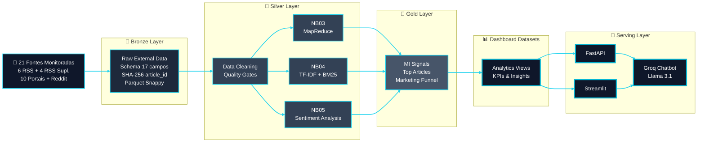

<!-- ======================================= ⚡️ Start DEFAULT HEADER ===========================================  -->

<!-- ========= START LANGUAGE BUTTON ========= -->
**[[🇧🇷 Português](README.pt_BR.md)] [**[🇬🇧 English](README.md)**]**

  
<!-- ========= END LANGUAGE BUTTON ========= -->

<!-- ========= START REPO TITLE ========= -->

  
  
  
  
  
  
  
  

## [Arquitetura e Pipeline]()

### ***Visão Macro+++

  

  

## [Official Data Collection — 21 Monitored Sources]()

  

| #  | Portal/Fonte                                   | Tipo                    | Método principal                    | Fallback     | URL base / endpoint de referência        |
| -- | ---------------------------------------------- | ----------------------- | ----------------------------------- | ------------ | ---------------------------------------- |
| 1  | InfoMoney                                      | Editorial               | RSS primário                        | —            | infomoney.com.br/feed/                   |
| 2  | Empiricus                                      | Editorial               | RSS primário                        | Scraping     | empiricus.com.br/feed/                   |
| 3  | Money Times                                    | Editorial               | RSS primário                        | —            | moneytimes.com.br/feed/                  |
| 4  | Seu Dinheiro                                   | Editorial               | RSS primário                        | —            | seudinheiro.com/feed/                    |
| 5  | Exame Invest                                   | Editorial               | RSS primário                        | —            | exame.com/feed/                          |
| 6  | CNN Brasil Business                            | Editorial               | RSS primário                        | —            | cnnbrasil.com.br/feed/                   |
| 7  | Suno Research                                  | Editorial               | RSS suplementar                     | —            | sunoresearch.com.br/feed/                |
| 8  | E-Investidor Estadão                           | Editorial               | RSS suplementar                     | —            | einvestidor.estadao.com.br/feed          |
| 9  | NeoFeed                                        | Editorial               | RSS suplementar                     | —            | neofeed.com.br/feed/                     |
| 10 | Toro Investimentos                             | Editorial               | RSS suplementar                     | Scraping     | blog.toroinvestimentos.com.br/feed/      |
| 11 | Funds Explorer                                 | Portal                  | Scraping                            | —            | fundsexplorer.com.br/ranking             |
| 12 | Status Invest                                  | Portal                  | Scraping                            | —            | statusinvest.com.br/fundos-imobiliarios  |
| 13 | Clube FII                                      | Portal                  | Scraping                            | —            | clubefii.com.br                          |
| 14 | FIIs.com.br                                    | Portal                  | Scraping                            | —            | fiis.com.br                              |
| 15 | Portal do FII                                  | Portal                  | Scraping                            | RSS fallback | portaldofii.com.br                       |
| 16 | Investidor10                                   | Portal                  | Scraping                            | —            | investidor10.com.br/fiis/                |
| 17 | Eu Quero Investir                              | Portal                  | Scraping                            | —            | euqueroinvestir.com/fundos-imobiliarios/ |
| 18 | Bora Investir (B3)                             | Portal                  | Scraping                            | —            | borainvestir.b3.com.br                   |
| 19 | XP Conteúdos                                   | Portal                  | Scraping                            | —            | conteudos.xpi.com.br                     |
| 20 | Investing Brasil                               | Portal                  | Scraping                            | —            | br.investing.com/news/stock-market-news  |
| 21 | Reddit (`r/investimentos` e `r/farialimabets`) | Social / comportamental | PRAW → API pública → frozen parquet | 3 níveis     | reddit.com / JSON público / PRAW         |

  
