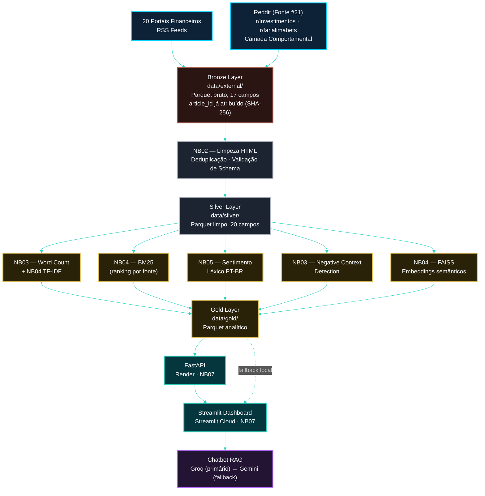
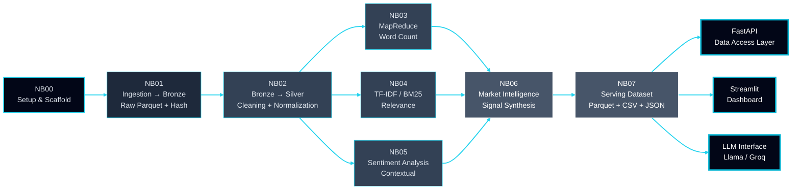

<!-- ========= START LANGUAGE BUTTON ========= -->
**[[🇧🇷 Português](README.pt_BR.md)] [**[🇬🇧 English](README.md)**]**

<br><br>
<!-- ========= END LANGUAGE BUTTON ========= -->

<!-- ========= START REPO TITLE ========= -->
<!-- ========= START REPO TITLE ========= -->
# <p align="center"> 🇧🇷 Plataforma de Inteligência para Investidores em REITs Brasileiros (FIIs) </p>
### <p align="center"> Inteligência de Mercado com IA · Análise Comportamental · Análise de Sentimento </p>

<br>

<p align="center">
Infraestrutura de IA ponta a ponta que transforma dados financeiros não estruturados em inteligência acionável para REITs brasileiros (FIIs).
</p>

<br>

$$\Huge {\textbf{\color{green} CRISP-DM} \space \textbf{\color{white} •} \space \textbf{\color{yellow} Data Lakehouse} \space \textbf{\color{white} •} \space \textbf{\color{green} NLP} \space \textbf{\color{white} •} \space \textbf{\color{yellow} IA Responsável} \space \textbf{\color{white} •} \space \textbf{\color{green} Conformidade Regulatória}}$$

<br>

#### <p align="center">Solução de nível institucional projetada para monitorar, estruturar, ranquear e interpretar sinais de REITs brasileiros (FIIs), utilizando mídias financeiras, portais de pesquisa e comunidades de investidores.
</p>

<br>

###### <p align="center">Big Data [•]() PySpark [•]() MapReduce [•]() NLP [•]() TF-IDF [•]() BM25 [•]() Recuperação Híbrida [•]() FAISS + Embeddings Multilíngues [•]() Web Scraping [•]() TOFU/MOFU/BOFU [•]() CRISP-DM [•]() FastAPI [•]() Streamlit [•]() IA Responsável [•]() LGPD [•]() Alinhamento com o EU AI Act</p>

<br><br>
<!-- ========= END REPO TITLE ========= -->

<!-- ========= START SPONSOR BADGES ========= -->
### <p align="center"> [](https://github.com/sponsors/Quantum-Software-Development)

<br><br>
<!-- ========= END SPONSOR BADGES ========= -->

<!-- ========= START DEMO VIDEO ========= -->
<p align="center">
   

 </p>

<!--
#### 🖤 Creative Direction, Music Curation & Editing by Fab⚡️  
##### 🎶 [Soundtrack:]() "Canon in D" — Johann Pachelbel
-->

<br><br>
<!-- ========= END DEMO VIDEO ========= -->


<!-- ========= START Institutional INFO ========= -->
## 🎓 Academic 

<br>

**Institution:** Pontifical Catholic University of São Paulo (PUC-SP) — FACEI  
[**Bachelor’s Program:**]() Humanistic AI & Data Science • 5th Semester • 2026  
[**Course:**]() AI Security, Cybersecurity & Social Engineering  
**Professors** [✨ Eduardo Savino Gomes]() and [✨ Carlos Eduardo Paes](https://www.linkedin.com/in/carlos-eduardo-de-barros-paes-ph-d-7b137a4/)  
**Project Author:** [Fabiana ⚡️ Campanari](https://linktr.ee/fabianacampanari) 

<br><br>

#

<br><br>
<!-- ========= END Institutional INFO ========= -->


<!-- ========= START Dashboard Streamlit ========= -->
<p align="center">
  <a href="" target="_blank" rel="noopener noreferrer">
    
  </a>
</p>
<!-- ========= END Dashboard Streamlit ========= -->

<!-- ========= START REACT APP ========= -->
<p align="center">

  <a href="https://euphonious-churros-b68a51.netlify.app/" target="_blank" rel="noopener noreferrer">
    
  </a>
  <!-- ========= END REACT APP ========= -->

<!-- ========= START PPTX ========= -->
  <a href="" target="_blank" rel="noopener noreferrer">
    
  </a>

</p>
<!-- ========= END PPTX ========= -->

<!-- ========= START DATA ANALYSING REPORT ========= -->
<p align="center">
  <a href="">
    
  </a>
</p>

<br><br>

#

<br><br>
<!-- ========= END DATA ANALYSING REPORT ========= -->
<!-- ===================== END BADGE GROUP 1 ===================== -->


<!-- ========= START NOTE ========= -->
> [!TIP]
> 
> ###  🇧🇷 Plataforma de Inteligência para Investidores em REITs Brasileiros (FIIs) <br><br>
>
> **[↗](https://github.com/Quantum-Software-Development/1-Cybersecurity-SocialEngineering_Hub)** Explore o repositório completo do curso
>
> <br>
>
>  #
>
> <br><br>
>
> $$\Huge {\textbf{\color{green} Onde as discussões de mercado se transformam em narrativas de investimento…}}$$
>
> $$\Huge {\textbf{\color{yellow} Porque os mercados falam muito...}}$$
> 
> $$\Huge {\textbf{\color{green} Sistemas inteligentes simplesmente ouvem melhor}}$$
>
> ### <p align="center"> ⚡


<br><br>

#

<br><br>
<!-- ========= END NOTE ========= -->

<!-- ========= START !WARNING] ========= -->
> [!WARNING]
>
> <br>
> ⚠️ Os projetos podem ser compartilhados publicamente quando permitido.
> O foco está no aprendizado aplicado, prático, utilizando conjuntos de dados do mundo real em Inteligência Artificial, Ciência de Dados, Governança de IA e Cibersegurança.
> Qualquer conteúdo sensível, confidencial ou proprietário permanece protegido em repositórios privados sempre que necessário. <br> <br>
>
> ⚠️  $\large \textbf{\color{green}{Aviso Legal (Disclaimer}}$ <br>
> Esta plataforma destina-se exclusivamente a fins educacionais, de pesquisa e análise.
> Não constitui aconselhamento financeiro, de investimento, jurídico ou profissional.
> Quaisquer análises, insights ou resultados apresentados têm caráter apenas acadêmico e informativo.


<br><br><br><br>
<!-- ========= END!WARNING]========= -->


## Índice

1. [Contexto Acadêmico e Institucional](#-contexto-acadêmico-e-institucional)
2. [Visão Geral e Definição do Produto](#-visão-geral-e-definição-do-produto)
3. [Objetivos](#-objetivos)
4. [Público-Alvo](#-público-alvo)
5. [Por Que Isso Importa](#-por-que-isso-importa)
6. [Cobertura de Fontes](#-cobertura-de-fontes)
7. [Estratégia de Coleta por Tipo de Fonte](#-estratégia-de-coleta-por-tipo-de-fonte)
8. [Fontes de Dados Oficiais — 21 Fontes Monitoradas](#-fontes-de-dados-oficiais--21-fontes-monitoradas)
9. [Arquitetura de Alto Nível](#-arquitetura-de-alto-nível)
10. [Pipeline NB00–NB07](#-pipeline-nb00nb07)
11. [Arquitetura de Serving — FastAPI + RAG](#-arquitetura-de-serving--fastapi--rag)
12. [Estrutura do Projeto](#-estrutura-do-projeto)
13. [Camada de API (FastAPI)](#-camada-de-api-fastapi)
14. [Endpoint Principal — Consulta Semântica](#-endpoint-principal--consulta-semântica)
15. [Camada de Recuperação (RAG via BM25)](#-camada-de-recuperação-rag-via-bm25)
16. [Camada de Geração (LLM — Groq)](#-camada-de-geração-llm--groq)
17. [Fluxo End-to-End](#-fluxo-end-to-end)
18. [Metodologia Analítica Expandida](#-metodologia-analítica-expandida)
19. [As 3 Técnicas Centrais: MapReduce + TF-IDF + BM25](#-as-3-técnicas-centrais-mapreduce--tf-idf--bm25--como-se-complementam)
20. [Foco em Marketing Intelligence: TOFU e Contexto Negativo](#-foco-em-marketing-intelligence-tofu-e-contexto-negativo)
21. [Do Requisito Acadêmico à Plataforma Analítica](#-do-requisito-acadêmico-à-plataforma-analítica)
22. [O Que Esta Plataforma Entrega](#-o-que-esta-plataforma-entrega)
23. [Perspectiva de Cibersegurança e Engenharia Social](#-perspectiva-de-cibersegurança-e-engenharia-social)
24. [Notebooks NB00–NB07: Relatório Técnico](#-notebooks-nb00nb07-relatório-técnico)
25. [Infraestrutura Big Data](#-infraestrutura-big-data)
26. [Governança](#-governança)
27. [Como Executar](#-como-executar)
28. [Makefile — Referência Completa](#-makefile--referência-completa)
29. [Roadmap de Entrega](#-roadmap-de-entrega)
30. [Evolução de Portfólio](#-evolução-de-portfólio)
31. [Outputs Esperados](#-outputs-esperados)
32. [Conjunto de Documentações](#-conjunto-de-documentações)
33. [Referências](#-referências)
34. [Autores](#-autores)

<br><br>
## [End-to-End AI/ML Data Pipeline]()

<br><br>





<!--


 TERMOS TOFU 

Priorizar:
- dividendos
- renda passiva
- patrimônio
- recorrência
- diversificação
- yield
- inflação
- longo prazo
- gestão
- carteira
- previsibilidade\
- geração de renda
- fundos imobiliários\renda mensal
- investimento imobiliário
- independência financeira
- proventos
- valorização patrimonial
- fluxo de caixa
—

TERMOS CONTYEXTO  NEGATIVOS

Detectar:
   -vacância
   -inadimplência
   -risco
   - prejuízo
- corte de dividendos
- alavancagem
- queda
- crise
- desvalorização
- deterioração
- incerteza
- baixa liquidez
- má gestão
- redução de proventos
- juros altos
- risco de crédito

<br><br>

## 1. Por que usar MapReduce?.

O problema é:

frequência sozinha não significa relevância.

Exemplo no contexto de FIIs:

A palavra:

**investimento**

pode aparecer milhares de vezes.

Mas isso não ajuda a decidir marketing.


<br>

Já:

**renda_passiva**


<br>

ou

**dividendos**

são muito mais relevantes para um investidor FII.

Então o MapReduce resolve a primeira camada do problema:

**“O que aparece com frequência?”**


<br><br>

No projeto:

* Spark + RDD
* parallelize()
* flatMap()
* map()
* reduceByKey()
* collect()


<br>

foram usados para:

* contar palavras
* identificar termos recorrentes
* medir frequência por fonte
* construir baseline estatística

 
<br> 

Ou seja:

**MapReduce = frequência + escalabilidade**

Sem ele:

não existe base quantitativa do projeto.


<br>

#
   
<br>

## 2. Por que usar TF-IDF?

Problema da frequência pura:

Palavras muito comuns dominam o ranking.

Exemplo:

* mercado
* investimento
* fundo
* imovel

aparecem em quase todos os portais.

Mas isso não significa:

**“melhor termo para marketing”.**

O TF-IDF resolve isso.

Ele pergunta:

**“O que é importante dentro de um documento, mas não aparece igual em todos?”**

No contexto do projeto:

Ele ajuda a descobrir:

termos distintivos do universo FII.

Exemplo:

Em vez de valorizar:

**mercado**

ele pode destacar:

* renda_passiva
* proventos
* fluxo_caixa
* valorizacao_patrimonial

Porque esses termos são:

* mais específicos
* mais educativos
* mais alinhados ao TOFU

Ou seja:

**TF-IDF = importância estatística contextual**


<br>

#

<br>

## 3. Por que usar BM25?

TF-IDF ainda tem uma limitação:

Ele não lida tão bem com:

* tamanho do texto
* contexto documental
* relevância semântica prática

Exemplo:

Um artigo enorme da InfoMoney pode ter:

**dividendos**

20 vezes.

Um artigo curto da Suno pode ter:

**dividendos**

4 vezes.

TF-IDF pode favorecer exageradamente o texto maior.

O BM25 corrige isso.

Ele:

* normaliza pelo tamanho do documento
* mede relevância contextual
* funciona melhor como ranking

No projeto:

Ele responde:

**“Qual termo realmente importa para um investidor FII dentro daquele contexto?”**

Isso é MUITO importante para:

decisão de marketing.

Porque vocês querem:

não apenas palavras frequentes,

mas:

palavras relevantes para awareness TOFU.

Exemplo:

* dividendos
* renda_passiva
* longo_prazo
* geracao_renda

ganham força porque aparecem em contexto educativo.

---

## 4. Por que usar RAG?

Mesmo com MapReduce, TF-IDF e BM25 existe uma limitação:

eles identificam padrões e relevância,

mas não geram explicações ou insights automaticamente.

O RAG (Retrieval-Augmented Generation) resolve esse problema.

Ele combina:

* recuperação de informação (retrieval)
* geração de texto por IA (generation)

No projeto:

os documentos processados por Spark, TF-IDF e BM25 tornam-se uma base de conhecimento.

Quando o usuário faz uma pergunta como:

**“Quais temas sobre FIIs são mais interessantes para conteúdo TOFU?”**

o RAG:

1. recupera os documentos mais relevantes;
2. utiliza os rankings gerados pelo BM25;
3. envia esse contexto para o modelo de IA;
4. gera uma resposta fundamentada nos dados coletados.

Dessa forma:

a IA não responde apenas com conhecimento genérico.

Ela responde utilizando os conteúdos reais analisados pelo projeto.

Ou seja:

**RAG = recuperação de conhecimento + geração contextualizada de insights**

---

## 5. Por que usar FaaS?

Após processar os dados, surge outro desafio:

como disponibilizar análises e respostas de forma escalável?

A solução é utilizar FaaS (Function as a Service).

FaaS é um modelo serverless em que funções são executadas sob demanda.

No projeto, isso permite:

* executar consultas sem manter servidores ativos;
* reduzir custos de infraestrutura;
* escalar automaticamente conforme o número de usuários;
* disponibilizar APIs para consumo dos resultados.

Exemplo:

Quando um usuário solicita:

**“Mostre os principais termos relacionados à renda passiva.”**

uma função serverless pode:

1. consultar os resultados armazenados;
2. aplicar o ranking BM25;
3. recuperar documentos para o RAG;
4. retornar a resposta instantaneamente.

Ou seja:

**FaaS = execução escalável e sob demanda dos serviços analíticos**

---

## 6. Por que usar todas as tecnologias juntas?

Porque cada uma resolve um problema diferente.

| Técnica   | O que responde?                                   | Papel no projeto       |
| --------- | ------------------------------------------------- | ---------------------- |
| MapReduce | O que aparece mais?                               | Frequência             |
| TF-IDF    | O que é importante?                               | Relevância estatística |
| BM25      | O que é realmente relevante no contexto?          | Ranking contextual     |
| RAG       | Como transformar dados em respostas inteligentes? | Geração de insights    |
| FaaS      | Como disponibilizar tudo de forma escalável?      | Execução serverless    |

Juntas, essas tecnologias transformam o projeto de uma simples análise textual em uma plataforma inteligente de marketing orientada por dados.

Vocês deixam de apenas:

**contar palavras**

para realizar:

**inteligência de marketing baseada em contexto, recuperação de conhecimento, IA generativa e processamento escalável em nuvem.**

-->


<br><br>
<br><br>
<br><br>
<br><br>
<br><br>
<br><br>
<br><br>
<br><br>


# 🏗️ [Architecture & Data Pipeline]()

<br>

## ⚡ 1. [Visão Geral do Sistema (High-Level)]()

<br>

O sistema é projetado como um **pipeline de inteligência de dados em múltiplas camadas**, transformando conteúdo financeiro não estruturado em insights acionáveis e respostas impulsionadas por IA.

```mermaid
flowchart LR

    classDef source fill:#0f172a,stroke:#22d3ee,color:#ffffff,stroke-width:2px;
    classDef bronze fill:#1e293b,stroke:#22d3ee,color:#ffffff,stroke-width:2px;
    classDef silver fill:#334155,stroke:#22d3ee,color:#ffffff,stroke-width:2px;
    classDef gold fill:#475569,stroke:#22d3ee,color:#ffffff,stroke-width:2px;
    classDef serving fill:#0f172a,stroke:#06b6d4,color:#ffffff,stroke-width:3px;

    A["🛰️ 21 Fontes Monitoradas<br/>6 RSS Primários + 4 RSS de Backup<br/>10 Portais Web + Reddit"]

    subgraph Bronze["🥉 Camada Bronze — Ingestão Bruta"]
        B["Dados Externos Brutos<br/>Schema Padronizado (17 Campos)<br/>article_id com SHA-256<br/>Armazenado em Parquet (Snappy)"]
    end

    subgraph Silver["🥈 Camada Silver — Processamento & NLP"]
        C["Limpeza e Validação de Dados<br/>Quality Gates"]
        D["NB03 — Processamento MapReduce"]
        E["NB04 — Indexação TF-IDF & BM25"]
        F["NB05 — Análise de Sentimento"]
    end

    subgraph Gold["🥇 Camada Gold — Inteligência"]
        G["Sinais de Inteligência de Mercado<br/>Artigos Mais Relevantes<br/>Features de Funil de Marketing"]
    end

    subgraph Dashboard["Camada Analítica"]
        H["Views de Dados Curadas<br/>KPIs & Insights"]
    end

    subgraph Serving["Camada de Serving"]
        I["FastAPI (Camada de API)"]
        J["Streamlit (Interface Dashboard)"]
        K["Interface LLM<br/>Groq + Llama 3.1"]
    end

    A --> B
    B --> C
    C --> D
    C --> E
    C --> F

    D --> G
    E --> G
    F --> G

    G --> H

    H --> I
    H --> J

    I --> K
    J --> K

    class A source
    class B bronze
    class C,D,E,F silver
    class G gold
    class H,I,J,K serving

    linkStyle default stroke:#22d3ee,stroke-width:2px
```

<br><br>




<br><br>

### ➠ [***Fluxo de Dependências entre os Notebooks***]()

<br><br>




<br><br>

>[!WARNING]
> [**Regra do Freeze:**]() NB01 é o único notebook que realiza requests HTTP ao vivo.<br>
> NB02–NB07 lêem **exclusivamente** de `data/external/` (dataset congelado).<br>
> Isso garante reprodutibilidade total — o corpus não muda entre execuções.


<br><br>

<br><br>


### ➠ [***Papel de Cada Notebook no Pipeline***]()

<br><br

| Notebook | CRISP-DM | Input | Output Principal | Engine |
|---|---|---|---|---|
| **NB00** `setup` | Business Understanding | — | `config/settings.py` · `logger.py` · stubs API | Python stdlib |
| **NB01** `bronze` | Data Understanding | 21 fontes ao vivo | `data/external/*.parquet` | feedparser · requests · PRAW |
| **NB02** `silver` | Data Preparation | `data/external/` | `silver_articles.parquet` | PySpark UDFs + quality gates |
| **NB03** `mapreduce` | Modeling | Silver | `word_count/*.parquet` (4 artefatos) | PySpark RDD MapReduce |
| **NB04** `tfidf_bm25` | Modeling | Silver | `tfidf_vectorizer.pkl` · `bm25_index.pkl` | sklearn + rank_bm25 |
| **NB05** `sentiment` | Modeling | Silver | `silver_enriched.parquet` · `articles_sentiment.parquet` | Léxico FII PT-BR + Spark UDF |
| **NB06** `mi` | Evaluation | Silver enriched + índices | `mi_signals.parquet` · `mi_top_articles.parquet` | BM25 + TF-IDF + PySpark |
| **NB07** `dashboard` | Deployment | Todos os Gold | `dashboard/*.parquet` · `*.csv` · `summary.json` | PySpark + Plotly |


<br><br>


## 2. [Fontes de Dados — 21 Canais Monitorados]()

O sistema ingere continuamente dados de um conjunto diversificado de fontes **editoriais, institucionais e comportamentais**, garantindo profundidade informacional e cobertura de sentimento.

<br>

| #  | [Source]()                                    | [Category]()  | [Primary Method]() | [Fallback]() | [Endpoint]()                        |
| -- | --------------------------------------------- | ------------- | ------------------ | ------------ | ----------------------------------- |
| 1  | [InfoMoney]()                                 | Editorial     | RSS                | —            | infomoney.com.br/feed/              |
| 2  | [Empiricus]()                                 | Editorial     | RSS                | Scraping     | empiricus.com.br/feed/              |
| 3  | [Money Times]()                               | Editorial     | RSS                | —            | moneytimes.com.br/feed/             |
| 4  | [Seu Dinheiro]()                              | Editorial     | RSS                | —            | seudinheiro.com/feed/               |
| 5  | [Exame Invest]()                              | Editorial     | RSS                | —            | exame.com/feed/                     |
| 6  | [CNN Brasil Business ]()                      | Editorial     | RSS                | —            | cnnbrasil.com.br/feed/              |
| 7  | [Suno Research]()                             | Editorial     | RSS (Secundário)   | —            | sunoresearch.com.br/feed/           |
| 8  | [E-Investidor]()                              | Editorial     | RSS (Secundário)   | —            | einvestidor.estadao.com.br/feed     |
| 9  | [NeoFeed]()                                   | Editorial     | RSS (Secundário)   | —            | neofeed.com.br/feed/                |
| 10 | [Toro Investimentos]()                        | Editorial     | RSS                | Scraping     | blog.toroinvestimentos.com.br/feed/ |
| 11 | [Funds Explorer]()                            | Portal        | Scraping           | —            | fundsexplorer.com.br                |
| 12 | [Status Invest]()                             | Portal        | Scraping           | —            | statusinvest.com.br                 |
| 13 | [Clube FII]()                                 | Portal        | Scraping           | —            | clubefii.com.br                     |
| 14 | [FIIs.com.br]()                               | Portal        | Scraping           | —            | fiis.com.br                         |
| 15 | [Portal do FII]()                             | Portal        | Scraping           | RSS          | portaldofii.com.br                  |
| 16 | [Investidor10]()                              | Portal        | Scraping           | —            | investidor10.com.br                 |
| 17 | [Eu Quero Investir]()                         | Portal        | Scraping           | —            | euqueroinvestir.com                 |
| 18 | [Bora Investir (B3)]()                        | Institutional | Scraping           | —            | borainvestir.b3.com.br              |
| 19 | [XP Conteúdos]()                              | Institutional | Scraping           | —            | conteudos.xpi.com.br                |
| 20 | [Investing Brasil]()                          | Portal        | Scraping           | —            | br.investing.com                    |
| 21 | [Reddit (r/investimentos, r/farialimabets)]() | Behavioral    | API (PRAW)         | JSON backup  | reddit.com                          |

<br><br>

## 3. [Arquitetura de Serving — FastAPI + RAG]()

O sistema expõe inteligência por meio de uma arquitetura de **Geração Aumentada por Recuperação (RAG)**.

<br>

```text
Data Pipeline → Banco Vetorial → FastAPI → LLM → Usuário
```

<br><br>

## 4. [Estrutura do Projeto]()

<br>

```text
app/
├── main.py
├── api/
│   └── routes.py
├── services/
│   ├── retrieval.py
│   ├── embeddings.py
│   ├── llm.py
├── models/
│   └── schemas.py
├── db/
│   └── vector_store.py
├── core/
│   └── config.py
```

<br><br>

## 5. [Camada de API (FastAPI)]()

<br>

```python
from fastapi import FastAPI
from app.api.routes import router

app = FastAPI(
    title="Market Intelligence API",
    description="Sistema de inteligência financeira com RAG",
    version="1.0.0"
)

app.include_router(router)
```

<br><br>

## 6. [Endpoint Principal — Consulta Semântica]()

<br>

```python
@router.post("/query")
async def query_system(question: str):
    
    context = retrieve_context(question)
    answer = generate_answer(question, context)

    return {
        "question": question,
        "context": context,
        "answer": answer
    }
```

<br><br>

## 7. [Camada de Recuperação (RAG)]()

<br>

```python
def retrieve_context(query: str, k: int = 5):
    query_embedding = embed_query(query)
    results = search_vectors(query_embedding, k=k)
    return [r["text"] for r in results]
```

<br><br>

## 8. [Camada de Embeddings]()

<br>

```python
from sentence_transformers import SentenceTransformer

model = SentenceTransformer("all-MiniLM-L6-v2")

def embed_query(text: str):
    return model.encode(text)
```

<br><br>

## 9. [Banco Vetorial (FAISS)]()

<br>

```python
index = faiss.IndexFlatL2(384)

def search_vectors(query_embedding, k=5):
    D, I = index.search(np.array([query_embedding]), k)
    return [{"text": f"doc_{i}"} for i in I[0]]
```

<br><br>

## 10. [Camada de Geração (LLM)]()

<br>

```python
def generate_answer(question, context):
    prompt = f"""
    Context:
    {context}

    Question:
    {question}

    Answer:
    """
    return call_llm(prompt)
```

<br><br>

## 11. [Fluxo End-to-End]()

<br>

| [Layer]()     | [Function]()                         |
| ------------- | ------------------------------------ |
| 🥉 [Bronze]() | Ingestão e armazenamento bruto       |
| 🥈 [Silver]() | Limpeza de dados e processamento NLP |
| 🥇 [Gold]()   | Geração de sinais e ranking          |
| [RAG ]()      | Recuperação semântica                |
| [FastAPI]()   | Interface de API                     |
| [LLM]()       | Raciocínio em linguagem natural      |

<br><br>

## 12. [Exemplo de Consulta]()

<br>

```json
{
  "question": "Qual é o sentimento atual dos investidores sobre FIIs logísticos?"
}
```

<br>

➠ [**Resposta:**]()

```json
{
  "answer": "Os dados recentes indicam um sentimento moderadamente positivo impulsionado por dividend yields estáveis e altas taxas de ocupação."
}
```

<br>

## [Nota Final]()

Esta arquitetura transforma um pipeline de dados tradicional em um **sistema completo de inteligência com IA**, permitindo:

<br>

[*]() busca semântica <br>
[*]() sentimento de investidores  <br>
[*]() insights em tempo real <br>
[*]() interação em linguagem natural


