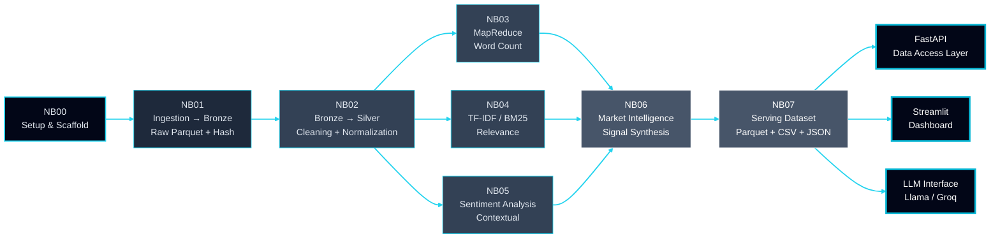

<!-- ======================================= ⚡️ Start DEFAULT HEADER ===========================================  -->

<!-- ========= START LANGUAGE BUTTON ========= -->
**[[🇧🇷 Português](README.pt_BR.md)] [**[🇬🇧 English](README.md)**]**

<br><br>
<!-- ========= END LANGUAGE BUTTON ========= -->

<!-- ========= START REPO TITLE ========= -->


<br><br>
<br><br>
<br><br>
<br><br>
<br><br>
<br><br>
<br><br>
<br><br>


# 🏗️ [Architecture & Data Pipeline]()

<br>

## ⚡ 1. [Visão Geral do Sistema (High-Level)]()

<br>

O sistema é projetado como um **pipeline de inteligência de dados em múltiplas camadas**, transformando conteúdo financeiro não estruturado em insights acionáveis e respostas impulsionadas por IA.

```mermaid
flowchart LR

    classDef source fill:#0f172a,stroke:#22d3ee,color:#ffffff,stroke-width:2px;
    classDef bronze fill:#1e293b,stroke:#22d3ee,color:#ffffff,stroke-width:2px;
    classDef silver fill:#334155,stroke:#22d3ee,color:#ffffff,stroke-width:2px;
    classDef gold fill:#475569,stroke:#22d3ee,color:#ffffff,stroke-width:2px;
    classDef serving fill:#0f172a,stroke:#06b6d4,color:#ffffff,stroke-width:3px;

    A["🛰️ 21 Fontes Monitoradas<br/>6 RSS Primários + 4 RSS de Backup<br/>10 Portais Web + Reddit"]

    subgraph Bronze["🥉 Camada Bronze — Ingestão Bruta"]
        B["Dados Externos Brutos<br/>Schema Padronizado (17 Campos)<br/>article_id com SHA-256<br/>Armazenado em Parquet (Snappy)"]
    end

    subgraph Silver["🥈 Camada Silver — Processamento & NLP"]
        C["Limpeza e Validação de Dados<br/>Quality Gates"]
        D["NB03 — Processamento MapReduce"]
        E["NB04 — Indexação TF-IDF & BM25"]
        F["NB05 — Análise de Sentimento"]
    end

    subgraph Gold["🥇 Camada Gold — Inteligência"]
        G["Sinais de Inteligência de Mercado<br/>Artigos Mais Relevantes<br/>Features de Funil de Marketing"]
    end

    subgraph Dashboard["Camada Analítica"]
        H["Views de Dados Curadas<br/>KPIs & Insights"]
    end

    subgraph Serving["Camada de Serving"]
        I["FastAPI (Camada de API)"]
        J["Streamlit (Interface Dashboard)"]
        K["Interface LLM<br/>Groq + Llama 3.1"]
    end

    A --> B
    B --> C
    C --> D
    C --> E
    C --> F

    D --> G
    E --> G
    F --> G

    G --> H

    H --> I
    H --> J

    I --> K
    J --> K

    class A source
    class B bronze
    class C,D,E,F silver
    class G gold
    class H,I,J,K serving

    linkStyle default stroke:#22d3ee,stroke-width:2px
```

<br><br>




<br><br>

### ➠ [***Fluxo de Dependências entre os Notebooks***]()

<br><br>




<br><br>

>[!WARNING]
> [**Regra do Freeze:**]() NB01 é o único notebook que realiza requests HTTP ao vivo.<br>
> NB02–NB07 lêem **exclusivamente** de `data/external/` (dataset congelado).<br>
> Isso garante reprodutibilidade total — o corpus não muda entre execuções.


<br><br>

<br><br>


### ➠ [***Papel de Cada Notebook no Pipeline***]()

<br><br

| Notebook | CRISP-DM | Input | Output Principal | Engine |
|---|---|---|---|---|
| **NB00** `setup` | Business Understanding | — | `config/settings.py` · `logger.py` · stubs API | Python stdlib |
| **NB01** `bronze` | Data Understanding | 21 fontes ao vivo | `data/external/*.parquet` | feedparser · requests · PRAW |
| **NB02** `silver` | Data Preparation | `data/external/` | `silver_articles.parquet` | PySpark UDFs + quality gates |
| **NB03** `mapreduce` | Modeling | Silver | `word_count/*.parquet` (4 artefatos) | PySpark RDD MapReduce |
| **NB04** `tfidf_bm25` | Modeling | Silver | `tfidf_vectorizer.pkl` · `bm25_index.pkl` | sklearn + rank_bm25 |
| **NB05** `sentiment` | Modeling | Silver | `silver_enriched.parquet` · `articles_sentiment.parquet` | Léxico FII PT-BR + Spark UDF |
| **NB06** `mi` | Evaluation | Silver enriched + índices | `mi_signals.parquet` · `mi_top_articles.parquet` | BM25 + TF-IDF + PySpark |
| **NB07** `dashboard` | Deployment | Todos os Gold | `dashboard/*.parquet` · `*.csv` · `summary.json` | PySpark + Plotly |


<br><br>


## 2. [Fontes de Dados — 21 Canais Monitorados]()

O sistema ingere continuamente dados de um conjunto diversificado de fontes **editoriais, institucionais e comportamentais**, garantindo profundidade informacional e cobertura de sentimento.

<br>

| #  | [Source]()                                    | [Category]()  | [Primary Method]() | [Fallback]() | [Endpoint]()                        |
| -- | --------------------------------------------- | ------------- | ------------------ | ------------ | ----------------------------------- |
| 1  | [InfoMoney]()                                 | Editorial     | RSS                | —            | infomoney.com.br/feed/              |
| 2  | [Empiricus]()                                 | Editorial     | RSS                | Scraping     | empiricus.com.br/feed/              |
| 3  | [Money Times]()                               | Editorial     | RSS                | —            | moneytimes.com.br/feed/             |
| 4  | [Seu Dinheiro]()                              | Editorial     | RSS                | —            | seudinheiro.com/feed/               |
| 5  | [Exame Invest]()                              | Editorial     | RSS                | —            | exame.com/feed/                     |
| 6  | [CNN Brasil Business ]()                      | Editorial     | RSS                | —            | cnnbrasil.com.br/feed/              |
| 7  | [Suno Research]()                             | Editorial     | RSS (Secundário)   | —            | sunoresearch.com.br/feed/           |
| 8  | [E-Investidor]()                              | Editorial     | RSS (Secundário)   | —            | einvestidor.estadao.com.br/feed     |
| 9  | [NeoFeed]()                                   | Editorial     | RSS (Secundário)   | —            | neofeed.com.br/feed/                |
| 10 | [Toro Investimentos]()                        | Editorial     | RSS                | Scraping     | blog.toroinvestimentos.com.br/feed/ |
| 11 | [Funds Explorer]()                            | Portal        | Scraping           | —            | fundsexplorer.com.br                |
| 12 | [Status Invest]()                             | Portal        | Scraping           | —            | statusinvest.com.br                 |
| 13 | [Clube FII]()                                 | Portal        | Scraping           | —            | clubefii.com.br                     |
| 14 | [FIIs.com.br]()                               | Portal        | Scraping           | —            | fiis.com.br                         |
| 15 | [Portal do FII]()                             | Portal        | Scraping           | RSS          | portaldofii.com.br                  |
| 16 | [Investidor10]()                              | Portal        | Scraping           | —            | investidor10.com.br                 |
| 17 | [Eu Quero Investir]()                         | Portal        | Scraping           | —            | euqueroinvestir.com                 |
| 18 | [Bora Investir (B3)]()                        | Institutional | Scraping           | —            | borainvestir.b3.com.br              |
| 19 | [XP Conteúdos]()                              | Institutional | Scraping           | —            | conteudos.xpi.com.br                |
| 20 | [Investing Brasil]()                          | Portal        | Scraping           | —            | br.investing.com                    |
| 21 | [Reddit (r/investimentos, r/farialimabets)]() | Behavioral    | API (PRAW)         | JSON backup  | reddit.com                          |

<br><br>

## 3. [Arquitetura de Serving — FastAPI + RAG]()

O sistema expõe inteligência por meio de uma arquitetura de **Geração Aumentada por Recuperação (RAG)**.

<br>

```text
Data Pipeline → Banco Vetorial → FastAPI → LLM → Usuário
```

<br><br>

## 4. [Estrutura do Projeto]()

<br>

```text
app/
├── main.py
├── api/
│   └── routes.py
├── services/
│   ├── retrieval.py
│   ├── embeddings.py
│   ├── llm.py
├── models/
│   └── schemas.py
├── db/
│   └── vector_store.py
├── core/
│   └── config.py
```

<br><br>

## 5. [Camada de API (FastAPI)]()

<br>

```python
from fastapi import FastAPI
from app.api.routes import router

app = FastAPI(
    title="Market Intelligence API",
    description="Sistema de inteligência financeira com RAG",
    version="1.0.0"
)

app.include_router(router)
```

<br><br>

## 6. [Endpoint Principal — Consulta Semântica]()

<br>

```python
@router.post("/query")
async def query_system(question: str):
    
    context = retrieve_context(question)
    answer = generate_answer(question, context)

    return {
        "question": question,
        "context": context,
        "answer": answer
    }
```

<br><br>

## 7. [Camada de Recuperação (RAG)]()

<br>

```python
def retrieve_context(query: str, k: int = 5):
    query_embedding = embed_query(query)
    results = search_vectors(query_embedding, k=k)
    return [r["text"] for r in results]
```

<br><br>

## 8. [Camada de Embeddings]()

<br>

```python
from sentence_transformers import SentenceTransformer

model = SentenceTransformer("all-MiniLM-L6-v2")

def embed_query(text: str):
    return model.encode(text)
```

<br><br>

## 9. [Banco Vetorial (FAISS)]()

<br>

```python
index = faiss.IndexFlatL2(384)

def search_vectors(query_embedding, k=5):
    D, I = index.search(np.array([query_embedding]), k)
    return [{"text": f"doc_{i}"} for i in I[0]]
```

<br><br>

## 10. [Camada de Geração (LLM)]()

<br>

```python
def generate_answer(question, context):
    prompt = f"""
    Context:
    {context}

    Question:
    {question}

    Answer:
    """
    return call_llm(prompt)
```

<br><br>

## 11. [Fluxo End-to-End]()

<br>

| [Layer]()     | [Function]()                         |
| ------------- | ------------------------------------ |
| 🥉 [Bronze]() | Ingestão e armazenamento bruto       |
| 🥈 [Silver]() | Limpeza de dados e processamento NLP |
| 🥇 [Gold]()   | Geração de sinais e ranking          |
| [RAG ]()      | Recuperação semântica                |
| [FastAPI]()   | Interface de API                     |
| [LLM]()       | Raciocínio em linguagem natural      |

<br><br>

## 12. [Exemplo de Consulta]()

<br>

```json
{
  "question": "Qual é o sentimento atual dos investidores sobre FIIs logísticos?"
}
```

<br>

➠ [**Resposta:**]()

```json
{
  "answer": "Os dados recentes indicam um sentimento moderadamente positivo impulsionado por dividend yields estáveis e altas taxas de ocupação."
}
```

<br>

## [Nota Final]()

Esta arquitetura transforma um pipeline de dados tradicional em um **sistema completo de inteligência com IA**, permitindo:

<br>

[*]() busca semântica <br>
[*]() sentimento de investidores  <br>
[*]() insights em tempo real <br>
[*]() interação em linguagem natural


