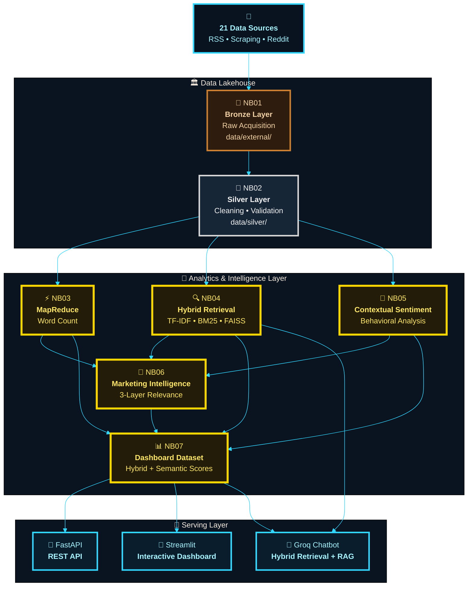

```mermaid
%%{
init: {
  "theme": "base",
  "themeVariables": {
    "background": "#07111F",
    "primaryColor": "#0B1622",
    "primaryTextColor": "#9FF4FF",
    "primaryBorderColor": "#32D7FF",
    "lineColor": "#32D7FF",
    "secondaryColor": "#0E1D2C",
    "tertiaryColor": "#091420",
    "fontSize": "15px"
  }
}
}%%

flowchart TD

    %%────────────────────────────
    %% Sources
    %%────────────────────────────
    S1["📡<br/><b>21 Data Sources</b><br/>RSS • Scraping • Reddit"]:::source

    %%────────────────────────────
    %% Data Lakehouse
    %%────────────────────────────
    subgraph DL["🏛️ Data Lakehouse"]
        direction TB

        NB01["🥉 NB01<br/><b>Bronze Layer</b><br/>Raw Acquisition<br/>data/external/"]:::bronze

        NB02["🥈 NB02<br/><b>Silver Layer</b><br/>Cleaning • Validation<br/>data/silver/"]:::silver
    end

    %%────────────────────────────
    %% Analytics Layer
    %%────────────────────────────
    subgraph AI["🧠 Analytics & Intelligence Layer"]
        direction TB

        NB03["⚡ NB03<br/><b>MapReduce</b><br/>Word Count"]:::gold

        NB04["🔍 NB04<br/><b>Hybrid Retrieval</b><br/>TF-IDF • BM25 • FAISS"]:::gold

        NB05["💬 NB05<br/><b>Contextual Sentiment</b><br/>Behavioral Analysis"]:::gold

        NB06["🎯 NB06<br/><b>Marketing Intelligence</b><br/>3-Layer Relevance"]:::gold

        NB07["📊 NB07<br/><b>Dashboard Dataset</b><br/>Hybrid + Semantic Scores"]:::gold
    end

    %%────────────────────────────
    %% Serving Layer
    %%────────────────────────────
    subgraph SERVE["🚀 Serving Layer"]
        direction TB

        API["🔌 FastAPI<br/><b>REST API</b>"]:::serve

        DASH["📱 Streamlit<br/><b>Interactive Dashboard</b>"]:::serve

        CHAT["🤖 Groq Chatbot<br/><b>Hybrid Retrieval + RAG</b>"]:::serve
    end

    %% Flow
    S1 --> NB01
    NB01 --> NB02

    NB02 --> NB03
    NB02 --> NB04
    NB02 --> NB05

    NB03 --> NB06
    NB04 --> NB06
    NB05 --> NB06

    NB06 --> NB07

    NB03 --> NB07
    NB04 --> NB07
    NB05 --> NB07

    NB07 --> API
    NB07 --> DASH

    NB04 --> CHAT
    NB07 --> CHAT

    %%────────────────────────────
    %% Styles
    %%────────────────────────────

    classDef source fill:#08131F,stroke:#32D7FF,stroke-width:3px,color:#A8F5FF;

    classDef bronze fill:#2E1C0E,stroke:#CD7F32,stroke-width:3px,color:#F2D2A5;

    classDef silver fill:#172636,stroke:#D6D6D6,stroke-width:3px,color:#F2F2F2;

    classDef gold fill:#221C08,stroke:#FFD700,stroke-width:4px,color:#FFE768;

    classDef serve fill:#0A1D2D,stroke:#32D7FF,stroke-width:3px,color:#A8F5FF;
```

