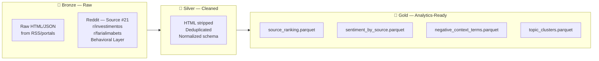

# Medallion Architecture
### **Investor Intelligence Platform - FIIs Brasil 🇧🇷**

  

## Overview

The **Medallion Architecture** (also known as Delta Architecture) organizes data into progressive quality layers. Each layer adds structure, cleaning, and business value to the preceding one.

  

## Layer Definitions

### 🥉 Bronze — Raw Ingestion

| Property | Value |
|----------|-------|
| **Location** | `data/bronze/` |
| **Format** | Parquet (partitioned by `source`) |
| **Transformations** | None |
| **Schema** | Flexible (source-dependent) |
| **Retention** | Project lifetime |
| **Git** | ❌ Not committed (data/bronze/ in .gitignore) |
| **Notebook** | `NB01` |

**What's stored**: Raw RSS entries, raw HTML bodies, raw Reddit post JSON.

  

### 🥈 Silver — Cleaned & Normalized

**Principle**: Single source of truth for downstream modeling. Validated, deduplicated, schema-enforced.

| Property | Value |
|----------|-------|
| **Location** | `data/silver/` |
| **Format** | Parquet (single partition) |
| **Key transformation** | Bronze → Silver (NB02, PySpark) |
| **Schema** | Fixed (see `docs/governance/data_dictionary.md`) |
| **ID** | `SHA-256(url)` — deterministic |
| **Quality** | No nulls in key fields; word_count ≥ 20 |
| **Git** | ❌ Not committed |
| **Notebook** | `NB02` |

 

**Transformations applied**:

## Data Processing Rules

| Operation | Input | Transformation | Output |
|---|---|---|---|
| **HTML Cleaning** | Raw HTML | BeautifulSoup stripping | Clean text |
| **Deduplication** | Duplicate URLs | Keep first occurrence | De-duplicated URLs |
| **Date Normalization** | `published_date` *(string)* | Timestamp conversion | `timestamp` |
| **ID Generation** | `url` | `SHA-256(url)` | `article_id` |
| **Feature Extraction** | `body` | `len(body.split())` | `word_count` |

 

### 🥇 Gold — Business-Ready Analytics

**Principle**: Pre-computed, aggregated outputs optimized for API serving and dashboard consumption.

| Property | Value |
|----------|-------|
| **Location** | `data/gold/` |
| **Format** | Parquet (one file per analytical output) |
| **Produced by** | NB03, NB04, NB05 |
| **Consumers** | FastAPI (NB06), Streamlit (NB07) |
| **Git** | ❌ Not committed (regenerated from Silver) |
| **Notebook** | `NB05` (final Gold export) |

 

**Gold tables**:

| File | Rows | Description |
|------|------|-------------|
| `source_ranking.parquet` | 20 | BM25 + sentiment + strategic score per source |
| `sentiment_by_source.parquet` | ~60 | Sentiment distribution per source |
| `negative_context_terms.parquet` | Variable | Negative term co-occurrence per source |
| `topic_clusters.parquet` | 5 | LDA topic model outputs |

 

### 🔒 External — Frozen Dataset

**Purpose**: Deterministic reproducibility and demo stability.

| Property | Value |
|----------|-------|
| **Location** | `data/external/` |
| **Origin** | NB01 real scraping, then frozen |
| **Git** | ✅ Committed (exception to gitignore) |
| **Mutation** | Never modified after initial collection |

   

## `data/external/`

| Resource | Format | Purpose |
|---|---|---|
| `rss_fii_articles.parquet` | Parquet | RSS article dataset |
| `portal_fii_articles.csv` | CSV | Financial portal article dataset |
| `reddit_fii_posts.parquet` | Parquet | Behavioral sentiment layer from Reddit *(Source #21)* |
| `data_collection_report.json` | JSON | Data provenance and collection metadata |
| `README.md` | Markdown | Folder-level documentation |

**Why frozen?** Scraping results vary by run (new articles appear, old ones disappear). Freezing ensures:
- NB02–NB07 produce identical results on any machine
- Academic evaluation is fair and reproducible
- No demo failures due to live API issues

  

## Pipeline Flow

| Notebook | Input | Processing | Output |
|---|---|---|---|
| **NB01** | RSS + Portals + Reddit | Data collection | `data/bronze/` → `data/external/` *(freeze)* |
| **NB02** | `data/external/` | PySpark ETL | `data/silver/` |
| **NB03** | `data/silver/` | BM25 + Sentiment + NegCtx | Gold intermediaries |
| **NB04** | `data/silver/` | LDA Topics | Gold intermediaries |
| **NB05** | Gold intermediaries | Aggregation | `data/gold/` *(final)* |
| **NB06** | `data/gold/` | FastAPI | REST endpoints |
| **NB07** | FastAPI *(or `data/gold/` fallback)* | Streamlit | User |

