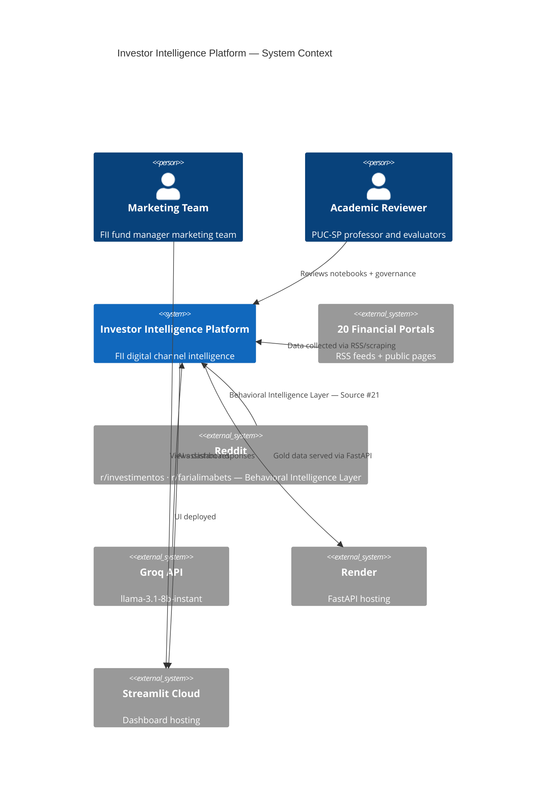
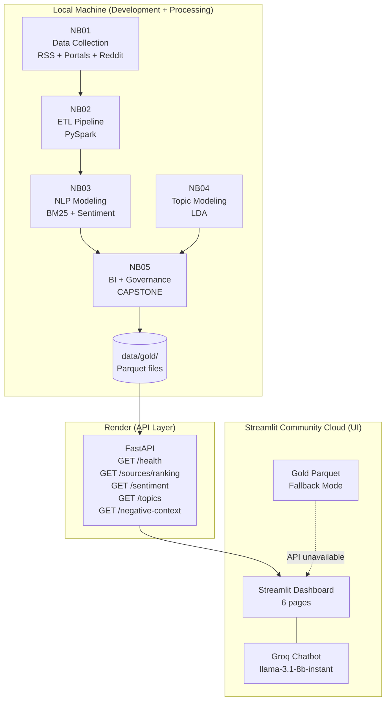

# System Architecture

**Investor Intelligence Platform - FIIs Brasil 🇧🇷**

  

## High-Level Architecture

  

## Deployment Architecture

  

## Component Catalog

| Component | Technology | Responsibility | Deployment |
|-----------|------------|---------------|------------|
| **Scraper** | feedparser, requests, PRAW | Data collection | Local only |
| **ETL Pipeline** | PySpark 3.5 | Bronze → Silver → Gold | Local only |
| **NLP Engine** | BM25, TextBlob, Scikit-learn | Modeling | Local only |
| **FastAPI** | FastAPI 0.111 + Uvicorn | REST API serving | Render |
| **Dashboard** | Streamlit 1.35 | UI + visualization | Streamlit Cloud |
| **AI Assistant** | Groq (llama-3.1-8b-instant) | Q&A chatbot | Groq cloud |
| **Gold Storage** | Parquet (PyArrow) | Analytics data store | Local + Render |

  

## FastAPI Endpoints

| Method | Endpoint | Description | Response |
|--------|---------|-------------|---------|
| GET | `/health` | Health check | `{"status": "healthy", "version": "2.1"}` |
| GET | `/sources/ranking` | BM25 + strategic score ranking | Array of source objects |
| GET | `/sentiment/by-source` | Sentiment distribution | Pivot by source + sentiment |
| GET | `/negative-context` | Negative context scores | Array sorted by severity |
| GET | `/topics` | LDA topic clusters | Array of topic objects |

  

## Security Architecture

| Layer | Control | Implementation |
|-------|---------|---------------|
| API key | Secret management | `st.secrets["GROQ_API_KEY_FII"]` → `os.getenv` |
| Git | Secret exclusion | `.gitignore` covers `.env`, `secrets.toml` |
| Scraping | Ethical compliance | Rate limiting, `robots.txt` check, user agent |
| Dashboard | No auth required | Public academic project; no PII in outputs |

  

## Technology Stack Summary

| Categoria         | Tecnologias / Versões |
|-------------------|------------------------|
| **Data Engineering** | PySpark 3.5.1 · Pandas 2.1.4 · PyArrow 14.0.2 |
| **NLP** | rank-bm25 0.2.2 · TextBlob 0.17.1 · NLTK 3.8.1 · Scikit-learn 1.4.2 |
| **Visualization** | Plotly 5.20.0 · WordCloud 1.9.3 |
| **Backend** | FastAPI 0.111.0 · Uvicorn 0.29.0 · Pydantic 2.7.1 |
| **Frontend** | Streamlit 1.35.0 |
| **AI** | Groq 0.9.0 (llama-3.1-8b-instant) |
| **Collection** | feedparser 6.0.11 · BeautifulSoup4 4.12.3 · PRAW 7.7.1 |
| **Runtime** | Python 3.10+ · Java 11+ (Spark dependency) |

