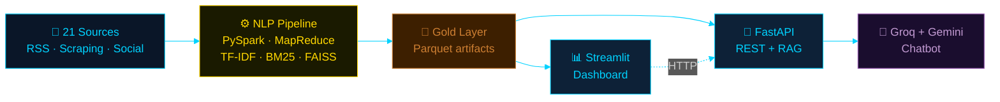
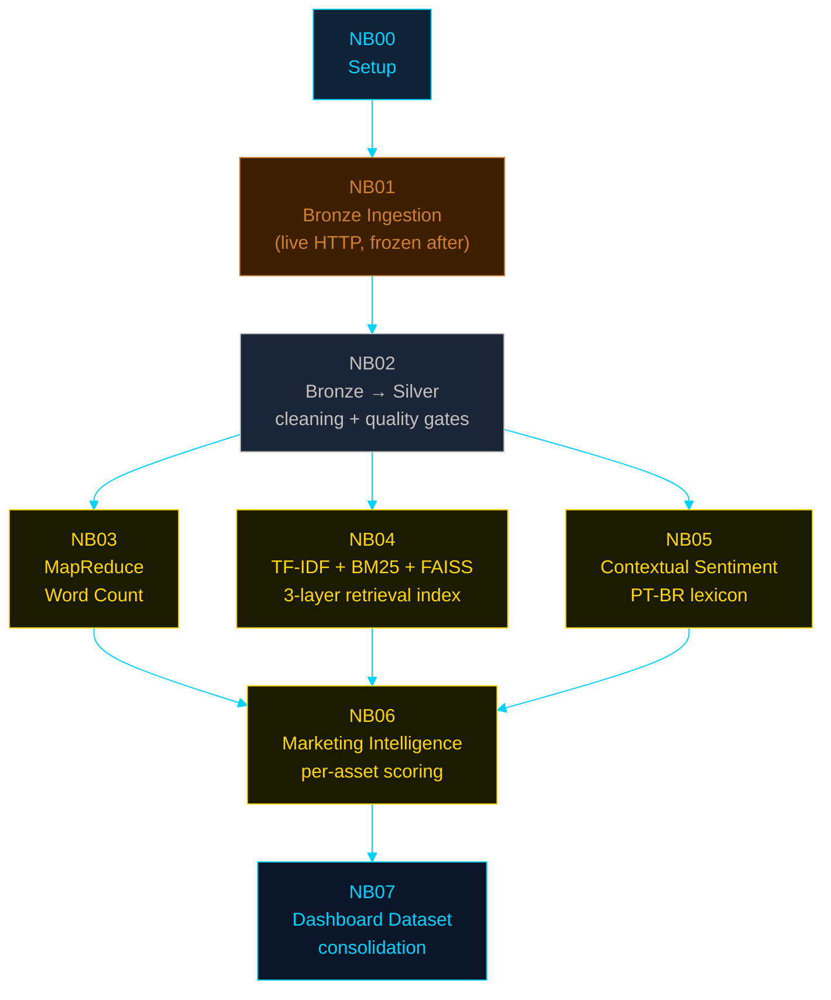
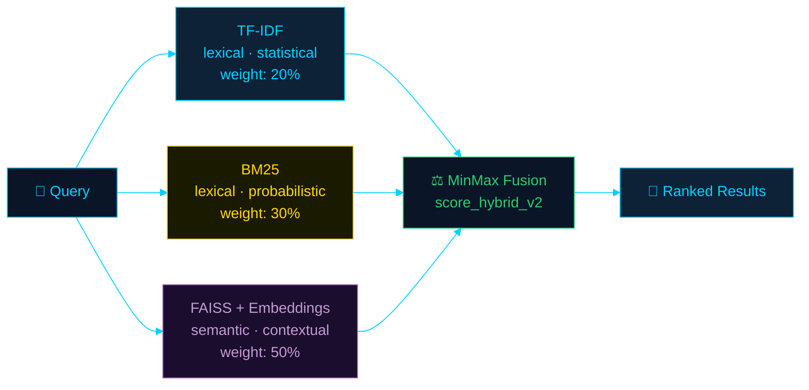
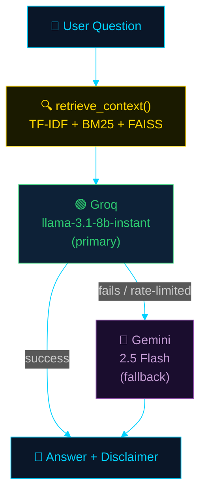
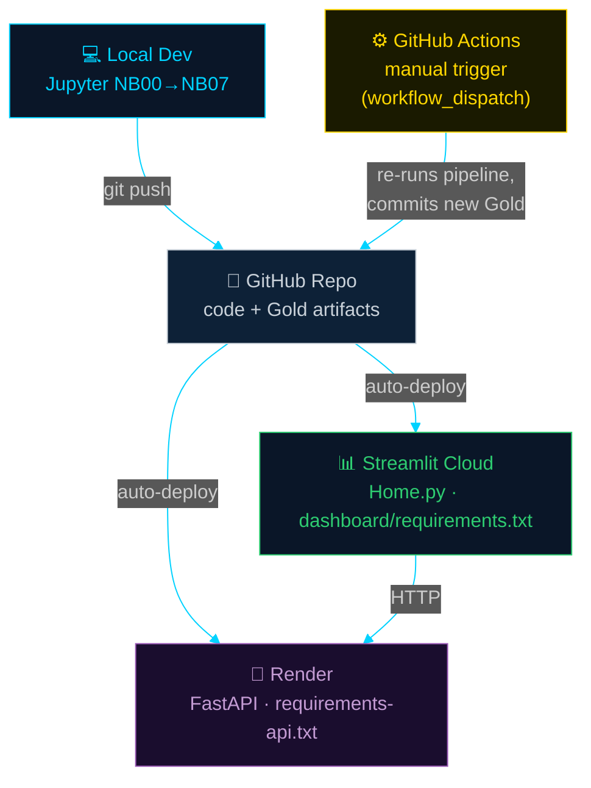

# 🏗️ Architecture Overview

## Investor Intelligence Platform — Brazilian REITs (FIIs)

> High-level system architecture for an international audience. For
> exhaustive, line-by-line technical detail (schemas, formulas, governance),
> see the Portuguese documentation under [`docs/`](.) — links are provided
> throughout this document.

---

## Table of Contents

1. [System Overview](#system-overview)
2. [Data Pipeline Architecture (Medallion)](#data-pipeline-architecture-medallion)
3. [Hybrid Retrieval Architecture (3 Layers)](#hybrid-retrieval-architecture-3-layers)
4. [RAG + Multi-LLM Fallback Architecture](#rag--multi-llm-fallback-architecture)
5. [Deployment Architecture](#deployment-architecture)
6. [Technology Stack](#technology-stack)
7. [Key Architectural Decisions](#key-architectural-decisions)
8. [Further Reading](#further-reading)

---

## System Overview

The platform ingests public editorial and social content about Brazilian
Real Estate Investment Funds (*Fundos de Investimento Imobiliário* — FIIs),
processes it through a distributed NLP pipeline, and serves the resulting
market intelligence through a REST API and an interactive dashboard.



**Three architectural pillars:**

| Pillar | Purpose | Detail |
|---|---|---|
| **Medallion data pipeline** | Reproducible, auditable batch processing | Bronze (raw) → Silver (clean) → Gold (analytics-ready) |
| **Hybrid retrieval** | Lexical + semantic search over the corpus | TF-IDF + BM25 (lexical) + FAISS embeddings (semantic) |
| **Resilient serving layer** | Production deployment on free-tier infrastructure | FastAPI (Render) + Streamlit (Community Cloud) + dual-LLM chatbot |

---

## Data Pipeline Architecture (Medallion)

8 Jupyter notebooks (`NB00`–`NB07`) implement the full pipeline under the
[CRISP-DM](https://en.wikipedia.org/wiki/Cross-industry_standard_process_for_data_mining)
methodology, with a frozen-dataset rule for reproducibility: only `NB01`
performs live HTTP requests; every downstream notebook reads exclusively
from the frozen Bronze snapshot.



| Layer | Storage | Schema enforcement | Mutability |
|---|---|---|---|
| **Bronze** | `data/external/*.parquet` | 17-field contract, `article_id = SHA-256(url)` | Frozen after `NB01` |
| **Silver** | `data/silver/*.parquet` | 22 columns, 3 quality gates | Regenerated per run |
| **Gold** | `data/gold/**/*.parquet` | Per-notebook output contracts | Regenerated per run |

> 🇧🇷 Full schema contracts: [`docs/architecture/bronze_schema.md`](architecture/bronze_schema.md),
> [`silver_schema.md`](architecture/silver_schema.md),
> [`gold_schema.md`](architecture/gold_schema.md).

---

## Hybrid Retrieval Architecture (3 Layers)

Three complementary techniques are combined into a single relevance score,
each compensating for the others' blind spots.



```
score_hybrid_v2 = 0.20 × TF-IDF_norm + 0.30 × BM25_norm + 0.50 × Semantic_norm
```

**Why three layers, not one:**

| Layer | Strength | Blind spot |
|---|---|---|
| TF-IDF | Surfaces domain-specific n-grams (e.g. *"dividend yield"*) | Ignores document length |
| BM25 | Normalizes by document length, saturates repeated terms | Still bag-of-words — no synonyms |
| FAISS (embeddings) | Captures semantic similarity even with zero lexical overlap | Higher latency per query (~10–50ms) |

**Graceful degradation:** if `faiss-cpu` / `sentence-transformers` are
unavailable in a constrained environment, the system automatically falls
back to a 2-layer hybrid (`40% TF-IDF + 60% BM25`) without raising an
exception.

> 🇧🇷 Full mathematical derivation: [`docs/methodology/BM25_FOUNDATION.md`](methodology/BM25_FOUNDATION.md).

---

## RAG + Multi-LLM Fallback Architecture

The chatbot uses *Retrieval-Augmented Generation*: the hybrid retrieval
layer above supplies grounded context to a generative LLM, which produces
the final natural-language answer.



**Design rationale — fallback, not replacement.** A single LLM provider,
even a free one, is a single point of failure under burst traffic (e.g.
several rapid questions during a live demo). Two independent, stable free
tiers (Groq and Google Gemini) cover for each other; neither requires a
credit card. A third option (OpenRouter) was evaluated and rejected: its
free catalog is explicitly subject to change without notice, which
reintroduces the exact instability this design avoids.

| Aspect | Single-provider | Fallback (implemented) |
|---|---|---|
| Rate-limit during burst traffic | Chat breaks | Second provider takes over transparently |
| Provider outage | No alternative | Other provider covers |
| Credit card required | No | No (neither provider) |

> 🇧🇷 Full decision record with rejected alternatives: [`docs/architecture/MULTI_LLM_FALLBACK.md`](architecture/MULTI_LLM_FALLBACK.md).

---

## Deployment Architecture



**Key property: each deployment target has its own dependency file.**
Render and Streamlit Cloud are both memory-constrained free tiers; shipping
the full notebook environment (PySpark, Torch, Selenium) to either would
slow builds and risk out-of-memory failures for dependencies that service
layer never actually imports.

| Target | Dependency file | Why separate |
|---|---|---|
| Notebooks (local) | `requirements.txt` | Full environment — PySpark, FAISS, Torch |
| API (Render) | `requirements-api.txt` | No PySpark/Jupyter — referenced directly by `render.yaml` |
| Dashboard (Streamlit Cloud) | `dashboard/requirements.txt` | Streamlit Cloud auto-discovers a dependency file in the *entrypoint's own directory* before falling back to the repo root — placing it next to `Home.py` keeps the build to 7 packages instead of ~56 |

**Data refresh model:** intentionally manual, not scheduled. `NB01`
performs live scraping across 21 sources; an unsupervised cron failure at
3am would leave the dashboard silently serving broken data. A human clicks
"Run workflow" when a refresh is needed — full pipeline re-run, no
incremental mode (TF-IDF/BM25 statistics are corpus-wide, not
per-document, so partial updates aren't mathematically equivalent to a
full refit).

> 🇧🇷 Full deployment guides: [`DEPLOY_RENDER.md`](../DEPLOY_RENDER.md),
> [`DEPLOY_STREAMLIT.md`](../DEPLOY_STREAMLIT.md). Refresh-model rationale:
> [`docs/architecture/ATUALIZACAO_E_REPROCESSAMENTO.md`](architecture/ATUALIZACAO_E_REPROCESSAMENTO.md).

---

## Technology Stack

| Layer | Technology |
|---|---|
| Distributed compute | Apache Spark (PySpark), RDD MapReduce |
| Lexical retrieval | scikit-learn (TF-IDF), `rank-bm25` (BM25Okapi) |
| Semantic retrieval | `sentence-transformers` (multilingual MiniLM), FAISS (`IndexFlatIP`) |
| Sentiment | Custom PT-BR lexicon, rule-based (no ML training) |
| API | FastAPI + Uvicorn |
| Dashboard | Streamlit + Plotly |
| LLM | Groq (`llama-3.1-8b-instant`) + Google Gemini (`gemini-2.5-flash`) |
| Storage | Apache Parquet (Snappy), pickle (indices), FAISS binary index |
| CI/Automation | GitHub Actions (`workflow_dispatch`) |
| Hosting | Render (API, free tier) + Streamlit Community Cloud (dashboard, free tier) |

---

## Key Architectural Decisions

| Decision | Why |
|---|---|
| Medallion architecture over a single flat table | Clear separation of raw fidelity (Bronze), cleanliness (Silver), and analytical value (Gold); matches industry-standard lakehouse patterns |
| `RANDOM_SEED = 42` everywhere | Deterministic reproducibility — running the pipeline twice yields identical output |
| Frozen Bronze snapshot | `NB02`–`NB07` never re-fetch live data, guaranteeing every downstream notebook run is reproducible |
| Hybrid retrieval (not embeddings alone) | Pure semantic search misses exact-match cases (e.g. ticker symbols); pure lexical search misses synonyms |
| Dual-LLM fallback (not single provider) | Removes a single point of failure without adding cost or credit-card dependency |
| Per-target dependency files | Avoids shipping PySpark/Torch to memory-constrained serving environments that never import them |
| Manual data refresh (not cron) | A human-supervised trigger catches partial scraping failures before they reach production silently |

---

## Further Reading

| Topic | Document |
|---|---|
| Full Portuguese README | [`README_FINAL.md`](../README_FINAL.md) |
| Step-by-step execution & deployment guide | [`MANUAL_COMPLETO.md`](../MANUAL_COMPLETO.md) |
| CRISP-DM methodology mapping | [`docs/methodology/CRISP_DM_MAPPING.md`](methodology/CRISP_DM_MAPPING.md) |
| Sentiment lexicon methodology | [`docs/methodology/SENTIMENT_METHODOLOGY.md`](methodology/SENTIMENT_METHODOLOGY.md) |
| Responsible AI & model cards | [`docs/governance/RESPONSIBLE_AI.md`](governance/RESPONSIBLE_AI.md) |
| LGPD (Brazilian data protection law) alignment | [`docs/governance/LGPD_ALIGNMENT.md`](governance/LGPD_ALIGNMENT.md) |

---

*Architecture Overview v1.0.0 · Investor Intelligence Platform · PUC-SP FACEI*
