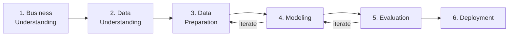

# CRISP-DM Methodology Mapping

### **Investor Intelligence Platform - FIIs Brasil 🇧🇷**

  

## Overview

This project follows **CRISP-DM** (Cross-Industry Standard Process for Data Mining), the de facto standard methodology for data science and machine learning projects.

  

## Phase-to-Notebook Mapping

### Phase 1: Business Understanding → `NB00`

**Deliverables**:
- Business problem formulation
- Success criteria definition
- CRISP-DM framework initialization
- Responsible AI principles documentation
- Project governance structure

 

**Key decisions made**:
- Specialization: FII digital channel intelligence (not general finance)
- NLP approach: BM25 for ranking, 4-layer sentiment for PT-BR
- Architecture: Medallion (Bronze/Silver/Gold), local scraping + cloud serving
- Scope: 20 financial portals + Reddit enrichment

 

### Phase 2: Data Understanding → `NB01`

**Deliverables**:
- Real data collection from 21 monitored sources (20 editorial + Reddit behavioral) (RSS + lightweight scraping)
- Reddit behavioral layer — PRAW API or frozen dataset fallback (Source #21)
- Frozen reproducible dataset (`data/external/`)
- Data collection provenance report

**Data exploration**:
- Source distribution analysis
- Publication date ranges
- Article volume per portal
- Initial FII keyword frequency scan

  

### Phase 3: Data Preparation → `NB02`

**Deliverables**:
- Bronze → Silver transformation (PySpark ETL)
- HTML stripping, deduplication, schema validation
- Quality filters (min word count, min char count)
- Silver Layer parquet output

**Techniques applied**:
- Deterministic ID generation: `SHA-256(url)`
- Null-safe column transformations
- PySpark `regexp_replace`, `trim`, `lower`

  

### Phase 4: Modeling → `NB03` + `NB04`

#### NB03 — NLP Modeling

**Deliverables**:
- Word Count analysis (explicit academic requirement)
- TF-IDF vectorization
- BM25 source relevance ranking
- 4-layer PT-BR sentiment analysis
- Negative Context Detection (Desafio Extra)
- Source explainability outputs

#### NB04 — Topic Modeling

**Deliverables**:
- LDA topic model (k=5 topics)
- Investor discussion cluster analysis
- Topic naming and business interpretation
- Coherence score evaluation

  

### Phase 5: Evaluation → `NB05` ★ CAPSTONE

**Deliverables**:
- Business Intelligence layer (executive insights)
- Strategic channel recommendations (Topo de Funil)
- Full Governance & Responsible AI documentation
- Gold Layer final export
- Academic conclusion and briefing alignment validation

This notebook represents the **complete academic delivery**.

  

### Phase 6: Deployment → `NB06` + `NB07`

#### NB06 — FastAPI Backend

**Deliverables**:
- FastAPI application validation
- REST endpoint documentation
- Render deployment guide

#### NB07 — Streamlit Dashboard

**Deliverables**:
- Streamlit UI validation
- Dual-mode (API + fallback) verification
- Groq chatbot integration test
- Streamlit Cloud deployment guide

  

## Iterative Cycles

| From | To | Trigger | Frequency |
|------|-----|---------|-----------|
| NB05 Evaluation | NB03 Modeling | Sentiment threshold adjustment | As needed |
| NB05 Evaluation | NB04 Modeling | Topic count adjustment | As needed |
| NB03 Modeling | NB02 Preparation | Feature engineering revision | As needed |
| NB06/07 Deployment | NB05 Evaluation | API serving validation reveals data issues | As needed |

  

## Quality Gates

| Gate | Notebook | Criterion |
|------|----------|-----------|
| Data completeness | NB01 | ≥ 500 real articles collected |
| Silver quality | NB02 | < 5% null values; duplicates removed |
| BM25 coverage | NB03 | All 20 sources scored |
| Topic coherence | NB04 | C_v > 0.4 (or human-validated) |
| API health | NB06 | `GET /health` returns 200 |
| Dashboard stability | NB07 | Dual mode tested (API + fallback) |

Methodology: *CRISP-DM (Chapman et al., 2000)*
