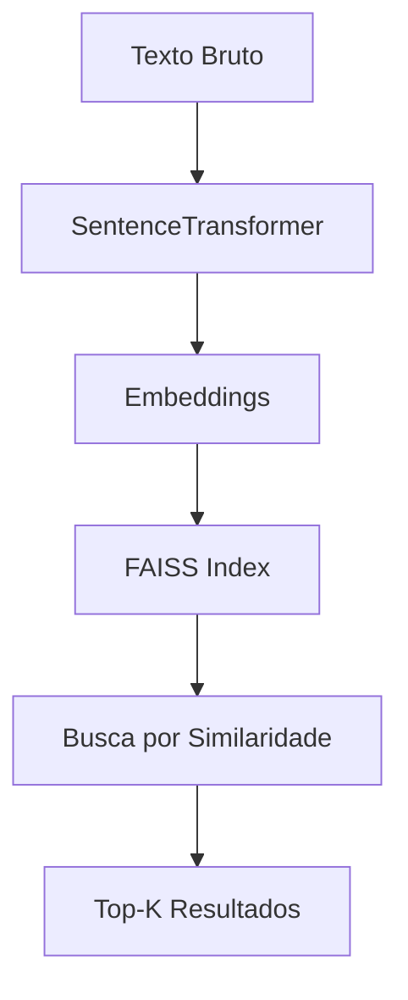

#  FAISS (Facebook AI Similarity Search)

##  Visão Geral

**FAISS (Facebook AI Similarity Search)** é uma biblioteca open-source desenvolvida pela Meta que permite **busca eficiente de similaridade em vetores de alta dimensão**.

No contexto deste projeto, o FAISS é utilizado para realizar **busca semântica inteligente**, permitindo encontrar documentos similares com base em significado — e não apenas por palavras-chave.

---

## 🧠 Papel no Pipeline

O FAISS atua como o mecanismo central de **recuperação vetorial**, sendo responsável por:

* Indexar embeddings gerados a partir de textos financeiros
* Permitir buscas rápidas em grandes volumes de dados
* Suportar o sistema de **RAG (Retrieval-Augmented Generation)**

---

## 🔄 Fluxo de Funcionamento

---

## ⚙️ Como Funciona

### 1. Geração de Embeddings

Os textos são convertidos em vetores numéricos utilizando modelos como:

* SentenceTransformer
* Modelos BERT-like

---

### 2. Indexação

Os vetores são armazenados em estruturas otimizadas, como:

* IndexFlatL2 (busca exata)
* IndexIVFFlat (busca aproximada)
* HNSW (Hierarchical Navigable Small World)

---

### 3. Busca por Similaridade

Dado um novo vetor (query), o FAISS retorna os vetores mais próximos com base em métricas como:

* Distância Euclidiana (L2)
* Similaridade de Cosseno

---

## 🔗 Integração com Outras Técnicas

O FAISS não atua sozinho. Ele se integra com:

### 📊 TF-IDF / BM25

* Responsáveis por busca lexical (baseada em palavras)
* Complementam o FAISS com precisão textual

### 🧩 Embeddings

* Representação semântica dos textos
* Base para o funcionamento do FAISS

### 🔁 RAG

* Usa o FAISS para recuperar contexto relevante
* Alimenta modelos de linguagem com dados externos

---

## 🧠 Aplicação no Projeto (FIIs)

No contexto de análise de Fundos Imobiliários (FIIs), o FAISS permite:

* Identificar notícias similares sobre ativos financeiros
* Detectar padrões em eventos de mercado
* Melhorar a análise de sentimento contextual
* Apoiar decisões de investimento com base em contexto semântico

---

## 🚀 Vantagens

* Alta performance em grandes volumes de dados
* Escalável para milhões de vetores
* Suporte a GPU (NVIDIA CUDA)
* Essencial para sistemas modernos de IA

---

## ⚠️ Limitações

* Requer embeddings bem treinados
* Busca aproximada pode perder precisão
* Não substitui técnicas lexicais (TF-IDF / BM25)

---

## 📚 Conclusão

O FAISS é uma peça fundamental na arquitetura de sistemas de IA modernos, permitindo transformar dados textuais em um sistema de busca semântica altamente eficiente.

Quando combinado com **TF-IDF, BM25, Embeddings e RAG**, forma uma solução robusta para análise inteligente de dados financeiros.

---
