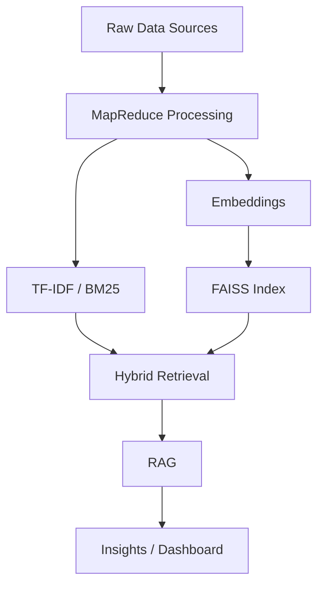
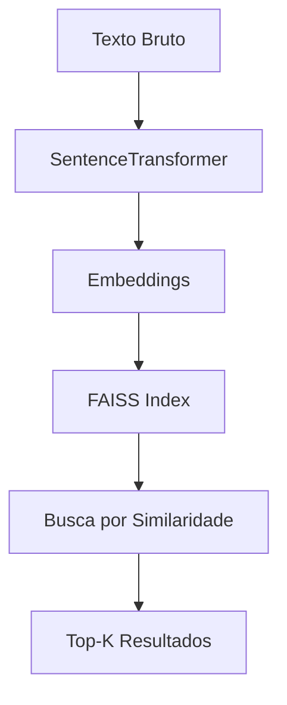

# 🔎 FAISS (Facebook AI Similarity Search)

## 📌 Visão Geral

**FAISS (Facebook AI Similarity Search)** é uma biblioteca open-source desenvolvida pela Meta que permite **busca eficiente de similaridade em vetores de alta dimensão**.

No contexto deste projeto, o FAISS é utilizado para realizar **busca semântica inteligente**, permitindo encontrar documentos similares com base em significado — e não apenas por palavras-chave.
  

## 🧠 Papel no Pipeline

O FAISS atua como o núcleo de **recuperação vetorial**, sendo responsável por:

* Indexar embeddings gerados a partir de textos financeiros
* Permitir buscas rápidas em grandes volumes de dados
* Servir como base para sistemas de **RAG (Retrieval-Augmented Generation)**

  

## 🏗️ Pipeline Completo (Arquitetura do Projeto)

 

  

## 🔄 Fluxo de Funcionamento do FAISS

 

-  

## ⚙️ Como Funciona

### 1. Geração de Embeddings

Os textos são convertidos em vetores numéricos utilizando modelos como:

* SentenceTransformer
* Modelos baseados em BERT

👉 Analogia:
Embeddings transformam textos em **coordenadas num espaço semântico**

  
### 2. Indexação

Os vetores são armazenados em estruturas otimizadas como:

* IndexFlatL2 (busca exata)
* IndexIVFFlat (busca aproximada)
* HNSW (alta performance em grafos)

  

### 3. Busca por Similaridade

Dada uma query:

* FAISS encontra os vetores mais próximos
* Utiliza métricas como:

  * Distância Euclidiana (L2)
  * Similaridade de Cosseno

👉 Analogia:
FAISS funciona como um **GPS semântico**, encontrando “pontos mais próximos” no espaço de significado

  

## 🔗 Como o FAISS se Integra às Outras Técnicas

Este projeto utiliza uma abordagem **híbrida**, onde múltiplas técnicas se complementam:

  

### 📊 TF-IDF + BM25 (Busca Lexical)

* Baseadas em frequência de palavras
* Excelentes para precisão textual
* Capturam termos exatos (ex: “dividend yield”, “vacância”)

✔ Limitacão: não entendem contexto semântico

  

### 🧩 Embeddings (Base Semântica)

* Capturam significado e contexto
* Permitem comparar textos mesmo com palavras diferentes

✔ Base para o FAISS

  

### 🔎 FAISS (Busca Vetorial)

* Realiza busca semântica em larga escala
* Retorna documentos mais relevantes por significado

✔ Resolve limitação da busca puramente lexical

  

### 🔀 Hybrid Retrieval

* Combina:

  * BM25 (precisão lexical)
  * FAISS (similaridade semântica)

✔ Melhor dos dois mundos

  

### 🤖 RAG (Retrieval-Augmented Generation)

* Usa os resultados do FAISS + BM25
* Injeta contexto relevante em LLMs

✔ Gera respostas mais precisas, explicáveis e contextualizadas

  

## 🧠 Aplicação no Projeto (FIIs)

No contexto de Fundos Imobiliários:

* Identificação de notícias similares sobre ativos
* Detecção de padrões de mercado
* Agrupamento de eventos financeiros
* Análise contextual de sentimento
* Apoio à decisão de investimento

  

## 🚀 Vantagens

* Alta performance (milhões de vetores)
* Escalável (CPU + GPU)
* Base para sistemas modernos de IA
* Essencial para RAG e busca semântica

  

## ⚠️ Limitações

* Depende da qualidade dos embeddings
* Busca aproximada pode perder precisão
* Não substitui TF-IDF / BM25

  

## 📚 Referência Conceitual

Para uma explicação mais profunda da arquitetura e fundamentos teóricos:

👉 Ver: `docs/Conceptual Foundations.md`

  

## 🧾 Conclusão

O FAISS é o componente central da camada semântica do sistema.

Quando combinado com:

* **TF-IDF**
* **BM25**
* **Embeddings**
* **RAG**

forma uma arquitetura robusta de **Inteligência de Mercado baseada em IA**, permitindo transformar dados financeiros não estruturados em **insights acionáveis**.

