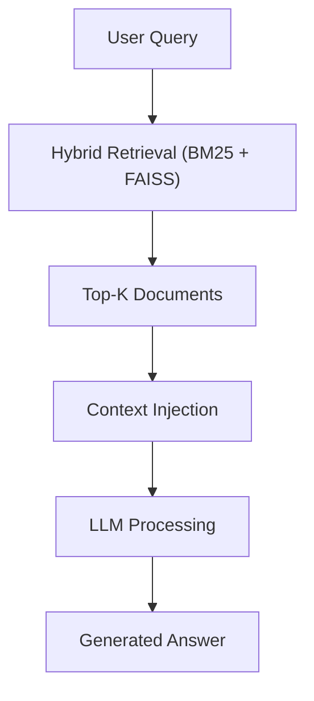

# 🤖 RAG (Retrieval-Augmented Generation)

## 📌 Visão Geral

**RAG (Retrieval-Augmented Generation)** é uma arquitetura que combina **recuperação de informação (retrieval)** com **modelos de linguagem (LLMs)** para gerar respostas mais precisas, contextualizadas e confiáveis.  

Diferente de modelos isolados, o RAG consulta dados externos antes de responder, reduzindo erros e alucinações.  

  

## 🧠 Papel no Pipeline

No projeto, o RAG é a camada final responsável por:  

* Transformar dados em respostas interpretáveis 
* Utilizar contexto recuperado (Hybrid Retrieval) 
* Gerar insights acionáveis  

  

## 🏗️ Pipeline do RAG

  

  

## ⚙️ Como Funciona

### 1. Query do Usuário

* O usuário faz uma pergunta 
* Exemplo: “Quais FIIs estão com risco de vacância?”  

  

### 2. Recuperação de Contexto

* Hybrid Retrieval (BM25 + FAISS) 
* Seleção dos documentos mais relevantes  

  

### 3. Injeção de Contexto

* Os documentos são inseridos no prompt do modelo 
* Criação de contexto estruturado  

  

### 4. Geração da Resposta

* O LLM gera a resposta com base no contexto 
* Resultado mais preciso e fundamentado  

  

## 🔗 Integração com Outras Técnicas

* **FAISS** → busca semântica 
* **BM25 / TF-IDF** → precisão lexical 
* **Embeddings** → representação de significado 
* **Hybrid Retrieval** → combinação otimizada  

  

## 🧠 Aplicação no Projeto (FIIs)

* Análise de notícias financeiras 
* Detecção de risco (vacância, inadimplência) 
* Geração de insights de investimento 
* Suporte à decisão estratégica  

  

## 🚀 Vantagens

* Redução de alucinações 
* Maior precisão 
* Respostas explicáveis 
* Integração com dados reais  

  

## ⚠️ Limitações

* Dependência da qualidade do retrieval 
* Custo computacional maior 
* Necessidade de engenharia de prompt  

  

## 📚 Referência

Ver: 
`docs/Conceptual Foundations.md`  

  

## 🧾 Conclusão

O RAG transforma o sistema em uma **plataforma de inteligência**, onde dados são convertidos em conhecimento acionável.  

