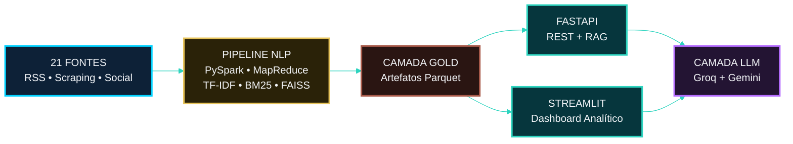
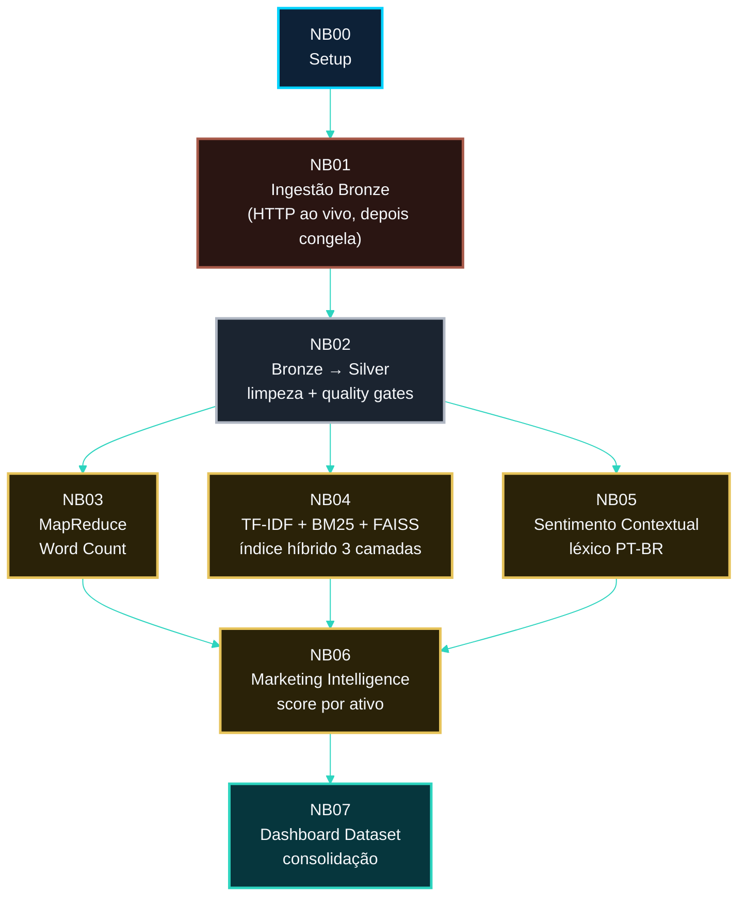
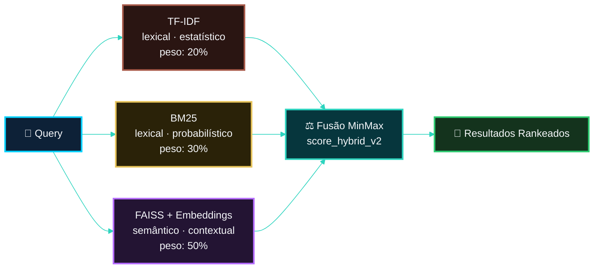
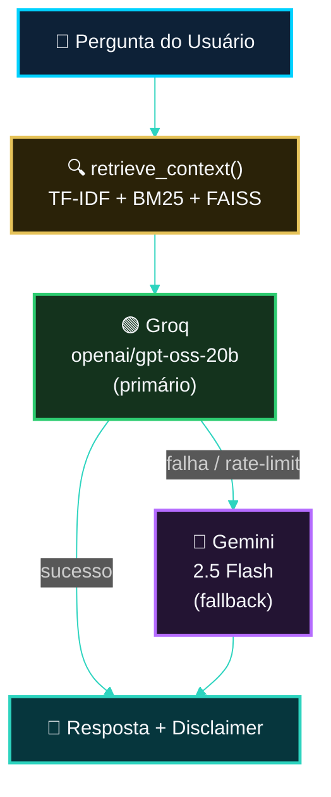
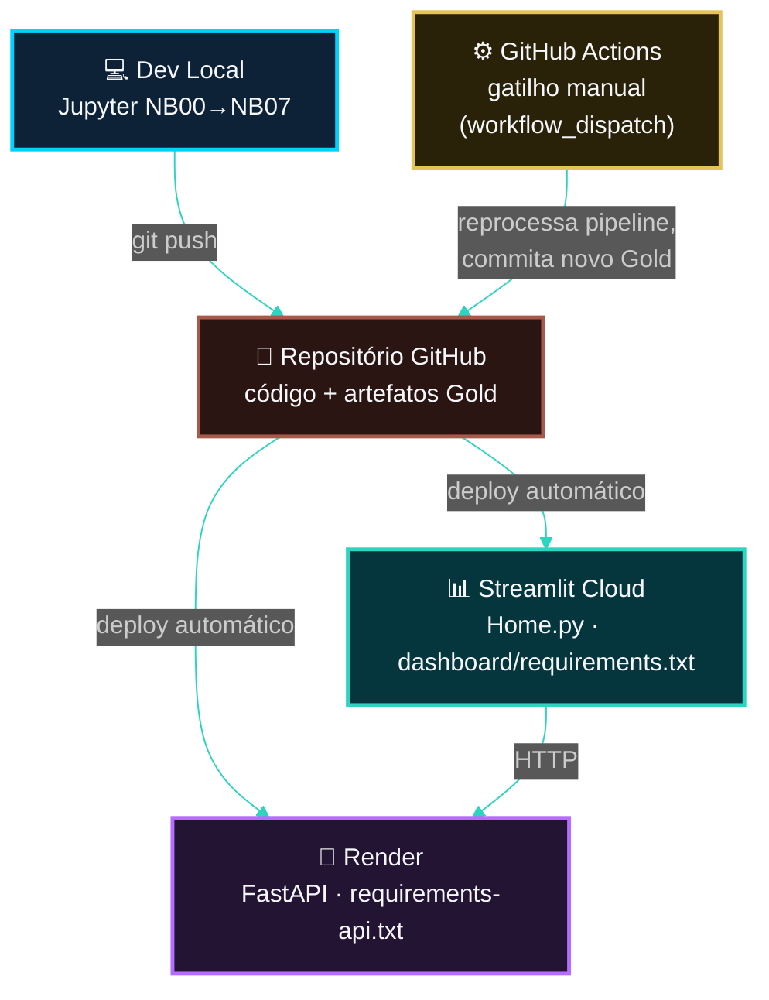

<!-- LANGUAGE BUTTONS -->
**\[[🇧🇷 Português](ARQUITETURA.md)\] \[**[🇬🇧 English](../../🇬🇧English/architecture/ARCHITECTURE.md)**\]**

<br><br>

## [🏗️ Visão Geral da Arquitetura]()
### Investor Intelligence Platform — FIIs Brasil 🇧🇷

<br><br>

> Arquitetura de alto nível do sistema para um público internacional. Para o detalhamento técnico exaustivo, linha a linha (schemas, fórmulas, governança), veja a documentação em português em [`docs/`](.) — os links estão espalhados ao longo deste documento.

<br><br>

## [📋 Sumário]()

<br><br>

1. [Visão Geral do Sistema](#visão-geral-do-sistema)
2. [Arquitetura do Pipeline de Dados (Medallion)](#arquitetura-do-pipeline-de-dados-medallion)
3. [Arquitetura de Recuperação Híbrida (3 Camadas)](#arquitetura-de-recuperação-híbrida-3-camadas)
4. [Arquitetura RAG + Fallback Multi-LLM](#arquitetura-rag--fallback-multi-llm)
5. [Arquitetura de Deployment](#arquitetura-de-deployment)
6. [Stack Tecnológico](#stack-tecnológico)
7. [Principais Decisões Arquiteturais](#principais-decisões-arquiteturais)
8. [Leituras Complementares](#leituras-complementares)

<br><br>

## [Visão Geral do Sistema]()

<br><br>

A plataforma ingere conteúdo editorial e social público sobre Fundos de Investimento Imobiliário brasileiros (FIIs), processa esse conteúdo através de um pipeline de NLP distribuído, e serve a inteligência de mercado resultante via uma API REST e um dashboard interativo.

<br><br>



<br><br>

[***Três Pilares Arquiteturais***]()

<br><br>

| Pilar | Propósito | Detalhe |
|---|---|---|
| **Pipeline de dados Medallion** | Processamento batch reprodutível e auditável | Bronze (bruto) → Silver (limpo) → Gold (pronto para análise) |
| **Recuperação híbrida** | Busca lexical + semântica sobre o corpus | TF-IDF + BM25 (lexical) + embeddings FAISS (semântico) |
| **Camada de serving resiliente** | Deploy em produção sobre infraestrutura free-tier | FastAPI (Render) + Streamlit (Community Cloud) + chatbot dual-LLM |

<br><br>

## [Arquitetura do Pipeline de Dados (Medallion)]()

<br><br>

8 notebooks Jupyter (`NB00`–`NB07`) implementam o pipeline completo sob a metodologia [CRISP-DM](https://en.wikipedia.org/wiki/Cross-industry_standard_process_for_data_mining), com uma regra de dataset congelado para reprodutibilidade: apenas o `NB01` realiza requests HTTP ao vivo; todo notebook downstream lê exclusivamente do snapshot Bronze congelado.

<br><br>



<br><br>

| Camada | Armazenamento | Enforcement de schema | Mutabilidade |
|---|---|---|---|
| **Bronze** | `data/external/*.parquet` | Contrato de 17 campos, `article_id = SHA-256(url)` | Congelado após `NB01` |
| **Silver** | `data/silver/*.parquet` | 22 colunas, 3 quality gates | Regenerado a cada execução |
| **Gold** | `data/gold/**/*.parquet` | Contratos de output por notebook | Regenerado a cada execução |

<br><br>

> Contratos de schema completos: [`BRONZE_SCHEMA.md`](BRONZE_SCHEMA.md), [`SILVER_SCHEMA.md`](SILVER_SCHEMA.md), [`GOLD_SCHEMA.md`](GOLD_SCHEMA.md) *(pendente de envio)*.

<br><br>

## [Arquitetura de Recuperação Híbrida (3 Camadas)]()

<br><br>

Três técnicas complementares são combinadas em um único score de relevância, cada uma compensando os pontos cegos das outras.

<br><br>



<br><br>

```
score_hybrid_v2 = 0.20 × TF-IDF_norm + 0.30 × BM25_norm + 0.50 × Semantic_norm
```

<br><br>

[***Por Que Três Camadas, Não Uma***]()

<br><br>

| Camada | Força | Ponto cego |
|---|---|---|
| TF-IDF | Destaca n-gramas específicos do domínio (ex.: *"dividend yield"*) | Ignora o comprimento do documento |
| BM25 | Normaliza por comprimento de documento, satura termos repetidos | Ainda é bag-of-words — sem sinônimos |
| FAISS (embeddings) | Captura similaridade semântica mesmo sem overlap lexical | Latência maior por query (~10–50ms) |

<br><br>

**Degradação graciosa:** se `faiss-cpu` / `sentence-transformers` não estiverem disponíveis em um ambiente restrito, o sistema cai automaticamente para um híbrido de 2 camadas (`40% TF-IDF + 60% BM25`) sem lançar exceção.

<br><br>

> Derivação matemática completa: [`BM25_FOUNDATION.md`](../metodologia/BM25_FOUNDATION.md). Camada semântica: [`FAISS.md`](../metodologia/FAISS.md).

<br><br>

## [Arquitetura RAG + Fallback Multi-LLM]()

<br><br>

O chatbot usa *Retrieval-Augmented Generation*: a camada de recuperação híbrida acima fornece contexto fundamentado a um LLM generativo, que produz a resposta final em linguagem natural.

<br><br>



<br><br>

**Justificativa de design — fallback, não substituição.** Um único provedor de LLM, mesmo que gratuito, é um ponto único de falha sob tráfego em rajada (ex.: várias perguntas rápidas durante uma demo ao vivo). Dois tiers gratuitos independentes e estáveis (Groq e Google Gemini) se cobrem mutuamente; nenhum dos dois exige cartão de crédito. Uma terceira opção (OpenRouter) foi avaliada e rejeitada: seu catálogo gratuito está explicitamente sujeito a mudanças sem aviso prévio, o que reintroduz exatamente a instabilidade que este design evita.

<br><br>

| Aspecto | Provedor único | Fallback (implementado) |
|---|---|---|
| Rate-limit sob tráfego em rajada | Chat quebra | Segundo provedor assume de forma transparente |
| Indisponibilidade do provedor | Sem alternativa | O outro provedor cobre |
| Exige cartão de crédito | Não | Não (nenhum dos dois) |

<br><br>

> Registro completo da decisão com alternativas rejeitadas: [`MULTI_LLM_FALLBACK.md`](MULTI_LLM_FALLBACK.md).

<br><br>

## [Arquitetura de Deployment]()

<br><br>



<br><br>

**Propriedade-chave: cada alvo de deployment tem seu próprio arquivo de dependências.** Render e Streamlit Cloud são ambos free-tiers restritos em memória; enviar o ambiente completo dos notebooks (PySpark, Torch, Selenium) para qualquer um dos dois deixaria o build mais lento e arriscaria falhas de memória por dependências que a camada de serving nunca importa de fato.

<br><br>

| Alvo | Arquivo de dependências | Por que separado |
|---|---|---|
| Notebooks (local) | `requirements.txt` | Ambiente completo — PySpark, FAISS, Torch |
| API (Render) | `requirements-api.txt` | Sem PySpark/Jupyter — referenciado diretamente por `render.yaml` |
| Dashboard (Streamlit Cloud) | `dashboard/requirements.txt` | O Streamlit Cloud descobre automaticamente um arquivo de dependências na *própria pasta do entrypoint* antes de cair para a raiz do repo — colocá-lo ao lado de `Home.py` mantém o build em 7 pacotes em vez de ~56 |

<br><br>

**Modelo de atualização de dados:** intencionalmente manual, não agendado. O `NB01` realiza scraping ao vivo em 21 fontes; uma falha não supervisionada de um cron às 3h deixaria o dashboard servindo dados quebrados silenciosamente. Uma pessoa clica em "Run workflow" quando uma atualização é necessária — reprocessamento completo do pipeline, sem modo incremental (as estatísticas de TF-IDF/BM25 são sobre o corpus inteiro, não por documento, então atualizações parciais não são matematicamente equivalentes a um refit completo).

<br><br>

> Guias completos de deployment: [`DEPLOY_RENDER.md`](../deploy/DEPLOY_RENDER.md), [`DEPLOY_STREAMLIT.md`](../deploy/DEPLOY_STREAMLIT.md) *(pendentes de envio)*. Justificativa do modelo de atualização: [`ATUALIZACAO_E_REPROCESSAMENTO.md`](ATUALIZACAO_E_REPROCESSAMENTO.md).

<br><br>

## [Stack Tecnológico]()

<br><br>

| Camada | Tecnologia |
|---|---|
| Computação distribuída | Apache Spark (PySpark), RDD MapReduce |
| Recuperação lexical | scikit-learn (TF-IDF), `rank-bm25` (BM25Okapi) |
| Recuperação semântica | `sentence-transformers` (MiniLM multilingue), FAISS (`IndexFlatIP`) |
| Sentimento | Léxico PT-BR customizado, baseado em regras (sem treino de ML) |
| API | FastAPI + Uvicorn |
| Dashboard | Streamlit + Plotly |
| LLM | Groq (`openai/gpt-oss-20b`) + Google Gemini (`gemini-2.5-flash`) |
| Armazenamento | Apache Parquet (Snappy), pickle (índices), índice binário FAISS |
| CI/Automação | GitHub Actions (`workflow_dispatch`) |
| Hospedagem | Render (API, free tier) + Streamlit Community Cloud (dashboard, free tier) |

<br><br>

## [Principais Decisões Arquiteturais]()

<br><br>

| Decisão | Por quê |
|---|---|
| Arquitetura Medallion em vez de tabela plana única | Separação clara entre fidelidade bruta (Bronze), limpeza (Silver) e valor analítico (Gold); segue o padrão de lakehouse consolidado na indústria |
| `RANDOM_SEED = 42` em todo lugar | Reprodutibilidade determinística — rodar o pipeline duas vezes produz o mesmo output |
| Snapshot Bronze congelado | `NB02`–`NB07` nunca re-buscam dados ao vivo, garantindo que toda execução downstream seja reprodutível |
| Recuperação híbrida (não só embeddings) | Busca semântica pura perde casos de match exato (ex.: tickers); busca lexical pura perde sinônimos |
| Fallback dual-LLM (não provedor único) | Remove um ponto único de falha sem adicionar custo ou dependência de cartão de crédito |
| Arquivos de dependências por alvo | Evita enviar PySpark/Torch para ambientes de serving restritos em memória que nunca os importam |
| Atualização de dados manual (não cron) | Um gatilho supervisionado por humano captura falhas parciais de scraping antes que cheguem silenciosamente à produção |

<br><br>

## [Leituras Complementares]()

<br><br>

| Tópico | Documento |
|---|---|
| Documentação oficial e sumário executivo | [`DOCUMENTO_OFICIAL.md`](../documento_oficial/DOCUMENTO_OFICIAL.md) |
| Guia passo a passo de execução e deployment | [`GUIA_COMPLETO_DE_EXECUCAO_DEPLOY.md`](../guia_de_execução/GUIA_COMPLETO_DE_EXECUCAO_DEPLOY.md) *(pendente de envio)* |
| Fundamentos conceituais da recuperação híbrida | [`FUNDAMENTOS_CONCEITUAIS_RECUPERACAO_HIBRIDA.md`](../metodologia/FUNDAMENTOS_CONCEITUAIS_RECUPERACAO_HIBRIDA.md) |
| Camada semântica FAISS | [`FAISS.md`](../metodologia/FAISS.md) |
| Metodologia do léxico de sentimento | [`SENTIMENT_METHODOLOGY.md`](../metodologia/SENTIMENT_METHODOLOGY.md) *(pendente de envio)* |
| IA Responsável e model cards | [`RESPONSIBLE_AI.md`](../governanca/RESPONSIBLE_AI.md) |
| Alinhamento com a LGPD | [`LGPD_ALIGNMENT.md`](../governanca/LGPD_ALIGNMENT.md) |

<br><br>

---

<br><br>

*Visão Geral da Arquitetura v1.0.0 · Investor Intelligence Platform · PUC-SP FACEI*
