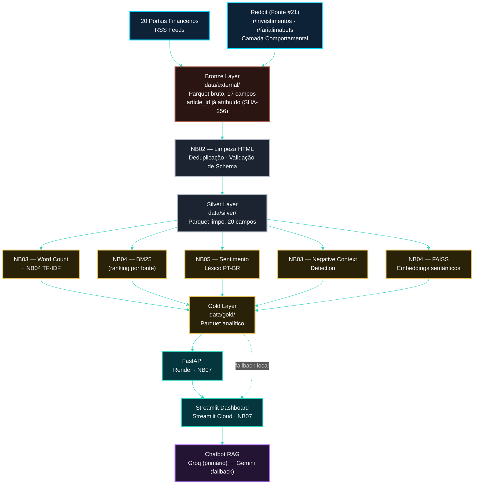

<!-- LANGUAGE BUTTONS -->
**\[[🇧🇷 Português](DATA_LINEAGE.md)\] \[**[🇬🇧 English](../../🇬🇧English/architecture/DATA_LINEAGE.md)**\]**

  

## [Linhagem de Dados]()
### Investor Intelligence Platform — FIIs Brasil 🇧🇷

  

## [Fluxo de Dados de Ponta a Ponta]()

  

  

## [Especificações por Camada]()

  

| Camada | Localização | Formato | Retenção | Git |
|---|---|---|---|---|
| **Bronze** | `data/external/` | Parquet (particionado por fonte) | Duração do projeto | ✅ commitado (dataset frozen) |
| **Silver** | `data/silver/` | Parquet (partição única) | Duração do projeto | ❌ gitignored |
| **Gold** | `data/gold/` | Parquet (um arquivo por tabela) | Por execução de análise | ✅ artefatos de deploy commitados (ver [`DEPLOY_RENDER.md`](../deploy/DEPLOY_RENDER.md)) |

  

> A política de retenção segue [`LGPD_ALIGNMENT.md`](../governanca/LGPD_ALIGNMENT.md): todas as camadas exceto `data/external/` (frozen) devem ser removidas do armazenamento local ao final do projeto.

  

## [Linhagem de Transformação]()

  

[***Bronze (NB01)***]()

  

`article_id` já é atribuído no momento da ingestão — `SHA-256(url)` — e nunca muda pelas camadas seguintes. Ver [`BRONZE_SCHEMA.md`](BRONZE_SCHEMA.md) para o contrato completo de 17 campos.

  

[***Bronze → Silver (NB02)***]()

  

| Transformação | Campo de Entrada | Campo de Saída | Lógica |
|---|---|---|---|
| Limpeza de HTML | `content` | `text_clean` | BeautifulSoup + regex |
| Deduplicação | `article_id` | — | Descarta duplicatas exatas |
| Normalização de data | `published_at` (str) | `published_dt` (timestamp) | PySpark `to_timestamp` |
| Filtro de qualidade | `text_clean` | — | Descarta se `word_count < 30` |
| Word count | `text_clean` | `word_count` | `F.size(F.split(...))` |

  

[***Silver → Gold (NB03–NB05)***]()

  

| Tabela de Saída | Colunas de Origem | Algoritmo |
|---|---|---|
| `source_word_count` | `text_clean`, `source_label` | MapReduce RDD |
| `document_relevance` | `text_clean`, `source` | TF-IDF + BM25Okapi + FAISS |
| `articles_sentiment` | `text_clean`, `source` | Léxico FII PT-BR + fallback TextBlob |
| `negative_context` | `text_clean`, `source` | Co-ocorrência em janela ±5 tokens |

  

## [Trilha de Auditoria]()

  

- **A camada Bronze nunca é modificada** após a ingestão — registro bruto imutável (regra de freeze do NB01)
- **`article_id`** é determinístico (`SHA-256(url)`) — seguro para joins entre execuções do pipeline
- **`silver_processing_report.json`** e **`api_payload_summary.json`** registram: data de execução, contagens por fonte, versão do pipeline
- **`RANDOM_SEED = 42`** garante que os scores híbridos e a análise de sentimento sejam reprodutíveis entre execuções

  

## [Ver Também]()

  

- **[`MEDALLION_OVERVIEW.md`](MEDALLION_OVERVIEW.md)** — visão geral da arquitetura Bronze/Silver/Gold
- **[`BRONZE_SCHEMA.md`](BRONZE_SCHEMA.md)**, **[`SILVER_SCHEMA.md`](SILVER_SCHEMA.md)**, **[`GOLD_SCHEMA.md`](GOLD_SCHEMA.md)** — contratos completos de schema por camada
- **[`DATA_DICTIONARY.md`](DATA_DICTIONARY.md)** — taxonomia de hashtags e termos monitorados

  

---

  

*Data Lineage v2.0.0 · Investor Intelligence Platform FIIs Brasil*
