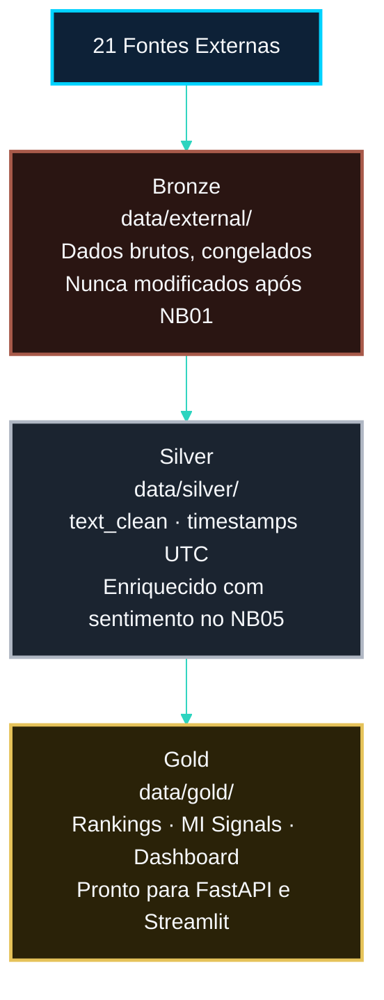
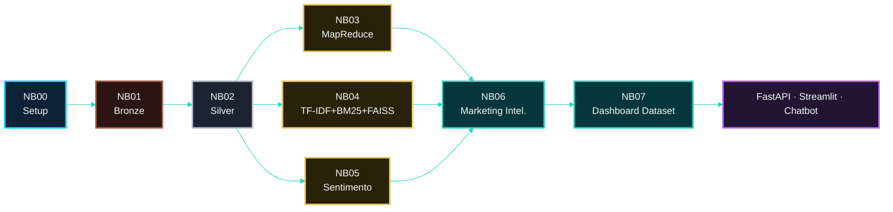

<!-- LANGUAGE BUTTONS -->
**\[[🇧🇷 Português](MEDALLION_OVERVIEW.md)\] \[**[🇬🇧 English](../../🇬🇧English/architecture/MEDALLION_OVERVIEW.md)**\]**

<br><br>

## [Arquitetura Medallion — Bronze · Silver · Gold]()
### Investor Intelligence Platform — FIIs Brasil 🇧🇷

<br><br>

## [Visão Geral]()

<br><br>

A plataforma segue o padrão **Medallion Architecture** (Delta Lake / Databricks pattern), organizado em três camadas de qualidade crescente de dados:

<br><br>



<br><br>

## [Princípios de Design]()

<br><br>

| Princípio | Implementação |
|---|---|
| **Imutabilidade do Bronze** | NB01 grava `data/external/` uma vez. NB02–NB07 leem apenas. |
| **Separação de responsabilidades** | Cada camada tem schema, qualidade e propósito definidos. |
| **Reprodutibilidade** | `RANDOM_SEED=42` + dataset frozen = resultados idênticos entre execuções. |
| **Rastreabilidade** | `article_id` e `source` preservados do Bronze ao Gold. |
| **Progressão de qualidade** | Bronze: fidelidade. Silver: limpeza. Gold: valor analítico. |

<br><br>

## [Camada Bronze — Data/External]()

<br><br>

**Propósito:** Preservar os dados exatamente como foram coletados.

<br><br>

**Responsabilidade:** Exclusiva do NB01.

<br><br>

**Regras:**

<br><br>

- Schema: 17 campos fixos
- `article_id = SHA-256(url)` — chave primária imutável
- `published_at = None` para conteúdo scraping (sem data real)
- Deduplicação por `article_id` e `content_hash` antes do freeze
- Compressão: Parquet snappy

<br><br>

**Arquivos:**

<br><br>

```
data/external/
├── bronze_all_articles.parquet  ← Input primário do NB02
├── rss_fii_articles.parquet
├── portal_fii_articles.parquet
└── reddit_fii_posts.parquet
```

<br><br>

## [Camada Silver — Data/Silver]()

<br><br>

**Propósito:** Texto limpo, datas normalizadas, qualidade garantida.

<br><br>

**Responsabilidade:** NB02 (ETL base) + NB05 (enriquecimento de sentimento).

<br><br>

**Transformações NB02:**

<br><br>

1. `text_clean` — remove HTML, URLs, boilerplates
2. `published_dt` — ISO-8601 UTC (nullable para scraping)
3. `source_label` — domínio → nome comercial
4. `word_count`, `char_count`, `has_content`
5. **3 Quality Gates** (null IDs · word_count ≥ 30 · dedup Window)

<br><br>

**Enriquecimento NB05:**

<br><br>

- `polarity_score`, `sentiment_label`
- `flag_*` e `score_*` para 6 categorias de sinais FII

<br><br>

**Arquivos:**

<br><br>

```
data/silver/
├── silver_articles.parquet      ← 20 colunas base
└── silver_enriched.parquet      ← 20 + 12 colunas de sentimento/sinais
```

<br><br>

## [Camada Gold — Data/Gold]()

<br><br>

**Propósito:** Datasets analíticos prontos para modelos, dashboards e APIs.

<br><br>

**Responsabilidade:** NB03, NB04, NB05, NB06, NB07.

<br><br>

**Subdiretórios:**

<br><br>

| Subdiretório | Gerado por | Conteúdo |
|---|---|---|
| `word_count/` | NB03 | Frequência de termos (MapReduce RDD) |
| `tfidf_bm25/` | NB04 | Índices TF-IDF + BM25 + FAISS (3 camadas) + funções de busca |
| `sentiment/` | NB05 | Stats de sentimento por fonte e por mês |
| `marketing_intelligence/` | NB06 | MI Signals por FII, top articles, funil TOFU/MOFU/BOFU |
| `dashboard/` | NB07 | Datasets consolidados para FastAPI + Streamlit |

<br><br>

## [Fluxo de Dependências entre Notebooks]()

<br><br>



<br><br>

## [Comparação com Padrões Industriais]()

<br><br>

| Aspecto | Implementação deste projeto | Padrão industrial (Databricks Delta Lake) |
|---|---|---|
| Camadas | Bronze / Silver / Gold | Bronze / Silver / Gold |
| Formato | Apache Parquet (snappy) | Delta format (Parquet + transaction log) |
| Imutabilidade | Freeze manual (NB01 único writer) | ACID transactions via Delta |
| Schema enforcement | Contrato documentado + validação RDD | Schema enforcement nativo Delta |
| Deduplicação | drop_duplicates + Window | MERGE INTO com Delta |
| Processamento | PySpark local[*] | PySpark em cluster Databricks/EMR |
| Escalabilidade | Até ~500 MB de corpus | Petabytes |

<br><br>

> **Contexto acadêmico:** a implementação com PySpark local[*] e Parquet snappy demonstra os mesmos princípios arquiteturais, patterns de código e modelo de qualidade de dados que seriam usados em escala industrial — apenas sem a infraestrutura de cluster.

<br><br>

## [Ver Também]()

<br><br>

- **[`BRONZE_SCHEMA.md`](BRONZE_SCHEMA.md)**, **[`SILVER_SCHEMA.md`](SILVER_SCHEMA.md)**, **[`GOLD_SCHEMA.md`](GOLD_SCHEMA.md)** — contratos de schema por camada
- **[`ARQUITETURA.md`](ARQUITETURA.md)** — visão de arquitetura completa da plataforma

<br><br>

---

<br><br>

*Medallion Architecture v1.0.0 · Investor Intelligence Platform FIIs Brasil*
