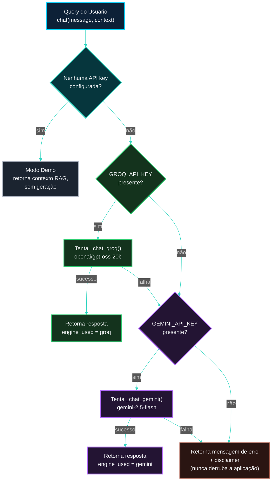

<!-- LANGUAGE BUTTONS -->
**\[[🇧🇷 Português](MULTI_LLM_FALLBACK.md)\] \[**[🇬🇧 English](../../🇬🇧English/architecture/MULTI_LLM_FALLBACK.md)**\]**

  

## [Fallback Multi-LLM: Groq + Gemini — Documento Técnico]()
### Investor Intelligence Platform — FIIs Brasil 🇧🇷

  

> Este documento justifica, em detalhe, a decisão de usar **dois motores de LLM** *(Large Language Model)* no chatbot RAG da plataforma — Groq como motor primário e Gemini como fallback automático — em vez de um único provedor, e por que alternativas consideradas (troca direta de provedor, OpenRouter) foram descartadas.

  

## [📋 Sumário]()

  

1. [Resumo Executivo](#resumo-executivo)
2. [O Problema Original](#o-problema-original)
3. [Por Que Groq Não É o Risco que Parece Ser](#por-que-groq-não-é-o-risco-que-parece-ser)
4. [O Risco Real: Rate Limit, Não Indisponibilidade](#o-risco-real-rate-limit-não-indisponibilidade)
5. [Alternativas Avaliadas e Descartadas](#alternativas-avaliadas-e-descartadas)
6. [A Solução Implementada](#a-solução-implementada)
7. [Fluxo Técnico do Fallback](#fluxo-técnico-do-fallback)
8. [Configuração](#configuração)
9. [Transparência ao Usuário Final](#transparência-ao-usuário-final)
10. [Ver Também](#ver-também)

  

## [Resumo Executivo]()

  

| Pergunta | Resposta |
|---|---|
| Por que dois motores de LLM? | Resiliência — se um sofrer rate-limit ou ficar indisponível, o outro assume automaticamente |
| Groq vai parar de existir? | Não — tier gratuito estável desde o lançamento, sem cartão de crédito, parte do modelo de negócio da empresa |
| Qual é o risco real então? | Rate limit (HTTP 429) durante uso intenso — ex.: várias perguntas em sequência rápida numa demonstração |
| Por que não trocar Groq por outro provedor? | Trocar não elimina o risco, só desloca para outro provedor — a solução correta é resiliência, não substituição |
| Por que não usar OpenRouter? | Tier gratuito menor (50 req/dia vs. tier do Groq) e catálogo de modelos gratuitos instável — introduziria o mesmo risco que estamos evitando |

  

## [O Problema Original]()

  

A pergunta que motivou esta decisão foi: **"e se trocarmos a LLM do Groq por uma totalmente gratuita, para não haver risco de cair a API?"** — uma preocupação legítima sobre depender de um único provedor terceiro para uma funcionalidade que será demonstrada/apresentada academicamente.

  

A resposta exigiu separar duas coisas que pareciam ser a mesma: **o medo** (a API "cair") e **o risco real** (rate limit) — que são fenômenos diferentes, com soluções diferentes.

  

## [Por Que Groq Não É o Risco que Parece Ser]()

  

O tier gratuito do Groq existe desde o lançamento da API. Não exige cartão de crédito. A razão estrutural para essa estabilidade: o negócio principal da empresa é vender hardware especializado (LPU — *Language Processing Unit*) para outras empresas; a API gratuita funciona como vitrine de demonstração de performance, não como produto a ser descontinuado.

  

Isso contrasta com provedores cujo "tier gratuito" é apenas uma cortesia temporária de aquisição de usuários, sujeita a remoção quando a estratégia de monetização muda.

  

## [O Risco Real: Rate Limit, Não Indisponibilidade]()

  

Verificado em 4 de junho de 2026, os limites do tier gratuito do Groq para o modelo usado neste projeto (`openai/gpt-oss-20b`) seguem o padrão documentado pela comunidade: janela de requisições por minuto (RPM), tokens por minuto (TPM) e requisições por dia (RPD) — historicamente na faixa de ~30 RPM e ~14.400 RPD para modelos desse porte.

  

**O cenário de falha real não é "o Groq saiu do ar"** — é: várias perguntas enviadas em sequência rápida (por exemplo, durante uma demonstração ao vivo para o professor) esgotam a janela de RPM, e a próxima requisição recebe HTTP 429 (*Too Many Requests*) até a janela resetar.

  

## [Alternativas Avaliadas e Descartadas]()

  

[***Gemini Sozinho (Substituição Direta)***]()

  

O Google AI Studio oferece tier gratuito comparável ao do Groq em alguns modelos — em certas comparações, com maior throughput de tokens por minuto. **Mas substituir um provedor único por outro provedor único não resolve o problema estrutural**: continua existindo um único ponto de falha, apenas com números diferentes.

  

[***OpenRouter***]()

  

Avaliado especificamente porque é um agregador que dá acesso a múltiplos modelos por uma única API — em teoria, uma forma de obter variedade sem gerenciar múltiplos SDKs. Descartado pelos seguintes motivos:

  

| Critério | OpenRouter free | Groq free |
|---|---|---|
| Limite diário sem nunca comprar créditos | 50 requisições/dia | ~14.400 requisições/dia (modelo 8B) |
| Limite por minuto | 20 RPM | 30 RPM |
| Estabilidade do catálogo gratuito | Lista de modelos pode mudar ou ser removida sem aviso prévio | Tier fixo desde o lançamento |
| Penalidade de falha | Tentativas que falham por rate-limit do provedor de origem ainda consomem a cota diária | N/A |

  

O ponto decisivo foi a **instabilidade do catálogo gratuito**: depender de um modelo `:free` específico do OpenRouter introduz exatamente o tipo de risco de "quebrar sem aviso" que esta decisão pretende eliminar — não é uma melhoria sobre o Groq, é uma troca de um risco conhecido e estável por um risco desconhecido e variável.

  

## [A Solução Implementada]()

  

**Fallback automático, não substituição.** Groq permanece como motor primário (menor latência, ~0.3s para 800 tokens); Gemini 2.5 Flash assume automaticamente apenas se o Groq falhar. Os dois provedores têm:

  

- Tier gratuito estável, sem necessidade de cartão de crédito
- Infraestrutura e política de rate-limit independentes uma da outra
- SDK oficial mantido ativamente (`groq` e `google-genai`)

  

A combinação reduz a probabilidade de falha total a um cenário em que **ambos** os provedores estejam indisponíveis simultaneamente — um cenário estatisticamente muito menos provável do que a falha de um único provedor.

  

## [Fluxo Técnico do Fallback]()

  

Implementado em `dashboard/chatbot/groq_client.py`, função `chat()`:

  

  

**Captura de exceção ampla, deliberadamente:** o `chat()` usa `except Exception` (não uma exceção específica de rate-limit) em cada tentativa — qualquer falha do motor primário (rate-limit, timeout, erro de rede, mudança de API) aciona o fallback, não apenas o cenário específico de 429. Isso prioriza resiliência sobre precisão diagnóstica no código de produção; o `print()` de log antes do fallback preserva a causa para depuração.

  

## [Configuração]()

  

| Variável de ambiente | Efeito se ausente |
|---|---|
| `GROQ_API_KEY` | Pula direto para a tentativa Gemini |
| `GEMINI_API_KEY` | Sem fallback — se o Groq falhar, retorna erro |
| Nenhuma das duas | Chatbot roda em modo demo (mostra o contexto recuperado pelo RAG, sem gerar texto) |

  

Como obter cada chave, sem custo e sem cartão de crédito:

  

- **Groq:** [console.groq.com](https://console.groq.com)
- **Gemini:** [aistudio.google.com](https://aistudio.google.com) → *Get API key* → *Create API key in a new project*

  

> 📦 Dependência: `google-genai` (SDK atual da Google). O pacote antigo `google-generativeai` está descontinuado — não usar.

  

## [Transparência ao Usuário Final]()

  

Por princípio de IA Responsável (explicabilidade), quando o Gemini responde no lugar do Groq, a resposta inclui uma nota informativa visível ao usuário:

  

> *Resposta gerada via Gemini — fallback automático (Groq indisponível neste momento).*

  

Isso evita que o usuário acredite estar sempre interagindo com o mesmo modelo, mantendo consistência com o princípio de transparência já adotado no restante da plataforma (rastreabilidade de `source`/`ingestion_method` do Bronze ao Gold).

  

## [Ver Também]()

  

- **`dashboard/chatbot/groq_client.py`** — implementação completa do fallback
- **[`RESPONSIBLE_AI.md`](../governanca/RESPONSIBLE_AI.md)** — model card atualizado com os dois motores
- **[`DEPLOY_RENDER.md`](../deploy/DEPLOY_RENDER.md)** — configuração de `GEMINI_API_KEY` como secret no Render *(pendente de envio)*
- **[`GUIA_COMPLETO_DE_EXECUCAO_DEPLOY.md`](../guia_de_execução/GUIA_COMPLETO_DE_EXECUCAO_DEPLOY.md)**, seção 3.6 — como obter ambas as chaves localmente *(pendente de envio)*

  

---

  

*Multi-LLM Fallback v1.0.0 · Investor Intelligence Platform FIIs Brasil*
