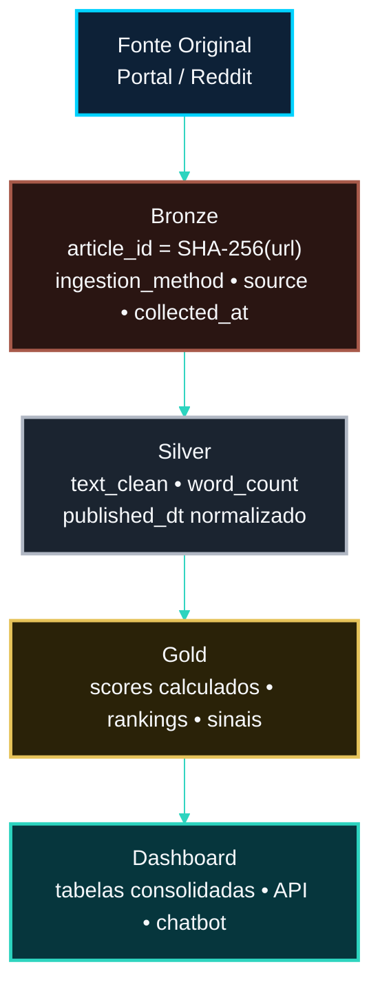

<!-- LANGUAGE BUTTONS -->
**\[[🇧🇷 Português](RESPONSIBLE_AI.md)\] \[**[🇬🇧 English](../../🇬🇧English/governance/RESPONSIBLE_AI.md)**\]**

<br><br>

## [Responsible AI — Documentação de IA Responsável]()
### Investor Intelligence Platform — FIIs Brasil 🇧🇷

<br><br>

**Referência:** European Commission. (2019). *Ethics Guidelines for Trustworthy AI.*

<br><br>

## [Resumo dos Princípios Atendidos]()

<br><br>

| Princípio | Status | Implementação |
|---|---|---|
| Supervisão humana | ✅ | Pipeline manual — nenhuma ação autônoma |
| Robustez técnica | ✅ | Quality gates, fallbacks, logging estruturado |
| Privacidade e governança de dados | ✅ | LGPD, sem dados pessoais identificáveis |
| Transparência | ✅ | Código aberto, metodologia documentada |
| Diversidade e não-discriminação | ✅ | Análise de conteúdo, sem scoring individual |
| Bem-estar social e ambiental | ✅ | Análise de mercado público, sem decisões automatizadas |
| Responsabilização | ✅ | Autores identificados, documentação completa |

<br><br>

## [1. Supervisão Humana (Human Oversight)]()

<br><br>

Todos os outputs do sistema são **informativos**, nunca decisórios:

<br><br>

- O chatbot (Groq, com fallback automático para Gemini) inclui disclaimer obrigatório em **todos** os outputs, independente de qual motor respondeu:
  ```
  "Esta análise é gerada por IA com base em dados públicos.
  Não constitui recomendação de investimento.
  Consulte um assessor financeiro certificado antes de tomar decisões."
  ```
- Scores MI, rankings e sentimento são insumos analíticos — nenhuma ação de compra/venda é executada automaticamente
- O pipeline requer execução manual sequencial (NB00→NB07) — sem triggers automáticos

<br><br>

## [2. Explicabilidade (XAI)]()

<br><br>

**IA Explicável (XAI)** é o conjunto de práticas que tornam os resultados de um sistema de IA compreensíveis, auditáveis e interpretáveis por humanos — em vez de apenas produzir uma resposta como caixa-preta, o sistema consegue justificar *por que* chegou a determinado resultado. A plataforma adota uma abordagem de interpretabilidade analítica alinhada a esses princípios: cada técnica usada no pipeline foi avaliada quanto ao seu grau de explicabilidade antes da adoção.

<br><br>

| Técnica | Explicável? | Motivo |
|---|---|---|
| Contagem de palavras (MapReduce) | ✅ Sim | Frequências são totalmente auditáveis |
| TF-IDF | ✅ Sim | Score decomponível por termo e por documento |
| BM25 | ✅ Sim | Score matemático interpretável, decomponível por termo da query |
| FAISS (embeddings semânticos) | ⚠️ Parcialmente | Similaridade coseno não decompõe por termo — ver [`FAISS.md`](../metodologia/FAISS.md) |
| Análise de sentimento (léxico PT-BR) | ✅ Sim | Polaridade rastreável a termos específicos do léxico |
| Enriquecimento via Reddit | ✅ Sim | Fonte transparente e rastreável (`source`, `ingestion_method`) |

<br><br>

Todo score gerado pela plataforma é **totalmente decomponível**:

<br><br>

[***TF-IDF — Decomposição por Termo***]()

<br><br>

```python
# Quais termos contribuíram para o score TF-IDF de um documento?
feature_names = tfidf_vectorizer.get_feature_names_out()
doc_vector = tfidf_matrix[doc_index]
top_terms = sorted(
    zip(feature_names, doc_vector.toarray()[0]),
    key=lambda x: x[1], reverse=True
)[:10]
```

<br><br>

[***BM25 — Decomposição por Termo***]()

<br><br>

```python
# Score de cada termo da query para um documento
term_scores = {qi: bm25_index.get_scores([qi])[doc_index] for qi in query_tokens}
```

<br><br>

[***Sentimento — Decomposição por Léxico***]()

<br><br>

```python
# Quais termos do léxico foram encontrados?
matched_pos = [t for t in tokens if FII_LEXICON.get(t, 0) > 0]
matched_neg = [t for t in tokens if FII_LEXICON.get(t, 0) < 0]
```

<br><br>

[***MI Score — Fórmula Auditável***]()

<br><br>

```
mi_score = 0.5 × relevance_hybrid + 0.3 × |polarity_score| + 0.2 × opportunity_score
```

<br><br>

Cada componente é rastreável até o documento original.

<br><br>

## [3. Transparência de Dados]()

<br><br>

[***Linhagem de Dados (Data Lineage)***]()

<br><br>



<br><br>

Cada registro mantém `article_id`, `source`, `source_type` e `ingestion_method` do Bronze ao Gold.

<br><br>

[***Campos de Proveniência Preservados em Todos os Datasets***]()

<br><br>

| Campo | Presente em | Propósito |
|---|---|---|
| `article_id` | Bronze, Silver, Gold | Chave única rastreável |
| `source` | Bronze, Silver, Gold | Portal de origem |
| `source_type` | Bronze, Silver, Gold | Tipo de coleta |
| `ingestion_method` | Bronze | Método técnico exato |
| `collected_at` | Bronze, Silver | Timestamp da coleta |
| `url` | Bronze, Silver, Gold | Link para conteúdo original |

<br><br>

## [4. Viés e Mitigações]()

<br><br>

[***Fontes Identificadas de Viés Potencial***]()

<br><br>

| Tipo de Viés | Descrição | Mitigação |
|---|---|---|
| Viés de seleção de fontes | 21 fontes escolhidas podem sobre-representar certos portais | Diversificação: 10 portais + 6 RSS + 4 RSS supl. + Reddit |
| Viés de léxico PT-BR | Léxico de sentimento pode não cobrir todas as nuances | 70+ termos + fallback TextBlob + revisão documentada |
| Viés de cobertura temporal | Corpus varia com o dia de execução | Dataset frozen garante reprodutibilidade |
| Viés de fonte editorial | Portais pagos vs gratuitos têm viés editorial | Reddit como camada social complementar |
| Viés de idioma | Pipeline foca PT-BR | `FII_FILTER_TERMS` em português; pipeline explicitamente PT-BR |

<br><br>

[***Léxico FII PT-BR — Transparência***]()

<br><br>

O léxico de 70+ termos é:

<br><br>

- Totalmente documentado em `docs/methodology/SENTIMENT_METHODOLOGY.md`
- Versionado junto com o código
- Revisável e atualizável sem reescrever a pipeline
- Auditável entrada por entrada

<br><br>

## [5. Robustez Técnica]()

<br><br>

[***Quality Gates (NB02)***]()

<br><br>

```
Gate 1: article_id != null AND url != null
Gate 2: word_count >= 30
Gate 3: dedup por article_id (mais recente quando duplicado)
```

<br><br>

[***Estratégia de Fallback (NB01)***]()

<br><br>

- RSS falha → Scraping
- Scraping falha → RSS alternativo
- Reddit PRAW falha → API pública → frozen parquet

<br><br>

[***Logging Estruturado (src/utils/logger.py)***]()

<br><br>

```python
log_source_success(logger, source, count)
log_source_failure(logger, source, error)
log_retry(logger, source, attempt, max_retries)
log_timeout(logger, source, timeout)
log_duplicate(logger, text)
log_quality_check(logger, gate=..., passed=..., dropped=...)
```

<br><br>

Todos os eventos são rastreados com timestamp ISO-8601 UTC.

<br><br>

## [6. Model Card — Componente de Sentimento]()

<br><br>

| Campo | Valor |
|---|---|
| **Nome** | FII PT-BR Sentiment Analyzer |
| **Versão** | 1.0.0 |
| **Tipo** | Lexicon-based rule system |
| **Idioma** | Português (PT-BR) |
| **Domínio** | Fundos de Investimento Imobiliário |
| **Input** | `text_clean` — texto normalizado de artigos FII |
| **Output** | `polarity_score ∈ [-1.0, +1.0]` + `sentiment_label` + 6 signal flags |
| **Treino** | N/A — baseado em léxico curado (sem ML) |
| **Validação** | Smoke tests com exemplos positivos, negativos e neutros |
| **Limitações** | Sem semântica; ironia não detectada; gírias novas não cobertas |
| **Manutenção** | Léxico revisável manualmente em `NB05_contextual_sentiment.ipynb` |

<br><br>

## [6.1 Model Card — Componente de Geração (Chatbot RAG)]()

<br><br>

| Campo | Valor |
|---|---|
| **Nome** | FII Chatbot RAG — Multi-LLM Fallback |
| **Versão** | 1.0.0 |
| **Motor primário** | Groq — `openai/gpt-oss-20b` |
| **Motor de fallback** | Google Gemini — `gemini-2.5-flash` (acionado automaticamente se o motor primário falhar ou sofrer rate-limit) |
| **Idioma** | Português (PT-BR), forçado via system prompt |
| **Domínio** | Fundos de Investimento Imobiliário (escopo restrito via prompt) |
| **Input** | Pergunta do usuário + contexto recuperado via RAG (TF-IDF+BM25+FAISS) |
| **Output** | Texto gerado + disclaimer legal obrigatório, sempre, independente do motor |
| **Treino** | N/A — modelos de terceiros usados via API, sem fine-tuning |
| **Validação** | Smoke tests locais cobrindo: ambos motores ativos, só primário, só fallback, nenhum (modo demo) |
| **Limitações** | Qualidade/estilo da resposta pode variar sutilmente entre Groq e Gemini, já que são modelos distintos; sem garantia de paridade exata entre os dois motores |
| **Transparência** | Resposta inclui nota informativa quando gerada pelo motor de fallback, evitando que o usuário assuma estar sempre interagindo com o mesmo modelo |
| **Justificativa da arquitetura dual** | Ver [`MULTI_LLM_FALLBACK.md`](../arquitetura/MULTI_LLM_FALLBACK.md) — resiliência contra rate-limit, não risco de descontinuação do provedor |
| **Manutenção** | `dashboard/chatbot/groq_client.py`, função `chat()` |

<br><br>

## [7. Escopo e Limites do Sistema]()

<br><br>

**O sistema FAZ:**

<br><br>

- Monitora conteúdo editorial público sobre FIIs
- Calcula scores de relevância e sentimento para fins analíticos
- Fornece ranking de artigos e fontes por relevância
- Suporta exploração analítica via dashboard e API

<br><br>

**O sistema NÃO FAZ:**

<br><br>

- Emite recomendações de investimento
- Toma decisões automatizadas sobre compra/venda
- Rastreia ou perfila investidores individuais
- Acessa dados privados ou protegidos

<br><br>

---

<br><br>

*Responsible AI Documentation v1.0.0 · Investor Intelligence Platform FIIs Brasil*
