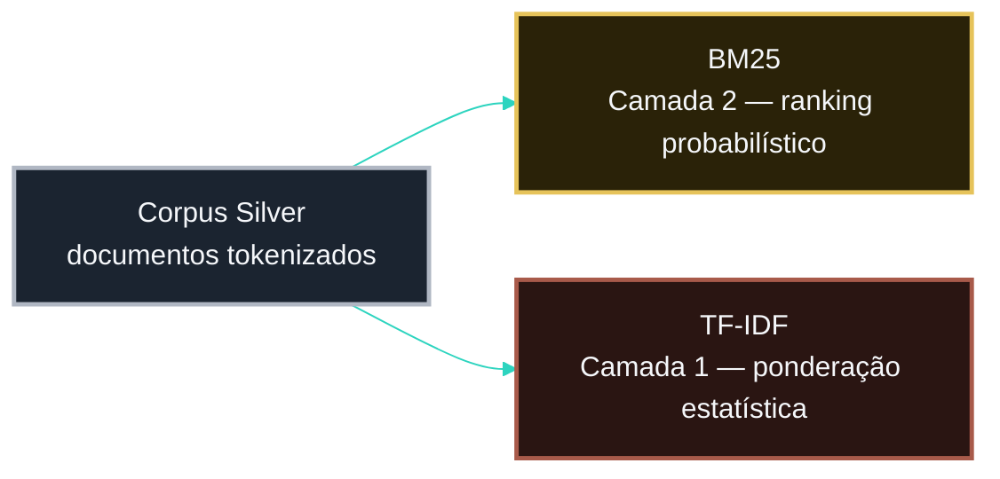

<!-- LANGUAGE BUTTONS -->
**\[[🇧🇷 Português](BM25_FOUNDATION.md)\] \[**[🇬🇧 English](../../🇬🇧English/methodology/BM25_FOUNDATION.md)**\]**

  

## [BM25 Foundation — Referência Matemática]()
### Investor Intelligence Platform — FIIs Brasil 🇧🇷

  

## [Visão Geral]()

  

BM25 (Best Matching 25) é o algoritmo de ranking de relevância principal usado para pontuar as 21 fontes monitoradas pela relevância do conteúdo FII.

  

## [Fórmula]()

  

$$
\huge \text{BM25}(D,Q) = \sum \text{IDF}(q_i) \cdot \frac{f(q_i,D) \cdot (k_1 + 1)}{f(q_i,D) + k_1 \cdot \left(1 - b + b \cdot \frac{|D|}{\text{avgdl}}\right)}
$$

    

| Parâmetro | Padrão | Efeito |
|---|---|---|
| k1 | 1.5 | Saturação de termo |
| b | 0.75 | Normalização por comprimento |

  

## [Papel Neste Projeto]()

  

  

- **BM25** = Camada 2 — ranking probabilístico de relevância por fonte
- **TF-IDF** = Camada 1 — ponderação estatística de termos (ver [`TFIDF_FOUNDATION.md`](TFIDF_FOUNDATION.md))
- **FAISS** = Camada 3 — similaridade semântica (ver [`FAISS.md`](FAISS.md))

  

## [Justificativa de Negócio]()

  

O objetivo central da plataforma é identificar **quais fontes digitais têm maior concentração de conteúdo relevante sobre FIIs** — um problema clássico de Recuperação de Informação, para o qual o BM25 é o padrão de fato da indústria (motores de busca, sistemas documentais, pipelines de IR).

  

[***Por Que BM25 em Vez de Apenas TF-IDF***]()

  

| Critério | TF-IDF | BM25 | Embeddings (FAISS) |
|---|---|---|---|
| Interpretabilidade | Alta | Muito alta | Baixa |
| Explicabilidade (XAI) | Alta | Alta | Baixa — não decompõe por termo |
| Captura semântica (sinônimos) | Baixa | Baixa | Alta |
| Controle de saturação de termo | Fraco | Forte | N/A |
| Normalização por tamanho de documento | Limitada | Forte | N/A |
| Custo computacional | Baixo | Baixo | Mais alto (~10-50ms/query) |
| Robustez multi-fonte (estilos editoriais distintos) | Média | Alta | Alta |

  

Nenhuma das três camadas substitui as outras — por isso a plataforma combina as três em `score_hybrid_v2` (ver [`FUNDAMENTOS_CONCEITUAIS_RECUPERACAO_HIBRIDA.md`](FUNDAMENTOS_CONCEITUAIS_RECUPERACAO_HIBRIDA.md)), em vez de escolher uma única técnica.

  

[***Exemplo Interpretável (XAI)***]()

  

Diferente de modelos *black-box*, o BM25 permite justificar tecnicamente por que uma fonte foi ranqueada acima de outra:

  

> *Um portal especializado recebe score BM25 elevado porque "dividend yield" apareceu 18 vezes, "vacância" 12 vezes e "P/VP" 9 vezes no seu corpus — termos raros no restante do corpus (IDF alto) e presentes de forma consistente (não saturada) nesse portal. Um portal financeiro genérico, sem esses termos, recebe score próximo de zero.*

  

Essa capacidade de justificar cada score decompondo-o por termo é o que torna o ranqueamento auditável, e não uma caixa-preta — ver [`RESPONSIBLE_AI.md`](../governanca/RESPONSIBLE_AI.md) para o princípio de explicabilidade aplicado a toda a plataforma.

  

## [Alinhamento com XAI]()

  

Todo score BM25 se decompõe em contribuições por termo (NB05).

  

## [Referência]()

  

Robertson & Zaragoza (2009). The Probabilistic Relevance Framework: BM25 and Beyond. *Foundations and Trends in IR*, 3(4), 333–389.

  

## [Ver Também]()

  

- **[`FAISS.md`](FAISS.md)** — camada semântica que complementa BM25/TF-IDF na Camada 3
- **[`FUNDAMENTOS_CONCEITUAIS_RECUPERACAO_HIBRIDA.md`](FUNDAMENTOS_CONCEITUAIS_RECUPERACAO_HIBRIDA.md)** — enquadramento conceitual da recuperação híbrida

  

---

  

*BM25 Foundation v1.0.0 · Investor Intelligence Platform FIIs Brasil*
