<!-- LANGUAGE BUTTONS -->
**\[[🇧🇷 Português](CRISP_DM_MAPPING.md)\] \[**[🇬🇧 English](../../🇬🇧English/methodology/CRISP_DM_MAPPING.md)**\]**

  

## [Mapeamento da Metodologia CRISP-DM]()
### Investor Intelligence Platform — FIIs Brasil 🇧🇷

  

> ⚠️ **Nota de atualização:** versões anteriores deste documento mapeavam um pipeline de 8 fases que incluía **LDA Topic Modeling** como um notebook dedicado (NB04) e um chatbot Groq single-provider. Essa estrutura foi **descontinuada**. O mapeamento abaixo reflete o pipeline final de 8 notebooks (`NB00`–`NB07`), com retrieval híbrido em 3 camadas (TF-IDF + BM25 + FAISS) substituindo o LDA, e o chatbot com fallback automático Groq → Gemini. Ver [`COMPLETE_EXECUTION_AND_DEPLOYMENT_GUIDE.md`](../guia_de_execução/GUIA_COMPLETO_DE_EXECUCAO_DEPLOY.md) para o histórico completo da migração.

  

## [Visão Geral]()

  

Este projeto segue o **CRISP-DM** (Cross-Industry Standard Process for Data Mining), a metodologia padrão de fato para projetos de ciência de dados e machine learning.

```mermaid
%%{init:{
'theme':'dark',
'themeVariables':{
'background':'#090d13',
'primaryTextColor':'#F5F7FA',
'lineColor':'#2dd4bf'
}}}%%

graph LR

BU["1. Business<br/>Understanding"]:::setup
DU["2. Data<br/>Understanding"]:::bronze
DP["3. Data<br/>Preparation"]:::silver
M["4. Modeling"]:::gold
E["5. Evaluation"]:::dash
D["6. Deployment"]:::llm

BU --> DU --> DP --> M --> E --> D
E -.->|itera| M
M -.->|itera| DP

classDef setup fill:#0d2137,stroke:#00d2ff,color:#F5F7FA,stroke-width:2.5px;
classDef bronze fill:#2a1512,stroke:#a85a4a,color:#F5F7FA,stroke-width:2.5px;
classDef silver fill:#1b2430,stroke:#b0b7c3,color:#F5F7FA,stroke-width:2.5px;
classDef gold fill:#2a2208,stroke:#e6c35a,color:#F5F7FA,stroke-width:2.5px;
classDef dash fill:#06363d,stroke:#2dd4bf,color:#F5F7FA,stroke-width:2.5px;
classDef llm fill:#231433,stroke:#b56cff,color:#F5F7FA,stroke-width:2.5px;
```

  

  

## [Mapeamento Fase → Notebook]()

  

[***Fase 1: Business Understanding → `NB00`***]()

  

**Entregas:**

  

- Formulação do problema de negócio
- Definição de critérios de sucesso
- Inicialização do framework CRISP-DM
- Documentação dos princípios de IA Responsável
- Estrutura de governança do projeto

  

**Decisões-chave tomadas:**

  

- Especialização: inteligência de canais digitais para FIIs (não finanças genéricas)
- Abordagem NLP: retrieval híbrido em 3 camadas (TF-IDF + BM25 + FAISS) + sentimento contextual PT-BR
- Arquitetura: Medallion (Bronze/Silver/Gold), scraping local + serving em nuvem
- Escopo: 20 portais financeiros + enriquecimento Reddit (21 fontes no total)

  

[***Fase 2: Data Understanding → `NB01`***]()

  

**Entregas:**

  

- Coleta real de dados das 21 fontes monitoradas (20 editoriais + Reddit comportamental) via RSS + scraping leve
- Camada comportamental Reddit — API pública/PRAW com fallback em 3 níveis (Fonte #21)
- Dataset reproduzível congelado (`data/external/`)
- Relatório de proveniência da coleta

  

**Exploração de dados:**

  

- Análise de distribuição por fonte
- Faixas de datas de publicação
- Volume de artigos por portal
- Varredura inicial de frequência de palavras-chave FII

  

[***Fase 3: Data Preparation → `NB02`***]()

  

**Entregas:**

  

- Transformação Bronze → Silver (PySpark ETL)
- Remoção de HTML, deduplicação, validação de schema
- Filtros de qualidade (`word_count >= 30`, 3 quality gates)
- Output Silver Layer em Parquet (20 campos base)

  

**Técnicas aplicadas:**

  

- Geração determinística de ID: `SHA-256(url)`
- Transformações de coluna null-safe
- PySpark `regexp_replace`, `trim`, `lower`

  

[***Fase 4: Modeling → `NB03` + `NB04`***]()

  

**NB03 — MapReduce Word Count**

  

- Contagem de palavras via RDD puro (requisito acadêmico explícito)
- Word count por fonte (dimensão source × term)
- Frequência de termos TOFU
- Negative Context Detection (`negative_ctx_ratio`, janela ±5 tokens)

  

**NB04 — Retrieval Híbrido em 3 Camadas**

  

- Vetorização TF-IDF (peso 20% no score híbrido)
- Ranking de relevância BM25 (peso 30%)
- Embeddings + índice FAISS semântico (peso 50%, camada opcional com fallback gracioso para 2 camadas)
- `document_relevance.parquet` — scores decompostos por query

  

[***Fase 5: Evaluation → `NB05` + `NB06`***]()

  

**NB05 — Sentimento Contextual**

  

- Léxico FII PT-BR (70+ termos) + fallback TextBlob
- 6 categorias de signal flags
- Enriquecimento do Silver com 12 colunas de sentimento

  

**NB06 — Marketing Intelligence**

  

- Camada de Business Intelligence (insights executivos)
- `mi_score` por FII — combinação de relevância híbrida, sentimento e oportunidade
- Funil TOFU/MOFU/BOFU
- Recomendações estratégicas de canal, baseadas em evidência

  

[***Fase 6: Deployment → `NB07` + Infraestrutura de Produção***]()

  

**NB07 — Consolidação do Dataset do Dashboard**

  

- Consolidação de todos os datasets Gold em tabelas prontas para consumo
- `api_payload_summary.json` para health-check e cache

  

**Infraestrutura de produção (fora dos notebooks):**

  

- FastAPI no Render — validação de endpoints REST, `/health` rico
- Streamlit Community Cloud — dashboard em modo híbrido (API + fallback Parquet local)
- Chatbot RAG com fallback automático Groq (`openai/gpt-oss-20b`) → Gemini (`gemini-2.5-flash`)

  

## [Ciclos Iterativos]()

  

| De | Para | Gatilho | Frequência |
|---|---|---|---|
| NB06 Evaluation | NB05 Modeling | Ajuste de threshold de sentimento | Conforme necessário |
| NB06 Evaluation | NB04 Modeling | Ajuste de pesos do score híbrido | Conforme necessário |
| NB03/NB04 Modeling | NB02 Preparation | Revisão de feature engineering | Conforme necessário |
| NB07/Deploy | NB06 Evaluation | Validação de serving na API revela problemas de dados | Conforme necessário |

  

## [Quality Gates]()

  

| Gate | Notebook | Critério |
|---|---|---|
| Completude de dados | NB01 | ≥ 500 artigos reais coletados |
| Qualidade Silver | NB02 | 3 quality gates (null IDs · word_count ≥ 30 · dedup) |
| Cobertura BM25 | NB04 | Todas as 21 fontes pontuadas |
| Camada semântica | NB04 | Fallback gracioso 2 camadas se FAISS indisponível |
| Saúde da API | NB07 / Render | `GET /health` retorna 200 |
| Estabilidade do dashboard | NB07 / Streamlit | Modo duplo testado (API + fallback local) |

  

## [Ver Também]()

  

- **[`MAPREDUCE_PATTERN.md`](MAPREDUCE_PATTERN.md)** — detalhamento técnico do NB03
- **[`BM25_FOUNDATION.md`](BM25_FOUNDATION.md)**, **[`FAISS.md`](FAISS.md)** — detalhamento técnico do NB04
- **[`SENTIMENT_METHODOLOGY.md`](SENTIMENT_METHODOLOGY.md)** — detalhamento técnico do NB05
- **[`GUIA_COMPLETO_DE_EXECUCAO_DEPLOY.md`](../guia_de_execução/GUIA_COMPLETO_DE_EXECUCAO_DEPLOY.md)** — execução passo a passo dos 8 notebooks

  

---

  

*CRISP-DM Methodology Mapping v2.0.0 · Investor Intelligence Platform FIIs Brasil*
*Metodologia: CRISP-DM (Chapman et al., 2000)*
