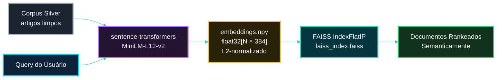

<!-- LANGUAGE BUTTONS -->
**\[[🇧🇷 Português](FAISS.md)\] \[**[🇬🇧 English](../../🇬🇧English/methodology/FAISS.md)**\]**

<br><br>

## [FAISS — Referência da Camada de Recuperação Semântica]()
### Investor Intelligence Platform — FIIs Brasil 🇧🇷

<br><br>

## [Visão Geral]()

<br><br>

FAISS (*Facebook AI Similarity Search*) é o índice vetorial que potencializa a Camada 3 do motor de recuperação híbrida da plataforma — a camada semântica que recupera artigos relevantes mesmo quando a query não compartilha nenhuma palavra exata com o documento.

<br><br>

O FAISS em si **não é** um modelo generativo e **não é** um modelo de embedding. É estritamente um índice de busca por similaridade: armazena vetores já produzidos por um encoder (`sentence-transformers`) e encontra os mais próximos de um vetor de query, de forma eficiente e em escala.

<br><br>

## [Por Que Uma Terceira Camada Foi Necessária]()

<br><br>

TF-IDF e BM25 são ambos modelos bag-of-words — comparam tokens, não significado. Nenhum dos dois consegue conectar `"renda mensal garantida"` a `dividend yield`, `provento` ou `distribuição`, porque nenhuma dessas palavras aparece na query. O FAISS fecha essa lacuna comparando representações vetoriais densas em vez de tokens.

<br><br>

## [Modelo de Embedding]()

<br><br>

| Propriedade | Valor | Justificativa |
|---|---|---|
| Modelo | `paraphrase-multilingual-MiniLM-L12-v2` | Equilibra qualidade semântica contra custo de inferência somente-CPU |
| Dimensão | 384 | Compacto o suficiente para um corpus de 500–5.000 artigos |
| Idiomas | 50+ (incl. PT-BR) | O corpus é 100% português brasileiro |
| Tamanho | ~120 MB | Viável em ambiente acadêmico/local, sem GPU dedicada |
| Tipo | Sentence-level encoder | Captura o significado de frases/parágrafos completos, não palavras isoladas |
| Alternativa Fase 2 | `neuralmind/bert-base-portuguese-cased` (768 dims) | Mais preciso para PT-BR nativo, porém ~3× mais lento |

<br><br>

## [Tipo de Índice]()

<br><br>

```
faiss.IndexFlatIP(384)
```

<br><br>

`IndexFlatIP` realiza uma busca exata (não aproximada) do vizinho mais próximo usando produto interno. Todo embedding é L2-normalizado antes da indexação, o que torna o produto interno matematicamente equivalente à similaridade coseno:

<br><br>

```
sim(q, d) = q̂ · d̂     (produto interno de vetores L2-normalizados = cosseno)
```

<br><br>

[***Por Que IndexFlatIP e Não IndexIVFFlat***]()

<br><br>

- O tamanho do corpus (500–5.000 documentos) torna a busca exata rápida o suficiente (bem abaixo de 10ms) sem precisar de indexação aproximada
- `IndexIVFFlat` só compensa em velocidade acima de aproximadamente 50.000 documentos
- Busca exata significa que nenhuma precisão é sacrificada por velocidade — um trade-off desnecessário nessa escala

<br><br>

## [Papel no Pipeline]()

<br><br>



<br><br>

- O `NB04` codifica o corpus Silver completo uma única vez, constrói o índice, e persiste ambos os artefatos (`embeddings.npy`, `faiss_index.faiss`)
- O `NB06` e o chatbot RAG carregam o índice persistido e codificam apenas a query recebida no momento da requisição
- O peso atribuído a esta camada no `score_hybrid_v2` é de **50%** — o maior dos três, porque a proximidade semântica é o que o modelo generativo (Groq/Gemini) melhor aproveita ao compor uma resposta

<br><br>

## [Fórmula do Score Híbrido]()

<br><br>

```
score_hybrid_v2 = 0.20 × TF-IDF_norm + 0.30 × BM25_norm + 0.50 × Semantic_norm
```

<br><br>

## [Degradação Graciosa]()

<br><br>

Se `faiss-cpu` ou `sentence-transformers` não estiver instalado no ambiente de execução, a função de retrieval detecta a ausência da Camada 3 e redistribui automaticamente os pesos para um híbrido de 2 camadas, sem lançar exceção e sem interromper o pipeline downstream (`NB06`, `NB07`):

<br><br>

```
score_hybrid_v1 = 0.40 × TF-IDF_norm + 0.60 × BM25_norm
```

<br><br>

## [Limitações]()

<br><br>

- **Custo de encoding:** cada nova query precisa passar pelo modelo de embedding antes da busca FAISS (~10–50ms por query em CPU) — mais lento que uma chamada simples `get_scores()` do BM25, mas ainda compatível com uso interativo em dashboard/API
- **Sem garantia de match exato:** um ticker literal como `"HGLG11"` é melhor atendido por BM25 isolado; o FAISS otimiza para significado, não para correspondência de caracteres
- **Custo de cold-start:** o modelo encoder (~120 MB) precisa ser carregado uma vez por processo — por isso `ENABLE_SEMANTIC_SEARCH` tem padrão `false` em deployments restritos em memória (ex.: tier gratuito do Render)

<br><br>

## [Alinhamento com XAI]()

<br><br>

Diferente de TF-IDF e BM25, os scores do FAISS não se decompõem em contribuições por termo — uma similaridade coseno entre dois vetores densos não tem "termos" discretos para atribuir crédito. Este é um trade-off de explicabilidade conhecido da camada semântica, compensado por manter `search_bm25()` disponível como função independentemente auditável para qualquer caso em que explicabilidade por termo seja necessária.

<br><br>

## [Referência]()

<br><br>

Johnson, J., Douze, M., & Jégou, H. (2019). Billion-scale similarity search with GPUs. *IEEE Transactions on Big Data.*

<br><br>

## [Ver Também]()

<br><br>

- **[`BM25_FOUNDATION.md`](BM25_FOUNDATION.md)** — as camadas lexicais que este documento complementa
- **[`FUNDAMENTOS_CONCEITUAIS_RECUPERACAO_HIBRIDA.md`](FUNDAMENTOS_CONCEITUAIS_RECUPERACAO_HIBRIDA.md)** — o enquadramento conceitual mais amplo das representações simbólicas, estatísticas e geométricas de significado
- **[`ARQUITETURA.md`](../arquitetura/ARQUITETURA.md)** — onde esta camada se encaixa no sistema geral

<br><br>

---

<br><br>

*Referência FAISS v1.0.0 · Investor Intelligence Platform FIIs Brasil*
