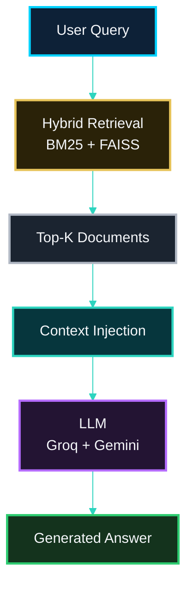

<!-- LANGUAGE BUTTONS -->
**\[[🇧🇷 Português](RAG.md)\] \[**[🇬🇧 English](../../🇬🇧English/methodology/RAG.md)**\]**

  

## [🤖 RAG (Retrieval-Augmented Generation)]()
### Investor Intelligence Platform — FIIs Brasil 🇧🇷

  

## [📌 Visão Geral]()

  

**RAG (Retrieval-Augmented Generation)** é uma arquitetura que combina **recuperação de informação (retrieval)** com **modelos de linguagem (LLMs)** para gerar respostas mais precisas, contextualizadas e confiáveis.

  

Diferente de modelos isolados, o RAG consulta dados externos antes de responder, reduzindo erros e alucinações.

  

## [🧠 Papel no Pipeline]()

  

No projeto, o RAG é a camada final responsável por:

  

- Transformar dados em respostas interpretáveis
- Utilizar contexto recuperado (Hybrid Retrieval)
- Gerar insights acionáveis

  

## [🏗️ Pipeline do RAG]()

  

  

## [⚙️ Como Funciona]()

  

[***1. Query do Usuário***]()

  

- O usuário faz uma pergunta
- Exemplo: "Quais FIIs estão com risco de vacância?"

  

[***2. Recuperação de Contexto***]()

  

- Hybrid Retrieval (BM25 + FAISS)
- Seleção dos documentos mais relevantes

  

[***3. Injeção de Contexto***]()

  

- Os documentos são inseridos no prompt do modelo
- Criação de contexto estruturado

  

[***4. Geração da Resposta***]()

  

- O LLM gera a resposta com base no contexto
- Resultado mais preciso e fundamentado

  

## [🔗 Integração com Outras Técnicas]()

  

- **FAISS** → busca semântica
- **BM25 / TF-IDF** → precisão lexical
- **Embeddings** → representação de significado
- **Hybrid Retrieval** → combinação otimizada

  

## [🧠 Aplicação no Projeto (FIIs)]()

  

- Análise de notícias financeiras
- Detecção de risco (vacância, inadimplência)
- Geração de insights de investimento
- Suporte à decisão estratégica

  

## [🚀 Vantagens]()

  

- Redução de alucinações
- Maior precisão
- Respostas explicáveis
- Integração com dados reais

  

## [⚠️ Limitações]()

  

- Dependência da qualidade do retrieval
- Custo computacional maior
- Necessidade de engenharia de prompt

  

## [📚 Referência]()

  

Ver: `docs/Conceptual Foundations.md`

  

## [🧾 Conclusão]()

  

O RAG transforma o sistema em uma **plataforma de inteligência**, onde dados são convertidos em conhecimento acionável.

  

---

  

*RAG (Retrieval-Augmented Generation) v1.0.0 · Investor Intelligence Platform FIIs Brasil*
