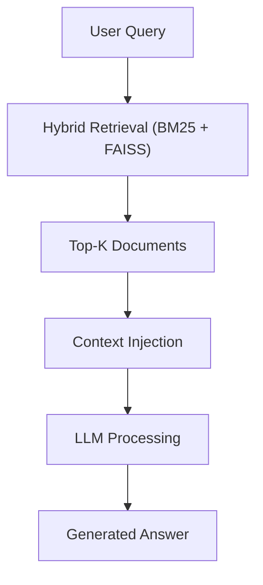

#  RAG (Retrieval-Augmented Generation)

##  Overview

**RAG (Retrieval-Augmented Generation)** is an architecture that combines **information retrieval** with **large language models (LLMs)** to generate accurate, context-aware, and grounded responses.  

Instead of relying only on internal model knowledge, RAG retrieves external data before generating an answer, significantly reducing hallucinations.  

  

## 🧠 Role in the Pipeline

Within this project, RAG acts as the **final intelligence layer**, responsible for:  

* Transforming retrieved data into human-readable answers 
* Leveraging Hybrid Retrieval outputs 
* Producing actionable financial insights  

  

## 🏗️ RAG Pipeline

 

  

## ⚙️ How It Works

### 1. User Query

* A question is submitted by the user 
* Example: “Which FIIs show signs of vacancy risk?”  

  

### 2. Context Retrieval

* Hybrid Retrieval (BM25 + FAISS) is applied 
* Most relevant documents are selected  

 

### 3. Context Injection

* Retrieved documents are injected into the prompt 
* Structured contextual input is built for the LLM  

 

### 4. Answer Generation

* The LLM generates a response using the provided context 
* Output is more accurate, explainable, and grounded  

  

## 🔗 Integration with Core Components

* **FAISS** → semantic similarity search 
* **BM25 / TF-IDF** → lexical precision 
* **Embeddings** → semantic representation 
* **Hybrid Retrieval** → optimized fusion layer  

  

## 🧠 Application in FIIs (Real Estate Investment Funds)

* Financial news interpretation 
* Risk detection (vacancy, default signals) 
* Context-aware sentiment analysis 
* Investment decision support  

  

## 🚀 Advantages

* Reduces hallucinations 
* Improves answer accuracy 
* Enables explainable outputs 
* Connects LLMs to real-world data  

  

## ⚠️ Limitations

* Dependent on retrieval quality 
* Higher computational cost 
* Requires prompt engineering optimization  

  

## 📚 Conceptual Reference

See: 

`docs/Conceptual Foundations.md`

  

## 🧾 Conclusion

RAG transforms the system into an **AI-powered intelligence platform**, where raw financial data becomes structured, explainable, and actionable knowledge.  

