# [Framework Analítico — Dos Dados à Decisão]()
### 🇧🇷 ***Da Frequência ao Significado: Inteligência para Tomada de Decisão em FIIs Brasileiros***

<br>

A plataforma transforma progressivamente informações financeiras brutas em inteligência estratégica acionável por meio de múltiplas camadas analíticas. Em vez de depender de uma única técnica de análise, cada etapa se apoia na anterior, enriquecendo as informações e reduzindo a incerteza até que os dados brutos se tornem suporte à decisão baseado em evidências.

<br><br>

## [TL;DR]()

Um [**pipeline de PLN + Recuperação de Informação**]() que transforma informações não estruturadas do mercado brasileiro de Fundos de Investimento Imobiliário (FIIs) em inteligência acionável.

Ao combinar [**Big Data, Recuperação de Informação, IA Semântica e Geração Aumentada por Recuperação (RAG)**](), a plataforma converte conteúdos financeiros fragmentados, discussões entre investidores e narrativas de mercado em insights estruturados que apoiam análises estratégicas e a tomada de decisão.

<br>

## [Stack]()

* [**MapReduce →**]() descoberta de padrões em larga escala e processamento distribuído
* [**TF-IDF →**]() importância dos termos e especificidade da informação
* [**BM25 →**]() ranqueamento por relevância contextual
* [**FAISS + Embeddings →**]() recuperação semântica e representação de significado
* [**RAG →**]() geração de respostas fundamentadas em evidências
* [**Análise de Sentimento Contextual →**]() interpretação de riscos e análise comportamental

<br>

## [Impacto]()

[*]() Análise do comportamento dos investidores <br>
[*]() Otimização da relevância do conteúdo <br>
[*]() Geração de inteligência de mercado <br>
[*]() Suporte à tomada de decisões estratégicas <br>
[*]() Avaliação da percepção de mercado e dos riscos

<br><br>

## [Da Frequência ao Significado: Inteligência Acionável para o Mercado de FIIs ]()

Este projeto combina **Big Data**, **Recuperação de Informação** e **Inteligência Artificial Semântica** para transformar informações financeiras fragmentadas, conversas entre investidores e conteúdos de mercado em sinais estratégicos acionáveis, revelando:

[*]() comportamento dos investidores <br>
[*]() relevância do conteúdo <br>
[*]() relações semânticas <br>
[*]() percepção de mercado <br>
[*]() oportunidades estratégicas

<br>

A jornada analítica segue um pipeline progressivo de inteligência:

<br>

> Frequência → Relevância → Significado → Decisão

<br>

Em vez de se limitar à simples contagem de palavras, a plataforma constrói progressivamente uma compreensão contextual capaz de apoiar decisões estratégicas explicáveis e fundamentadas em evidências.

<br><br>

### [Evolução Analítica]()

A plataforma aplica múltiplas camadas de inteligência, cada uma contribuindo com uma capacidade analítica distinta.

<br>

| [Camada]() | [Objetivo]() |
| ------ | --------- |
| [Big Data]() | Processar grandes volumes de informações financeiras |
| [Recuperação de Informação]() | Identificar o conteúdo mais relevante |
| [IA Semântica]() | Compreender o significado além das palavras exatas |
| [Inteligência para Decisão]() | Transformar insights em ações estratégicas |

<br><br>

## [Metodologia]()

<br>

## 1. [MapReduce — Descobrindo a Atenção Coletiva]()

O MapReduce analisa o corpus em larga escala para identificar:

* os tópicos mais frequentemente discutidos
* a terminologia financeira predominante
* padrões emergentes de discussão
* as áreas que atraem a maior atenção dos investidores

<br>

### [***Exemplo:***]()

<br>

```text
dividendos         15.420 ocorrências
fundo              38.900 ocorrências
mercado            31.200 ocorrências
investimento       28.500 ocorrências
vacância            6.300 ocorrências
```

<br>

### [***Insight***]()

<br>

A alta frequência de **"dividendos"** indica um forte interesse dos investidores.

No entanto, a frequência, por si só, não mede o valor informacional.

**Frequência ≠ Importância**

Um termo que aparece com muita frequência não é necessariamente o mais informativo nem o mais relevante para a tomada de decisão.

Essa limitação motiva a próxima camada analítica, que avalia o quão distintivo cada termo realmente é em todo o corpus.

<br><br>

## 2. [TF-IDF — Medindo o Valor Informacional]()

Enquanto o MapReduce identifica o que é discutido com maior frequência, o TF-IDF determina quais termos realmente diferenciam um documento de outro.

Em vez de se concentrar apenas na contagem de ocorrências, o TF-IDF mede a especificidade informacional de cada termo dentro de todo o corpus.

<br>

### [***Exemplo:***]()

<br>

### Artigo:

<br>

> "O XPTO11 aumenta os dividendos após o crescimento da receita imobiliária."

<br>

### [***Análise:***]()

<br>

```text
dividendos                   → importância média
renda mensal                 → alta importância
XPTO11                       → alta importância
distribuição extraordinária  → importância muito alta
```

<br>

### [***Insight***]()

<br>

Um termo pode ser altamente relevante dentro de um documento sem necessariamente ser único em toda a coleção.

O TF-IDF, portanto, destaca o vocabulário que melhor caracteriza cada documento individualmente.

No entanto, identificar termos informativos representa apenas parte do problema.

A próxima camada analítica determina **quais documentos são, de fato, os mais relevantes para a intenção de busca do usuário**, introduzindo a relevância contextual por meio de ranqueamento.

<br><br>

## 3. [BM25 — Ranqueamento por Relevância Contextual]()

Embora o TF-IDF identifique os termos que melhor caracterizam documentos individuais, ele não determina qual documento responde de forma mais eficaz à consulta do usuário.

O BM25 resolve essa limitação ao introduzir um modelo de ranqueamento que considera tanto as propriedades estatísticas do corpus quanto o contexto da busca. Em vez de simplesmente contar ocorrências de termos, o BM25 avalia o quão bem cada documento atende à necessidade de informação do usuário.

O ranqueamento é calculado considerando:

[*]() frequência do termo <br>
[*]() frequência inversa do documento (IDF) <br>
[*]() normalização do comprimento do documento <br>
[*]() intenção de busca

<br>

### [***Exemplo:***]()

<br>

### Consulta:

<br>

> "FIIs com dividendos mensais consistentes"

<br>

### Comparação:

<br>

```text
Documento A:

"XPTO11 mantém distribuições mensais de dividendos estáveis há 24 meses consecutivos."

Pontuação BM25 → 8,7


Documento B:

"O mercado imobiliário continua se recuperando com novas oportunidades de investimento."

Pontuação BM25 → 2,1
```

<br>

### [***Insight***]()

<br>

O BM25 identifica o documento que mais se aproxima da intenção de busca do usuário, em vez de simplesmente selecionar aquele que contém o maior número de termos correspondentes.

Isso melhora substancialmente a qualidade da recuperação de informações ao equilibrar frequência, raridade e relevância contextual.

No entanto, o BM25 continua sendo, fundamentalmente, um modelo de recuperação lexical.

Se dois documentos descrevem o mesmo conceito utilizando vocabulários diferentes, informações relevantes ainda podem ser ignoradas.

A próxima camada analítica supera essa limitação por meio de representações semânticas capazes de compreender o significado, e não apenas as palavras exatas.

<br><br>

# 4. [FAISS + Embeddings — Compreendendo o Significado Além das Palavras]()

Tradicionalmente, os métodos de busca dependem principalmente de correspondências lexicais exatas.

Consequentemente, documentos que discutem o mesmo conceito utilizando terminologias diferentes podem não ser recuperados, mesmo expressando ideias praticamente idênticas.

<br>

### [***Por exemplo:***]()

<br>

```text
yield ≠ dividendos ≠ distribuições
```

<br>

Sob uma perspectiva lexical, essas expressões são diferentes.

Sob uma perspectiva semântica, porém, estão intimamente relacionadas.

Os modelos de *embeddings* transformam palavras, frases e documentos em vetores numéricos de alta dimensão que preservam a similaridade semântica, em vez da correspondência textual exata.

O FAISS (*Facebook AI Similarity Search*) permite a indexação e a recuperação eficientes dessas representações vetoriais, tornando a busca semântica viável mesmo em coleções de documentos muito grandes.

Em vez de corresponder palavras, a plataforma recupera documentos de acordo com a proximidade conceitual.

<br>

### [***Exemplo:***]()

<br>

```text
rendimento mensal
        ≈
dividendos recorrentes
        ≈
distribuições de renda
```

<br>

Embora a redação mude, o conceito financeiro subjacente permanece essencialmente o mesmo.

<br>

### [***Insight:***]()

<br>

A recuperação semântica permite que a plataforma descubra informações que permaneceriam invisíveis para buscas tradicionais baseadas em palavras-chave.

Em vez de perguntar se dois documentos contêm termos idênticos, o FAISS avalia se eles comunicam ideias semelhantes.

Isso aumenta significativamente o *recall* (capacidade de recuperar informações relevantes), preservando ao mesmo tempo a relevância contextual, permitindo que investidores acessem informações conceitualmente relacionadas independentemente do vocabulário utilizado.

Ainda assim, recuperar documentos semanticamente relevantes não é o objetivo final.

Os usuários precisam, em última análise, de respostas sintetizadas, e não apenas de listas de documentos.

A próxima etapa, portanto, combina recuperação semântica com Grandes Modelos de Linguagem (LLMs) para gerar respostas fundamentadas em evidências verificáveis.

<br>

### [Transição — Da Recuperação de Informação à Geração de Conhecimento]()

Neste ponto, a plataforma evoluiu progressivamente por meio de quatro etapas analíticas complementares.

Cada camada contribui com uma capacidade distinta:

<br>

* [**MapReduce**]() identifica a atenção coletiva em grandes volumes de dados.
* [**TF-IDF**]() mede a especificidade informacional.
* [**BM25**]() classifica documentos de acordo com sua relevância contextual.
* [**FAISS + Embeddings**]() recupera informações com base na similaridade semântica.

<br>

Em conjunto, essas técnicas melhoram significativamente a qualidade da recuperação de informações.

No entanto, os usuários ainda recebem documentos, e não respostas diretas.

A próxima camada analítica fecha essa lacuna ao integrar recuperação de informação com inteligência artificial generativa, permitindo que a plataforma transforme evidências recuperadas em respostas coerentes, explicáveis e fundamentadas por meio da **Geração Aumentada por Recuperação (RAG)**.

<br><br>

## 5. [Retrieval-Augmented Generation (RAG) — Da Recuperação de Informação à Inteligência]()

Depois que a plataforma é capaz de recuperar os documentos mais relevantes — tanto lexical quanto semanticamente —, o próximo desafio é transformar essas informações em respostas claras, confiáveis e explicáveis.

O **Retrieval-Augmented Generation (RAG)** preenche essa lacuna ao combinar técnicas de recuperação de informação com a capacidade de raciocínio dos Grandes Modelos de Linguagem (LLMs).

Em vez de gerar respostas exclusivamente a partir do conhecimento interno do modelo, o RAG primeiro recupera as evidências mais relevantes do corpus indexado e incorpora esse contexto ao processo de geração.

<br>

> Essa abordagem reduz significativamente as alucinações, ao mesmo tempo em que melhora a precisão factual, a transparência e a explicabilidade.

<br>

### [Evidências recuperadas:]()

<br>

[*]() "O XPTO11 distribuiu R$ 0,85 por cota no último ciclo de dividendos..." <br>
[*]() "Os investidores continuam priorizando fundos com renda recorrente estável..." <br>
[*]() "Os FIIs de logística mantiveram taxas de vacância inferiores à média do mercado..."

<br>

### [Resposta gerada:]()

<br>

> "Os FIIs analisados demonstram um foco consistente na geração de renda recorrente, com investidores demonstrando preferência por fundos que mantêm distribuições estáveis de dividendos e níveis resilientes de ocupação."

<br>

### [***Insight:***]()

<br>

A resposta gerada não se baseia apenas no conhecimento prévio do modelo de linguagem.

Em vez disso, ela é fundamentada em evidências recuperadas diretamente da base de conhecimento da plataforma, garantindo que as conclusões permaneçam rastreáveis até documentos reais.

Isso transforma a recuperação de informação em geração de conhecimento explicável, em vez de simples geração de texto.

No entanto, a correção factual, por si só, não é suficiente para produzir inteligência de mercado.

A linguagem financeira é inerentemente contextual, e fatos idênticos podem carregar implicações muito diferentes dependendo da forma como são expressos.

Por isso, a próxima camada analítica concentra-se na interpretação do contexto, e não apenas na recuperação de informações.

<br><br>

## 6. [Análise de Sentimento Contextual — Compreendendo o Significado Além da Polaridade]()

A análise tradicional de sentimento costuma classificar textos como positivos, negativos ou neutros.

Embora útil para diversas aplicações, essa abordagem é insuficiente para os mercados financeiros, onde palavras idênticas podem comunicar oportunidade, cautela ou risco, dependendo do contexto.

Por esse motivo, a plataforma realiza [**análise de sentimento sensível ao contexto**](), avaliando não apenas a polaridade emocional, mas também o significado semântico que envolve os eventos financeiros.

<br>

### [Cenário positivo:]()

<br>

> "O fundo aumentou a distribuição de dividendos após um crescimento operacional sustentado."

<br>

🟢 Positivo

<br>

### [Cenário de risco:]()

<br>

> "O fundo manteve dividendos excepcionalmente elevados apesar da queda nas taxas de ocupação."

<br>

🟡 / 🔴 Alerta

<br>

Embora ambas as afirmações mencionem distribuições de dividendos, elas comunicam condições de mercado completamente diferentes.

A primeira reflete força operacional.

A segunda pode indicar uma política de distribuição insustentável e, portanto, merece atenção adicional.

<br>

### [***Insight:***]()

<br>

O contexto determina a interpretação.

Ao combinar compreensão semântica com análise de sentimento contextual, a plataforma distingue sinais saudáveis do mercado de potenciais alertas, permitindo que investidores interpretem narrativas financeiras com maior precisão.

Em vez de avaliar palavras isoladas, o sistema analisa as relações entre eventos, indicadores financeiros e contexto narrativo para identificar oportunidades, incertezas e riscos emergentes.

Essa camada analítica final completa a transição da recuperação de informações para a inteligência aplicada à tomada de decisão.

<br><br>

## 7. [Framework Analítico — Dos Dados à Decisão]()

The analytical workflow can be viewed as a progressive intelligence pipeline.

Each stage enriches the output of the previous one, gradually increasing the informational value extracted from the data.

```mermaid
%%{init:{
'theme':'dark',
'themeVariables':{
'background':'#090d13',
'primaryTextColor':'#F5F7FA',
'lineColor':'#2dd4bf'
}
}}%%

graph LR

A["MAPREDUCE<br/>Frequency<br/>Pattern Discovery"]:::silver

B["TF-IDF<br/>Term Importance<br/>Noise Reduction"]:::silver

C["BM25<br/>Contextual Ranking<br/>Search Relevance"]:::gold

D["FAISS + EMBEDDINGS<br/>Semantic Retrieval<br/>Meaning Understanding"]:::gold

E["RAG<br/>Evidence-Based Generation<br/>Context Injection"]:::dash

F["CONTEXTUAL SENTIMENT<br/>Risk Detection<br/>Behavior Analysis"]:::dash

G["DECISION INTELLIGENCE<br/>Strategic Insights"]:::llm

A --> B
B --> C
C --> D
D --> E
E --> F
F --> G

classDef silver fill:#111827,stroke:#94a3b8,color:#F5F7FA,stroke-width:2px;
classDef gold fill:#1f2937,stroke:#e6c35a,color:#F5F7FA,stroke-width:2px;
classDef dash fill:#06363d,stroke:#2dd4bf,color:#F5F7FA,stroke-width:2px;
classDef llm fill:#231433,stroke:#b56cff,color:#F5F7FA,stroke-width:2px;
```




<br>


Rather than representing isolated algorithms, this framework illustrates the progressive evolution of analytical capabilities.


<br>

Each technique contributes a distinct layer of intelligence:

- [**MapReduce**]() identifies collective attention and large-scale patterns.
- [**TF-IDF**]() measures informational specificity.
- [**BM25**]() ranks documents according to contextual relevance.
- [**FAISS + Embeddings**]() enables semantic understanding.
- [**RAG**]() transforms retrieved evidence into explainable answers.
- [**Contextual Sentiment Analysis**]() interprets behavioral signals and market risk.
- [**Decision Intelligence**]() integrates all previous layers into actionable strategic insights.

<br>

> The result is a complete analytical pipeline that progressively transforms raw information into contextual knowledge and, ultimately, into decision support.

<br>

### [Analytical Comparison Table]()

<br>

| [Technique]() | [Question Answered]() | [Intelligence Layer]() |
| ---------- | ----------------- | ------------------ |
| [MapReduce]() | Is this topic frequently discussed? | Collective attention |
| [TF-IDF]() | Does this term distinguish this document? | Information specificity |
| [BM25]() | Which document best satisfies the user's query? | Contextual relevance |
| [FAISS + Embeddings]() | Can different words represent the same concept? | Semantic understanding |
| [RAG]() | How can retrieved evidence become a reliable answer? | Knowledge generation |
| [Contextual Sentiment Analysis]() | Does the surrounding context indicate opportunity or risk? | Risk interpretation |

<br><br>

## 8. [Final Synthesis]()

### [The analytical evolution of the platform can be summarized as:]()

<br>

```text
Word Frequency
      ↓
Information Relevance
      ↓
Contextual Ranking
      ↓
Semantic Understanding
      ↓
Evidence-Based Generation
      ↓
Risk Interpretation
      ↓
Strategic Decision
```

<br>

### [Or, more succinctly:]()

<br>

```text
word count → relevance → meaning → evidence → context → strategic decision
```

<br>

The platform does far more than analyze financial data.

It progressively transforms fragmented information into contextual knowledge, contextual knowledge into explainable intelligence, and explainable intelligence into evidence-based strategic decision support.

By integrating statistical analysis, information retrieval, semantic search, generative AI, and contextual interpretation within a unified analytical framework, the system reduces uncertainty, improves explainability, and enables more informed investment decisions.

