## Analytical Framework — From Data to Decision

The platform progressively transforms raw financial information into actionable strategic intelligence through multiple analytical layers. Rather than relying on a single analytical technique, each stage builds upon the previous one, enriching the information and reducing uncertainty until raw data becomes evidence-based decision support.

The analytical workflow can be viewed as a progressive intelligence pipeline.
Each stage enriches the output of the previous one, gradually increasing the informational value extracted from the data.

```mermaid
%%{init:{
'theme':'dark',
'themeVariables':{
'background':'#090d13',
'primaryTextColor':'#F5F7FA',
'lineColor':'#2dd4bf'
}
}}%%

graph LR

A["MAPREDUCE<br/>Frequency<br/>Pattern Discovery"]:::silver

B["TF-IDF<br/>Term Importance<br/>Noise Reduction"]:::silver

C["BM25<br/>Contextual Ranking<br/>Search Relevance"]:::gold

D["FAISS + EMBEDDINGS<br/>Semantic Retrieval<br/>Meaning Understanding"]:::gold

E["RAG<br/>Evidence-Based Generation<br/>Context Injection"]:::dash

F["CONTEXTUAL SENTIMENT<br/>Risk Detection<br/>Behavior Analysis"]:::dash

G["DECISION INTELLIGENCE<br/>Strategic Insights"]:::llm

A --> B
B --> C
C --> D
D --> E
E --> F
F --> G

classDef silver fill:#111827,stroke:#94a3b8,color:#F5F7FA,stroke-width:2px;
classDef gold fill:#1f2937,stroke:#e6c35a,color:#F5F7FA,stroke-width:2px;
classDef dash fill:#06363d,stroke:#2dd4bf,color:#F5F7FA,stroke-width:2px;
classDef llm fill:#231433,stroke:#b56cff,color:#F5F7FA,stroke-width:2px;
```

<br>



<br>

> Rather than representing isolated algorithms, this framework illustrates the progressive evolution of analytical capabilities.


<br><br>

## Analytical Comparison Table

| Technique | Question Answered | Intelligence Layer |
| ---------- | ----------------- | ------------------ |
| MapReduce | Is this topic frequently discussed? | Collective attention |
| TF-IDF | Does this term differentiate the content? | Information specificity |
| BM25 | Which document best matches the query? | Contextual relevance |
| FAISS + Embeddings | Do different words express the same meaning? | Semantic understanding |
| RAG | How can evidence become an answer? | Knowledge generation |
| Sentiment Analysis | Is the context positive or risky? | Risk interpretation |

<br><br>

## Complete Analytical Evolution

The analytical pipeline evolves through successive layers of intelligence. Each stage addresses the limitations of the previous one while adding a deeper level of understanding, ultimately transforming unstructured information into strategic knowledge.

<br>

```text
Word Frequency
      ↓
Information Relevance
      ↓
Contextual Ranking
      ↓
Semantic Understanding
      ↓
Evidence-Based Generation
      ↓
Strategic Decision
```

Rather than operating as isolated algorithms, these techniques work together as an integrated analytical workflow in which every layer enriches the next.

<br><br>

## Final Synthesis

The platform transforms:

```text
word count → relevance → meaning → strategic decision
```

<br>

> Rather than simply processing data, the platform converts information into contextual knowledge, contextual knowledge into strategic intelligence, and strategic intelligence into evidence-based decision support. By progressively enriching every analytical stage with additional context, the system reduces uncertainty and enables more explainable, transparent, and informed decisions.

<br><br>


## From Frequency to Meaning: Decision Intelligence for Brazilian FIIs

<br>

# TL;DR

An **NLP + Information Retrieval pipeline** that transforms unstructured information from the Brazilian Real Estate Investment Fund (FII) market into actionable intelligence.

By combining **Big Data, Information Retrieval, Semantic AI, and Retrieval-Augmented Generation (RAG)**, the platform converts fragmented financial content, investor discussions, and market narratives into structured insights that support strategic analysis and decision-making.

<br><br>

## Stack

* **MapReduce →** large-scale pattern discovery and distributed processing
* **TF-IDF →** term importance and information specificity
* **BM25 →** contextual relevance ranking
* **FAISS + Embeddings →** semantic retrieval and meaning representation
* **RAG →** evidence-grounded response generation
* **Contextual Sentiment Analysis →** risk interpretation and behavioral analysis

<br><br>

## Impact

* Investor behavior analysis
* Content relevance optimization
* Market intelligence generation
* Strategic decision support
* Market perception and risk assessment

<br><br>


## From Frequency to Meaning: Actionable Intelligence for the FII Market

This project combines **Big Data**, **Information Retrieval**, and **Semantic Artificial Intelligence** to transform fragmented financial information, investor conversations, and market content into actionable strategic signals, revealing:

* investor behavior
* content relevance
* semantic relationships
* market perception
* strategic opportunities

<br>

The analytical journey follows a progressive intelligence pipeline:

# Frequency → Relevance → Meaning → Decision

<br>

Instead of stopping at simple word counting, the platform progressively builds contextual understanding capable of supporting explainable and evidence-based strategic decisions.

<br><br>

## Analytical Evolution

The platform applies multiple layers of intelligence, each contributing a distinct analytical capability.

<br>

| Layer | Objective |
| ------ | --------- |
| Big Data | Process large volumes of financial information |
| Information Retrieval | Identify the most relevant content |
| Semantic AI | Understand meaning beyond exact words |
| Decision Intelligence | Transform insights into strategic actions |

<br><br>

## Methodology

## 1. MapReduce — Discovering Collective Attention

MapReduce analyzes the corpus at scale to identify:

* the most frequently discussed topics
* dominant financial terminology
* emerging discussion patterns
* areas attracting the greatest investor attention

<br>

### ***Example:***

<br>

```text
dividends          15,420 occurrences
fund               38,900 occurrences
market             31,200 occurrences
investment         28,500 occurrences
vacancy             6,300 occurrences
```

<br>

### ***Insight***

The high frequency of **"dividends"** indicates strong investor interest.

However, frequency alone does not measure informational value.

<br>

### ***Frequency ≠ Importance***

A frequently occurring term is not necessarily the most informative or the most relevant for decision-making.

This limitation motivates the next analytical layer, which evaluates how distinctive each term actually is across the entire corpus.


<br><br>

## 2. TF-IDF — Measuring Informational Value

While MapReduce identifies what is frequently discussed, TF-IDF determines which terms truly differentiate one document from another.

Instead of focusing solely on occurrence counts, TF-IDF measures the informational specificity of each term within the complete corpus.

<br>

### ***Example:***

Article:

> "XPTO increases dividends after growth in real estate revenue."

Analysis:

```text
dividends                    → medium importance
monthly income               → high importance
XPTO11                       → high importance
extraordinary distribution   → very high importance
```

<br>

### ***Insight***

A term may be highly relevant within a document without necessarily being unique across the entire collection.

TF-IDF therefore highlights the vocabulary that best characterizes individual documents.

However, identifying informative terms is only part of the problem.

The next analytical layer determines **which documents are actually the most relevant to a user's search intent**, introducing contextual relevance through ranking.


<br><br>


## 3. BM25 — Contextual Relevance Ranking

Although TF-IDF identifies the terms that best characterize individual documents, it does not determine which document most effectively answers a user's query.

BM25 addresses this limitation by introducing a ranking model that considers both the statistical properties of the corpus and the context of the search. Instead of simply counting term occurrences, BM25 evaluates how well each document satisfies the user's information need.

The ranking is computed by considering:

* term frequency
* inverse document frequency
* document length normalization
* search intent

<br>

### ***Example:***

<br>

Query:

> "FIIs with consistent monthly dividends"

Comparison:

```text
Document A:

"XPTO11 has maintained stable monthly dividend distributions for 24 consecutive months."

BM25 Score → 8.7


Document B:

"The real estate market continues to recover with new investment opportunities."

BM25 Score → 2.1
```

<br>

### ***Insight***

BM25 identifies the document that most closely aligns with the user's search intent rather than simply selecting the document containing the greatest number of matching terms.

This substantially improves information retrieval quality by balancing frequency, rarity, and contextual relevance.

However, BM25 remains fundamentally a lexical retrieval model.

If two documents describe the same concept using different vocabulary, relevant information may still be overlooked.

The next analytical layer overcomes this limitation through semantic representations capable of understanding meaning rather than exact wording.

<br><br>


# 4. FAISS + Embeddings — Understanding Meaning Beyond Words

Traditional search methods depend primarily on exact lexical matches.

Consequently, documents discussing the same concept with different terminology may not be retrieved, even though they express nearly identical ideas.

For example:

```text
yield ≠ dividends ≠ distributions
```

From a lexical perspective, these expressions are different.

From a semantic perspective, however, they are closely related.

Embedding models transform words, phrases, and documents into high-dimensional numerical vectors that preserve semantic similarity rather than exact textual correspondence.

FAISS (Facebook AI Similarity Search) enables efficient indexing and retrieval of these vector representations, making semantic search practical even across very large document collections.

Instead of matching words, the platform retrieves documents according to conceptual proximity.

<br>

### ***Example:***

<br>

```text
monthly yield
      ≈
recurring dividends
      ≈
income distributions
```

Although the wording changes, the underlying financial concept remains essentially the same.

<br>

### ***Insight***

Semantic retrieval enables the platform to discover information that would be invisible to traditional keyword-based search.

Rather than asking whether two documents contain identical terms, FAISS evaluates whether they communicate similar ideas.

This significantly increases recall while preserving contextual relevance, allowing investors to access conceptually related information regardless of the vocabulary used.

Nevertheless, retrieving semantically relevant documents is not the final objective.

Users ultimately require synthesized answers rather than lists of documents.

The next stage therefore combines semantic retrieval with large language models to generate responses grounded in verifiable evidence.


<br><br>


## Transition — From Retrieval to Knowledge Generation

At this point, the platform has progressively evolved through four complementary analytical stages.

Each layer contributes a distinct capability:

* **MapReduce** identifies collective attention across massive datasets.
* **TF-IDF** measures informational specificity.
* **BM25** ranks documents according to contextual relevance.
* **FAISS + Embeddings** retrieves information based on semantic similarity.

Together, these techniques dramatically improve the quality of information retrieval.

However, users still receive documents rather than direct answers.

The next analytical layer closes this gap by integrating retrieval with generative artificial intelligence, enabling the platform to transform retrieved evidence into coherent, explainable, and evidence-based responses through Retrieval-Augmented Generation (RAG).

<br><br>


## 5. Retrieval-Augmented Generation (RAG) — From Retrieval to Intelligence

Once the platform is capable of retrieving the most relevant documents—both lexically and semantically—the next challenge is transforming that information into clear, reliable, and explainable answers.

Retrieval-Augmented Generation (RAG) bridges this gap by combining information retrieval with the reasoning capabilities of Large Language Models (LLMs).

Instead of generating responses exclusively from a model's internal knowledge, RAG first retrieves the most relevant evidence from the indexed corpus and injects that context into the generation process.

This approach significantly reduces hallucinations while improving factual accuracy, transparency, and explainability.


<br>

### Retrieved evidence:

* "XPTO distributed R$0.85 per share during the last dividend cycle..."
* "Investors continue to prioritize funds with stable recurring income..."
* "Logistics FIIs maintained lower vacancy rates than the market average..."

<br>

### Generated response:

> "The analyzed FIIs demonstrate a consistent focus on recurring income generation, with investors showing a preference for funds that maintain stable dividend distributions and resilient occupancy levels."

<br>

### ***Insight***

The generated answer is not based solely on the language model's prior knowledge.

Instead, it is grounded in evidence retrieved directly from the platform's knowledge base, ensuring that conclusions remain traceable to real documents.

This transforms retrieval into explainable knowledge generation rather than generic text generation.

However, factual correctness alone is not sufficient for market intelligence.

Financial language is inherently contextual, and identical facts may carry very different implications depending on how they are expressed.

The next analytical layer therefore focuses on interpreting context rather than simply retrieving information.

<br><br>


## 6. Contextual Sentiment Analysis — Understanding Meaning Beyond Polarity

Traditional sentiment analysis often classifies text as positive, negative, or neutral.

While useful for many applications, this approach is insufficient for financial markets, where identical words can communicate opportunity, caution, or risk depending on their context.

For this reason, the platform performs **context-aware sentiment analysis**, evaluating not only emotional polarity but also the semantic meaning surrounding financial events.

Positive scenario:

<br>

> "The fund increased dividend distributions following sustained operational growth."

<br>

🟢 Positive

<br>

Risk scenario:

<br>

> "The fund maintained unusually high dividends despite declining occupancy rates."

<br>

🟡 / 🔴 Warning

<br>

Although both statements mention dividend distributions, they communicate entirely different market conditions.

The first reflects operational strength.

The second may indicate an unsustainable distribution policy and therefore deserves additional attention.

<br>

### ***Insight***

Context determines interpretation.

By combining semantic understanding with contextual sentiment analysis, the platform distinguishes healthy market signals from potential warning signs, allowing investors to interpret financial narratives more accurately.

Rather than evaluating isolated words, the system analyzes relationships between events, financial indicators, and narrative context to identify opportunities, uncertainty, and emerging risks.

This final analytical layer completes the transition from information retrieval to decision intelligence.

<br>

Each technique contributes a distinct layer of intelligence:

- **MapReduce** identifies collective attention and large-scale patterns.
- **TF-IDF** measures informational specificity.
- **BM25** ranks documents according to contextual relevance.
- **FAISS + Embeddings** enables semantic understanding.
- **RAG** transforms retrieved evidence into explainable answers.
- **Contextual Sentiment Analysis** interprets behavioral signals and market risk.
- **Decision Intelligence** integrates all previous layers into actionable strategic insights.

The result is a complete analytical pipeline that progressively transforms raw information into contextual knowledge and, ultimately, into decision support.

<br><br>

## Analytical Comparison Table

<br>

| Technique | Question Answered | Intelligence Layer |
| ---------- | ----------------- | ------------------ |
| MapReduce | Is this topic frequently discussed? | Collective attention |
| TF-IDF | Does this term distinguish this document? | Information specificity |
| BM25 | Which document best satisfies the user's query? | Contextual relevance |
| FAISS + Embeddings | Can different words represent the same concept? | Semantic understanding |
| RAG | How can retrieved evidence become a reliable answer? | Knowledge generation |
| Contextual Sentiment Analysis | Does the surrounding context indicate opportunity or risk? | Risk interpretation |

<br><br>

## Final Synthesis

The analytical evolution of the platform can be summarized as:

<br>

```text
Word Frequency
      ↓
Information Relevance
      ↓
Contextual Ranking
      ↓
Semantic Understanding
      ↓
Evidence-Based Generation
      ↓
Risk Interpretation
      ↓
Strategic Decision
```

<br>

Or, more succinctly:

<br>


```text
word count → relevance → meaning → evidence → context → strategic decision
```

<br>

 The platform does far more than analyze financial data.

It progressively transforms fragmented information into contextual knowledge, contextual knowledge into explainable intelligence, and explainable intelligence into evidence-based strategic decision support.

By integrating statistical analysis, information retrieval, semantic search, generative AI, and contextual interpretation within a unified analytical framework, the system reduces uncertainty, improves explainability, and enables more informed investment decisions.

